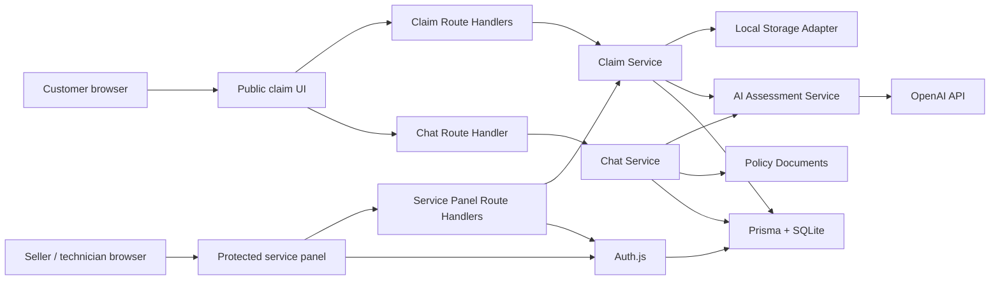
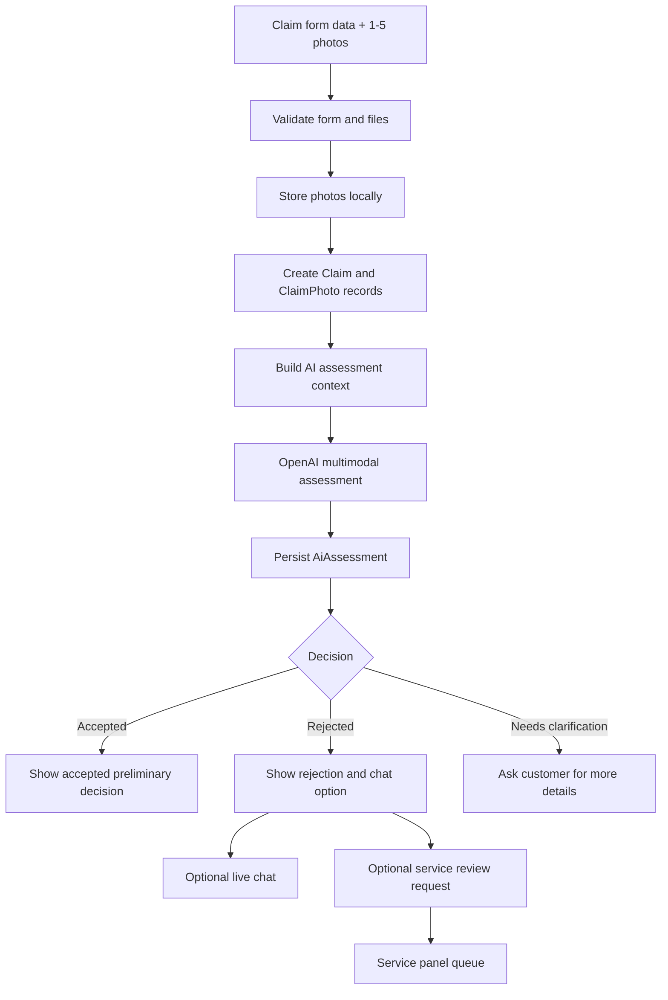
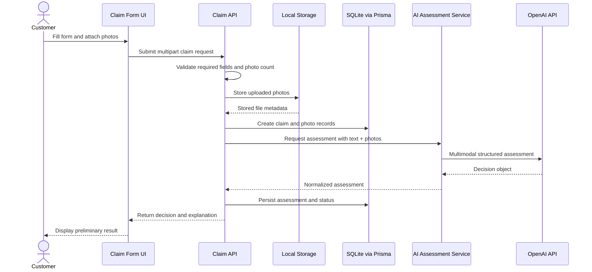
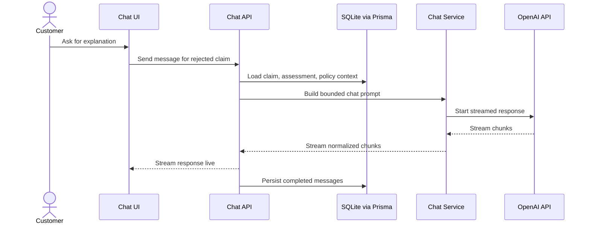

# ADR: Bicycle Claims Assistant - Main Architecture

**Date:** 2026-06-17
**Status:** Accepted
**PRD:** [docs/PRD.md](../PRD.md)

---

## 1. Overview

This ADR defines the initial architecture for the Bicycle Claims Assistant MVP described in the PRD. The application collects a bicycle claim, stores claim data and uploaded photos, performs a preliminary AI assessment, exposes a simple service panel for seller/technician review, and supports live AI chat after a rejected preliminary decision.

The app has not been initialized yet. The architecture therefore defines the target scaffold, module boundaries, persistence model, AI contracts, testing strategy, and deployment constraints before implementation begins.

---

## 2. Context7 Library References

Implementing agents must use these handles before coding against the referenced libraries.

| Library / Docs | Context7 Handle or Official URL | Used for |
|---|---|---|
| Next.js | `/vercel/next.js` | App Router, Route Handlers, Server Actions, deployment model |
| React | `/reactjs/react.dev` | UI components and client-side state |
| Tailwind CSS | `/tailwindlabs/tailwindcss.com` | Utility CSS, theme variables, design tokens |
| Vercel AI SDK | `/vercel/ai` | Streaming chat, OpenAI provider integration, structured AI outputs |
| Prisma | `/prisma/web` | SQLite ORM, schema, migrations, typed database access |
| Auth.js | `/websites/authjs_dev` | Simple credentials login and protected service panel |
| Vitest | `/vitest-dev/vitest` | Unit and integration tests |
| OpenAI API | `https://developers.openai.com/api/docs/` | Image input, structured outputs, streaming responses |

---

## 3. System Architecture

### Architecture Pattern

Use a single Next.js full-stack application with App Router. The frontend, backend route handlers, AI orchestration, authentication, and persistence access live in one application package under `app/`.

This is a modular monolith: modules are separated by responsibility, but deployed as one application.

### Repository Structure

| Path | Purpose |
|---|---|
| `app/` | Next.js application root |
| `app/app/` | App Router routes and layouts |
| `app/components/` | Reusable UI components |
| `app/features/claims/` | Claim form, claim detail, claim workflows |
| `app/features/service-panel/` | Seller/technician dashboard |
| `app/features/chat/` | Rejected-claim chat UI and state |
| `app/lib/ai/` | AI prompts, schemas, OpenAI/AI SDK adapters |
| `app/lib/db/` | Prisma client and persistence repositories |
| `app/lib/auth/` | Auth.js config and access guards |
| `app/lib/storage/` | Local file storage adapter |
| `app/prisma/` | Prisma schema, migrations, SQLite database |
| `app/tests/` | Unit, integration, and E2E tests |
| `assets/` | Design tokens and reference assets |
| `docs/` | PRD, policies, ADR, design guidelines |

### Technology Stack

| Layer | Technology | Reason |
|---|---|---|
| Frontend | Next.js App Router + React + TypeScript | Matches course stack and supports full-stack routes in one app |
| Styling | Tailwind CSS + CSS theme variables | Maps directly to `assets/design-tokens.json` and design guidelines |
| Backend | Next.js Route Handlers + Server Actions | Keeps form mutations and API boundaries inside the app |
| AI | Vercel AI SDK + OpenAI provider | Supports live streaming chat and TypeScript-friendly AI workflows |
| Database | SQLite via Prisma | Simple MVP persistence with typed models and migrations |
| File storage | Local filesystem adapter | Matches user decision for MVP image storage |
| Authentication | Auth.js Credentials provider | Simple login for seller/technician panel without external OAuth |
| Hosting | Vercel | User-selected deployment target |
| Testing | Vitest, Testing Library, Playwright | Covers TDD unit/integration/UI/E2E layers |

---

## 4. Module Structure & Dependencies

Dependency direction:

1. UI routes depend on feature modules.
2. Feature modules depend on application services.
3. Application services depend on repositories, storage, auth, and AI adapters.
4. Repositories depend on Prisma.
5. AI adapters depend on AI SDK/OpenAI.
6. Shared schemas are imported by UI, API, services, and tests.

No module may import UI components from persistence, AI, storage, or auth modules.

| Module | Responsibility | Depends on | Used by |
|---|---|---|---|
| `claims` | Claim submission, validation, status display | schemas, claim service | public UI, API |
| `service-panel` | Claim list/detail for staff | auth, claim service | protected UI |
| `chat` | Post-rejection live chat | chat service, claim service | public claim detail |
| `ai` | Assessment and chat generation | AI SDK, OpenAI, policy loader | claim service, chat service |
| `db` | Typed persistence access | Prisma | services |
| `storage` | Image write/read/delete abstraction | filesystem | claim service |
| `auth` | Credentials login and route protection | Auth.js, db | protected routes |
| `design-system` | Tokens and reusable UI primitives | Tailwind tokens | all UI |

---

## 5. Data Models

### Claim

Represents one customer claim.

Key fields:

- `id`: unique string identifier.
- `equipmentType`: enum, initially `bicycle`.
- `brand`: string, required.
- `model`: string, required.
- `problemDescription`: string, required.
- `damageCircumstances`: string, required.
- `status`: enum: `draft`, `submitted`, `needs_clarification`, `preliminarily_accepted`, `preliminarily_rejected`, `service_review_requested`, `closed`.
- `damageType`: enum, initially `mechanical` or `unknown`.
- `createdAt`, `updatedAt`: timestamps.

Persistence: SQLite until migrated.

### ClaimPhoto

Represents a photo uploaded for a claim.

Key fields:

- `id`: unique string identifier.
- `claimId`: parent claim.
- `fileName`: stored file name.
- `originalFileName`: client-provided name.
- `mimeType`: image MIME type.
- `sizeBytes`: number.
- `localPath`: relative path managed by storage adapter.
- `createdAt`: timestamp.

Relationship: many photos per claim, maximum 5.

### AiAssessment

Represents one preliminary AI assessment.

Key fields:

- `id`: unique string identifier.
- `claimId`: parent claim.
- `decision`: enum: `accepted`, `rejected`, `needs_clarification`.
- `damageType`: enum.
- `confidence`: enum: `low`, `medium`, `high`.
- `reasoningSummary`: Polish user-facing explanation.
- `photoEvidenceSummary`: Polish summary of image observations.
- `descriptionEvidenceSummary`: Polish summary of description/circumstance interpretation.
- `createdAt`: timestamp.

Relationship: a claim can have multiple assessments if the customer clarifies the issue.

### ChatMessage

Represents one persisted message in the post-rejection chat.

Key fields:

- `id`: unique string identifier.
- `claimId`: parent claim.
- `role`: enum: `user`, `assistant`, `system`.
- `content`: Polish text.
- `createdAt`: timestamp.

### User

Represents a staff account for simple login.

Key fields:

- `id`: unique string identifier.
- `email`: unique string.
- `passwordHash`: string.
- `role`: enum: `seller`, `technician`, `admin`.
- `createdAt`, `updatedAt`: timestamps.

---

## 6. API / Interface Contracts

### Public Claim Submission

Boundary: `POST /api/claims`

Input:

- `equipmentType`: must be `bicycle`.
- `brand`: non-empty string.
- `model`: non-empty string.
- `problemDescription`: non-empty string.
- `damageCircumstances`: non-empty string.
- `photos`: 1 to 5 image files.

Output:

- `claimId`.
- `status`.
- `assessment`: decision, damage type, user-facing summary.

Errors:

- Missing required field.
- Unsupported equipment type.
- No photo.
- More than 5 photos.
- Unsupported file type.
- Storage failure.
- AI assessment failure.

### Claim Clarification

Boundary: `POST /api/claims/{claimId}/clarifications`

Input:

- Additional description text.
- Optional additional photos, respecting total maximum of 5.

Output:

- Updated claim status.
- New assessment.

### Service Review Request

Boundary: `POST /api/claims/{claimId}/service-review`

Input:

- Optional customer note.

Output:

- Updated status `service_review_requested`.

### Staff Claim List

Boundary: `GET /api/service/claims`

Auth: required.

Output:

- Paginated claims with status, brand, model, created date, decision, review flag.

### Staff Claim Detail

Boundary: `GET /api/service/claims/{claimId}`

Auth: required.

Output:

- Claim fields.
- Photo metadata and view URLs.
- Assessments.
- Chat history.

### Rejection Chat

Boundary: `POST /api/claims/{claimId}/chat`

Input:

- Current chat messages.
- Claim id.

Output:

- Live streamed assistant response.

Errors:

- Claim not found.
- Claim is not rejected.
- AI provider unavailable.
- Message rejected by safety validation.

---

## 7. Environment Variables

| Variable | Purpose | Required | Example value |
|---|---|---|---|
| `OPENAI_API_KEY` | OpenAI provider credentials | Yes | `sk-...` |
| `DATABASE_URL` | SQLite database URL | Yes | `file:./prisma/dev.db` |
| `AUTH_SECRET` | Auth.js session secret | Yes | generated secret |
| `APP_BASE_URL` | Absolute app URL for callbacks/links | Yes | `http://localhost:3000` |
| `UPLOAD_DIR` | Local upload directory | Yes | `./data/uploads` |
| `SEED_ADMIN_EMAIL` | Initial staff account email | Yes for seed | `admin@example.com` |
| `SEED_ADMIN_PASSWORD` | Initial staff account password | Yes for seed | local-only password |
| `AI_ASSESSMENT_MODEL` | OpenAI model for multimodal assessment | Yes | model selected during implementation |
| `AI_CHAT_MODEL` | OpenAI model for chat | Yes | model selected during implementation |

---

## 8. Technical Decisions

### Use a Next.js modular monolith

**Status:** Accepted  
**Date:** 2026-06-17

**Context:** The MVP requires public UI, protected staff UI, APIs, AI calls, and persistence. A separate frontend/backend split would add coordination overhead before the product concept is proven.

**Decision:** Use a single Next.js App Router application with clear internal modules.

**Rejected alternatives:**

- Separate frontend and backend apps: rejected because it increases setup and deployment complexity for the course MVP.
- Static SPA with external API: rejected because file upload, auth, and server-side AI calls need trusted backend execution.

**Consequences:**

- (+) One deployable unit and one TypeScript codebase.
- (+) Easy route-handler access to OpenAI and SQLite.
- (-) Backend and frontend share one runtime and must keep module boundaries disciplined.

**Review trigger:** Revisit if the service panel needs independent scaling, separate backend ownership, or non-Next clients.

### Treat Vercel + SQLite + local files as MVP-only

**Status:** Accepted  
**Date:** 2026-06-17

**Context:** The user selected Vercel, SQLite, and local file storage. SQLite and local uploads are appropriate for local MVP development, but are not durable production storage on serverless Vercel.

**Decision:** Implement SQLite and local storage behind repository/storage interfaces. Local development is the durable MVP environment. Vercel deployment is a demo deployment unless persistence is migrated to managed database and object storage.

**Rejected alternatives:**

- PostgreSQL + Vercel Blob now: rejected because the user explicitly selected SQLite and local files.
- No Vercel deployment: rejected because Vercel is the selected hosting target.

**Consequences:**

- (+) Fast local development and low setup cost.
- (+) Future migration path is explicit.
- (-) Vercel deployment cannot be treated as production-durable.

**Review trigger:** Before any real user pilot, migrate to persistent hosted database and object storage.

---

## 9. Diagrams

### 9.1 Architecture / Component Diagram

### 9.2 Data Flow Diagram

### 9.3 Sequence Diagrams

#### Claim submission and preliminary AI assessment

#### Rejection chat

---

## 10. Testing Strategy

### Philosophy

Implementation must follow TDD. Tests define the expected behavior from the PRD and ADR before production code is written. AI calls must be isolated behind adapters so unit and integration tests can use deterministic fixtures.

### Test Layers

| Layer | Type | Scope | Tools |
|---|---|---|---|
| Unit | Pure logic tests | validation, decision normalization, policy context, status transitions | Vitest |
| Component | UI behavior | form validation, upload controls, decision screens, chat states | Vitest + Testing Library |
| Integration | API + database + mocked AI | claim submission, auth guards, persistence | Vitest + Prisma test database |
| E2E | Real app flow with mocked external AI | customer flow, staff panel, chat | Playwright |

### Key Test Scenarios

- Valid claim with one photo creates claim, stores photo metadata, runs assessment, and returns a decision.
- Missing description blocks submission.
- Missing damage circumstances requests clarification.
- More than 5 photos is rejected before storage.
- Frame damaged after fall may return rejected decision with explanation referencing description.
- Frame cracked during normal riding is not rejected solely because the damage is mechanical.
- Rejected claim exposes chat entry point.
- Chat refuses to promise refund, replacement, repair, or final legal decision.
- Staff panel requires login.
- Service review request changes claim status.

### Technical Acceptance Criteria

- TAC-000-01: All public user-facing UI strings are Polish.
- TAC-000-02: The AI assessment service returns only one of the three PRD decision categories.
- TAC-000-03: Claim submission stores no database record if validation fails before file persistence.
- TAC-000-04: Protected service panel routes deny unauthenticated access.
- TAC-000-05: `npm test`, `npm run lint`, and `npm run build` pass before any commit.
