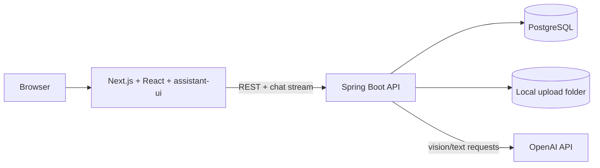
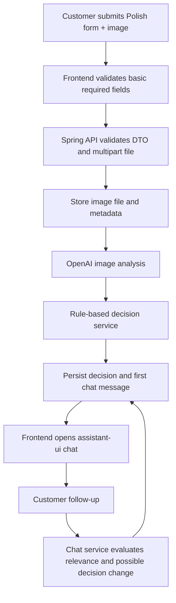
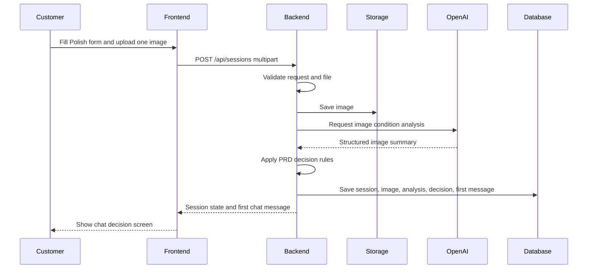
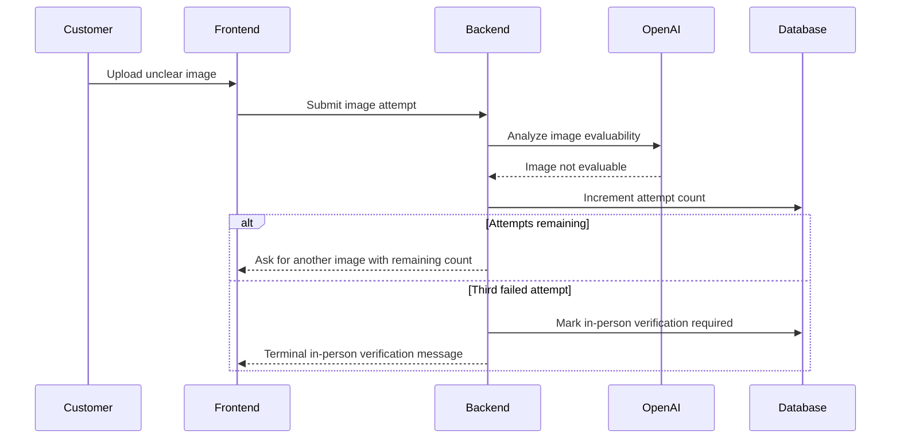
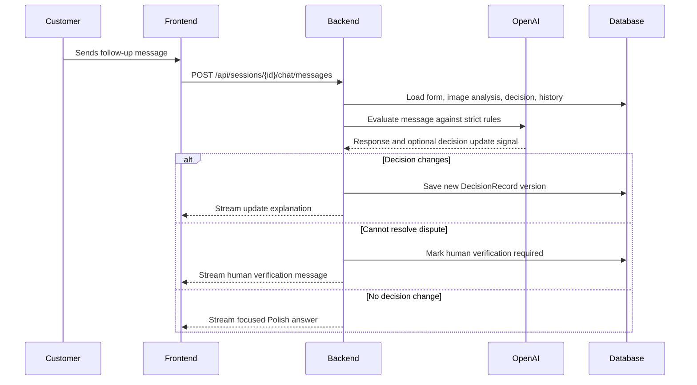

# ADR: Best Service Decision - Main Architecture

**Date:** 2026-06-17
**Status:** Accepted
**PRD:** [docs/PRD.md](../PRD.md)

---

## 1. Overview

Best Service Decision is a local-first MVP for evaluating electronics complaint and return requests. The application collects structured Polish form data, accepts exactly one image per attempt, uses OpenAI vision/text analysis, applies strict PRD rules, records the session, and opens a Polish chat where the customer can ask follow-up questions or challenge the decision.

This ADR set defines the architecture needed to implement the PRD without guessing. The product is not initialized yet, so these decisions define the initial repository shape, tools, module boundaries, API contracts, storage, AI boundaries, and test strategy.

---

## 2. Context7 Library References

Future agents must use these handles before implementing library-specific code.

| Library | Context7 Handle | Used for |
|---|---|---|
| Spring Boot | `/spring-projects/spring-boot` | Java backend, REST API, validation, multipart upload, config, Docker Compose support |
| OpenAI Java SDK | `/openai/openai-java` | OpenAI client, Responses API, vision/text calls, streaming, structured outputs |
| assistant-ui | `/assistant-ui/assistant-ui` | React chat primitives, runtime, custom backend integration |
| Next.js | `/vercel/next.js` | Frontend app framework |
| React | `/reactjs/react.dev` | Frontend component model |
| Tailwind CSS | `/tailwindlabs/tailwindcss.com` | UI styling with GitHub-like design tokens |
| Shadcn/ui | `/shadcn-ui/ui` | Form, input, dialog, button primitives when useful |
| JUnit 5 | Resolve before implementation | Java unit tests |
| Testcontainers | Resolve before implementation | PostgreSQL-backed integration tests |
| Playwright | Resolve before implementation | Browser E2E tests |

---

## 3. System Architecture

### Architecture Pattern

Use a local-first modular monolith backend plus a separate Next.js frontend:

- Backend: Java 21, Spring Boot 3.x, Maven, PostgreSQL, Spring Data JPA/Hibernate.
- Frontend: Next.js, React, assistant-ui, Tailwind CSS, local API proxy/config to Spring backend.
- AI boundary: backend-owned OpenAI integration. The frontend never calls OpenAI directly.
- Deployment for course: local developer VM. Docker Compose starts PostgreSQL; backend and frontend run as local processes.

This is intentionally not a microservice architecture. The MVP needs clear business behavior, traceable decisions, and easy debugging more than independent service scaling.

### Repository Structure

The repository should evolve into:

| Path | Purpose |
|---|---|
| `app/backend/` | Spring Boot application |
| `app/frontend/` | Next.js application |
| `assets/` | Design tokens and GitHub-like visual assets |
| `docs/` | PRD, ADRs, design guidelines |
| `course-materials/` | Training notes and examples |
| `examples/` | Reference agent configs |

Backend packages must be organized by feature/domain, not by generic technical layer.

### Technology Stack

| Layer | Technology | Reason |
|---|---|---|
| Backend runtime | Java 21 | User preference; stable modern Java baseline |
| Backend framework | Spring Boot 3.x | Strong Java web, validation, configuration, testing, and JPA ecosystem |
| Backend API | Spring MVC REST + streaming endpoint | Simple local MVP, compatible with browser and assistant-ui custom backend |
| Persistence | PostgreSQL + Spring Data JPA/Hibernate | Best fit for SQL/JPA domain modeling and future extension |
| Migrations | Flyway | Repeatable schema setup for course VMs and tests |
| File storage | Local filesystem | Course VM has limited assets; simpler than object storage |
| AI provider | OpenAI via OpenAI Java SDK | User selected OpenAI; backend keeps secrets server-side |
| Frontend | Next.js + React | Standard React app framework, works well with assistant-ui |
| Chat UI | assistant-ui custom backend runtime | Provides chat primitives while keeping Java backend as the AI owner |
| Styling | Tailwind CSS + GitHub-like tokens | Matches created design system and keeps UI implementation fast |
| Component base | Shadcn/ui where useful | Accessible form/dialog primitives without forcing a full design system |
| Java tests | JUnit 5, Mockito, Spring Boot Test, Testcontainers | Supports TDD from unit to real PostgreSQL integration |
| E2E tests | Playwright | Browser validation of form, upload, chat, and retry flows |

---

## 4. Module Structure and Dependencies

Backend modules are package-level modules inside one Spring Boot app:

| Module | Responsibility | Depends on | Used by |
|---|---|---|---|
| `caseintake` | Validate and create complaint/return sessions | `storage`, `persistence` | REST controllers, chat |
| `imageanalysis` | Call OpenAI vision and classify image evaluability | `ai`, `storage`, `persistence` | decision |
| `decision` | Apply strict PRD complaint/return rules | `imageanalysis`, `persistence` | chat, API |
| `chat` | Persist conversation, handle follow-up messages, stream assistant replies | `decision`, `ai`, `persistence` | frontend chat |
| `ai` | OpenAI client facade, prompts, structured response parsing | config only | imageanalysis, chat |
| `storage` | Store and retrieve uploaded image files locally | config only | caseintake, imageanalysis |
| `persistence` | JPA entities, repositories, migrations | PostgreSQL | all domain modules |
| `api` | REST DTOs, controllers, error responses | domain modules | frontend |

Dependency direction is inward to domain behavior and outward to adapters. Domain services must not depend on controllers. Controllers must not expose JPA entities.

Frontend modules:

| Module | Responsibility |
|---|---|
| `app/(case)/` | Initial Polish form, upload, validation, retry state |
| `components/assistant/` | assistant-ui thread, composer, message rendering |
| `lib/api/` | Typed client for Spring backend |
| `lib/design-tokens/` | Token import/mapping from `assets/design-tokens.json` |
| `components/ui/` | Shadcn/Tailwind primitives |

---

## 5. Data Models

### ServiceSession

Represents one customer complaint or return flow.

Key fields:

- `id`: UUID.
- `requestType`: enum `COMPLAINT` or `RETURN`.
- `status`: enum `DRAFT`, `IMAGE_RETRY_REQUIRED`, `DECIDED`, `HUMAN_VERIFICATION_REQUIRED`, `IN_PERSON_VERIFICATION_REQUIRED`.
- `terminalState`: nullable enum `APPROVED`, `REJECTED`, `HUMAN_VERIFICATION_REQUIRED`, `IN_PERSON_VERIFICATION_REQUIRED`.
- `equipmentCategory`: PRD-defined enum.
- `equipmentNameOrModel`: required text.
- `purchaseDate`: required date.
- `reason`: required for complaint, optional for return.
- `imageAttemptCount`: integer 0-3.
- `createdAt`, `updatedAt`.

### UploadedImage

Represents one image attempt.

Key fields:

- `id`: UUID.
- `sessionId`: parent session.
- `attemptNumber`: 1-3.
- `originalFilename`: sanitized filename.
- `contentType`: detected MIME type.
- `sizeBytes`: file size.
- `storagePath`: relative path under configured upload root.
- `isEvaluable`: nullable boolean.
- `rejectionReason`: nullable text when image is unclear or invalid.

### ImageAnalysis

Stores the AI-generated condition summary for one image attempt.

Key fields:

- `id`: UUID.
- `imageId`: analyzed image.
- `visibleDamage`, `defectIndicators`, `usageSigns`, `possibleCauseIndicators`, `missingOrAlteredParts`, `resaleCondition`: structured nullable text fields.
- `isContradictoryWithForm`: boolean.
- `rawModelSummary`: text.
- `modelName`: configured OpenAI model name.
- `createdAt`.

### DecisionRecord

Stores initial and updated decisions.

Key fields:

- `id`: UUID.
- `sessionId`: parent session.
- `version`: increasing integer.
- `status`: enum `APPROVED`, `REJECTED`, `HUMAN_VERIFICATION_REQUIRED`.
- `rejectionType`: nullable enum from PRD.
- `rejectionReasonPl`: nullable Polish text.
- `justificationPl`: Polish text.
- `nextStepsPl`: Polish text.
- `ruleCategory`: exact PRD rule category used.
- `changedBecauseMessageId`: nullable chat message reference.
- `createdAt`.

### ChatMessage

Stores customer and system messages.

Key fields:

- `id`: UUID.
- `sessionId`: parent session.
- `role`: enum `CUSTOMER`, `SYSTEM`.
- `contentPl`: Polish text.
- `sequenceNumber`: increasing integer.
- `messageType`: enum `INITIAL_DECISION`, `FOLLOW_UP`, `DECISION_UPDATE`, `REFUSAL`, `ROUTE_TO_HUMAN`.
- `createdAt`.

---

## 6. API / Interface Contracts

### `POST /api/sessions`

Creates a session and submits the first image attempt.

Input:

- Multipart form.
- `requestType`: `complaint` or `return`.
- `equipmentCategory`: one of PRD categories.
- `equipmentNameOrModel`: non-empty.
- `purchaseDate`: ISO date.
- `reason`: required for complaint.
- `image`: exactly one JPG/PNG/WebP image.

Output:

- `sessionId`.
- `status`.
- `imageAttemptCount`.
- `decision`: present only when image is evaluable.
- `imageRetry`: present only when another image is required.
- `firstChatMessage`: present when a decision or terminal verification state exists.

Errors:

- `400` validation error with field-level Polish messages.
- `413` file too large.
- `415` unsupported media type.
- `502` AI provider unavailable.

### `POST /api/sessions/{sessionId}/image-attempts`

Submits a replacement image when retry is allowed.

Input:

- Multipart with exactly one image.

Output:

- Same decision/retry shape as `POST /api/sessions`.

Errors:

- `409` if session is not waiting for image retry.
- `422` if max attempts already reached.

### `GET /api/sessions/{sessionId}`

Returns session state, latest decision, image attempt count, and chat history.

### `POST /api/sessions/{sessionId}/chat/messages`

Accepts a customer follow-up message and streams or returns the system answer.

Input:

- `contentPl`: non-empty Polish or customer-provided text.

Output:

- Streamed assistant text for chat UI plus final persisted message metadata.

Errors:

- `404` unknown session.
- `409` terminal state does not allow further automated decision changes.
- `502` AI provider unavailable.

---

## 7. Environment Variables

| Variable | Purpose | Required | Example value |
|---|---|---|---|
| `OPENAI_API_KEY` | OpenAI API key used by backend only | Yes | `sk-...` |
| `OPENAI_TEXT_MODEL` | Configurable text/decision model | Yes | `gpt-5.2` |
| `OPENAI_VISION_MODEL` | Configurable multimodal image model | Yes | `gpt-5.2` |
| `DATABASE_URL` | JDBC URL for PostgreSQL | Yes | `jdbc:postgresql://localhost:5432/best_service_decision` |
| `DATABASE_USERNAME` | Database user | Yes | `app` |
| `DATABASE_PASSWORD` | Database password | Yes | `app` |
| `UPLOAD_ROOT` | Local directory for uploaded images | Yes | `./var/uploads` |
| `MAX_IMAGE_SIZE_MB` | Upload size cap | Yes | `8` |
| `FRONTEND_PUBLIC_API_BASE_URL` | Frontend-to-backend API base | Yes | `http://localhost:8080` |
| `CORS_ALLOWED_ORIGINS` | Allowed frontend origins | Yes | `http://localhost:3000` |

---

## 8. Technical Decisions

### Use Java 21 and Spring Boot 3.x for the Backend

**Status:** Accepted
**Date:** 2026-06-17
**Context:** The project owner primarily works with Java and SQL. The MVP needs validation, JPA persistence, file upload, and straightforward local development.
**Decision:** Use Java 21 with Spring Boot 3.x, Spring MVC, Spring Data JPA, Bean Validation, and externalized YAML configuration.
**Rejected alternatives:**
- Node.js-only backend: better aligned with the original demo stack, but weaker fit for the user's Java/JPA preference.
- Python FastAPI backend: fast for AI prototypes, but not aligned with the requested Java stack.
**Consequences:**
- (+) Strong type safety and mature JPA/testing ecosystem.
- (-) Frontend and backend will use different languages.
**Review trigger:** Revisit if the course explicitly requires a single TypeScript app.

### Use Next.js and assistant-ui for the Frontend

**Status:** Accepted
**Date:** 2026-06-17
**Context:** The user does not have a frontend preference. The PRD requires a polished form and chat interface.
**Decision:** Use Next.js with React and assistant-ui. Use assistant-ui with a custom backend adapter because the AI and persistence live in Spring Boot.
**Rejected alternatives:**
- Thymeleaf/server-rendered Spring UI: easier Java-only stack, but poor fit for rich streaming chat UX.
- Plain React without assistant-ui: more work and more risk for chat state, composer, message rendering, and accessibility.
**Consequences:**
- (+) Modern chat UX with composable primitives.
- (-) Requires TypeScript/React conventions in addition to Java.
**Review trigger:** Revisit if the team decides to avoid JavaScript frameworks.

### Use PostgreSQL with JPA/Hibernate

**Status:** Accepted
**Date:** 2026-06-17
**Context:** The MVP must record each session, decisions, messages, and state transitions. The user requested SQL best suited for JPA/Hibernate.
**Decision:** Use PostgreSQL locally via Docker Compose and Spring Data JPA/Hibernate for persistence.
**Rejected alternatives:**
- H2 only: fast, but weaker parity with real SQL behavior.
- MySQL: familiar to the user, but PostgreSQL is a strong default for Testcontainers, JSON-friendly extensions, and future growth.
**Consequences:**
- (+) Real relational persistence from day one.
- (-) Requires local PostgreSQL container or installed DB.
**Review trigger:** Revisit if the VM cannot run Docker or PostgreSQL reliably.

### Use Local Filesystem Image Storage for MVP

**Status:** Accepted
**Date:** 2026-06-17
**Context:** The app is for a course VM with limited assets. Object storage would add setup overhead.
**Decision:** Store uploaded images under `UPLOAD_ROOT`, and store only metadata/path in PostgreSQL.
**Rejected alternatives:**
- Database BLOBs: simpler backup story, but can bloat the database and complicate streaming files.
- S3/MinIO: better production shape, but unnecessary for the course MVP.
**Consequences:**
- (+) Simple, transparent, cheap for local development.
- (-) Requires care when resetting DB so orphaned files do not accumulate.
**Review trigger:** Revisit when deploying outside the VM or sharing sessions between machines.

### Use Anonymous Sessions, Not Authentication

**Status:** Accepted
**Date:** 2026-06-17
**Context:** Authentication is out of scope in the PRD. The MVP is customer-facing but course-local.
**Decision:** Use anonymous UUID sessions. The browser stores the active `sessionId`; backend does not require login.
**Rejected alternatives:**
- Full Spring Security login: unnecessary for MVP and slows course delivery.
- No session identifier: impossible to resume chat and image attempts.
**Consequences:**
- (+) Keeps MVP focused on decision behavior.
- (-) Session links must be treated as bearer access to that session.
**Review trigger:** Revisit before production, employee dashboard, or multi-user deployment.

---

## 9. Diagrams

### 9.1 Architecture / Component Diagram

### 9.2 Data Flow Diagram

### 9.3 Sequence Diagrams

#### Form Submission and Initial Decision

#### Image Retry and In-Person Verification

#### Follow-Up Chat and Decision Challenge

---

## 10. Testing Strategy

### Philosophy

Use TDD. Start each feature from PRD/ADR acceptance criteria, write failing tests, implement the smallest working behavior, then refactor while tests remain green.

### Test Layers

| Layer | Type | Scope | Tools |
|---|---|---|---|
| Unit | Fast isolated tests | Decision rules, validators, prompt builders, storage path rules | JUnit 5, Mockito, AssertJ |
| Integration | Spring context + real PostgreSQL | API validation, JPA mappings, migrations, session persistence | Spring Boot Test, Testcontainers |
| Contract | Frontend/backend DTO compatibility | Request/response shapes and error payloads | Generated OpenAPI or shared JSON fixtures |
| E2E | Real browser and real backend | Form, image retry, chat decision, disagreement flow | Playwright |
| AI boundary | Mocked OpenAI | Deterministic image/decision outputs | Fake OpenAI adapter |

### Key Test Scenarios

| Scenario | What is tested | Expected behavior |
|---|---|---|
| Complaint approved | Complaint reason plus image supports defect | Decision `approved`, Polish justification |
| Complaint insufficient evidence | No service-relevant evidence | Rejection type `insufficient_evidence` |
| Complaint mechanical damage | Image shows external damage | Rejection type `mechanical_damage_detected` unless routed to human due contradiction |
| Return approved | Image supports unused/resellable condition | Decision `approved` |
| Return signs of use | Image shows wear/dirt/fingerprints | Rejection type `signs_of_use` |
| Image retry max | Three unclear image attempts | Terminal in-person verification |
| Customer disagreement | Customer challenges decision | Decision changes only with relevant new facts, otherwise human verification |
| Off-topic chat | Unrelated or abusive message | Refusal in Polish and case-focused response |

### Technical Acceptance Criteria

- TAC-000-01: Backend never exposes `OPENAI_API_KEY` to frontend.
- TAC-000-02: Every persisted session has at least one `DecisionRecord` or a terminal image verification state after successful form submission.
- TAC-000-03: Every customer-facing validation, decision, retry, and chat message is stored and returned in Polish.
- TAC-000-04: No REST endpoint returns JPA entities directly.
- TAC-000-05: Integration tests run against PostgreSQL, not only an in-memory database.
- TAC-000-06: E2E tests cover complaint, return, image retry, and follow-up chat flows.
