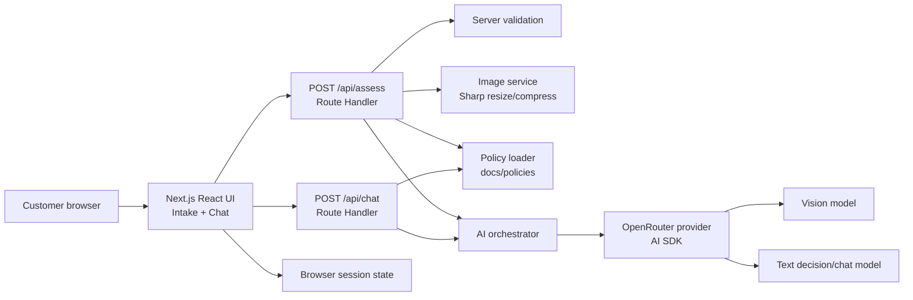
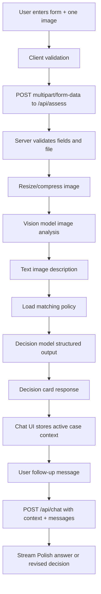
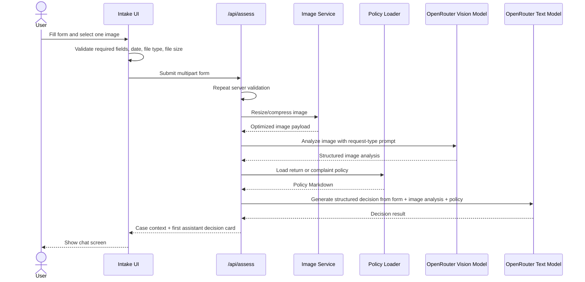
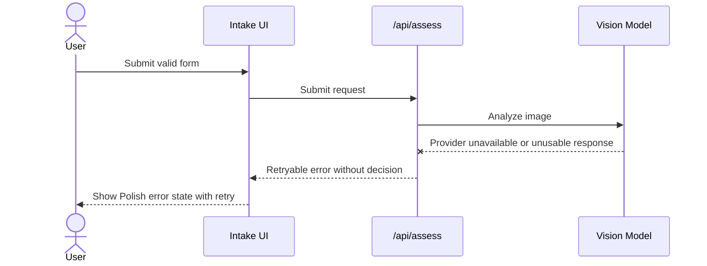

# ADR: Hardware Service Decision Copilot - Main Architecture

**Date:** 2026-06-18
**Status:** Accepted
**PRD:** [docs/PRD-Product-Requirements-Document.md](../PRD-Product-Requirements-Document.md)

---

## 1. Overview

Hardware Service Decision Copilot is a Polish-language self-service web application for preliminary return and complaint assessment for consumer electronics. The user submits a short intake form and exactly one product photo. The system analyzes the photo with a multimodal model, evaluates the case against the relevant policy document with a separate text/decision model, and opens a chat where the customer can ask follow-up questions or provide new information.

The decision is always advisory and non-binding. The implementation must never present the result as a final service decision or legal advice.

---

## 2. Resolved Requirements And Assumptions

The `create-adr` process normally requires clarification before writing. For this repository the following points are resolved from the PRD, prompt, and `.env.example`:

| Area | Decision / assumption |
|---|---|
| Framework | Next.js 16 App Router with TypeScript. |
| Runtime | Node.js runtime for server routes because image processing and provider SDK calls run server-side. |
| AI SDK | Vercel AI SDK for model calls, structured output, and streaming chat UI. |
| LLM provider | OpenRouter only for MVP. No direct OpenAI SDK integration unless added later by ADR. |
| Models | Separate OpenRouter model configuration for image analysis and for decision/chat. The existing `OPENROUTER_MODEL` remains a fallback/default. |
| Persistence | No database. Conversation state persists only for the active browser session until reload or new request. |
| Deployment | Local development first, compatible with Vercel/serverless deployment. |
| Security | No auth. API keys stay server-side only. Uploaded images are processed in memory and are not persisted. |
| Testing | TDD is required. If no test infrastructure exists, implementation must add it before production code. |

---

## 3. Context7 Library References

Implementing agents must use these handles to fetch current docs before writing code.

| Library | Context7 Handle | Used for |
|---|---|---|
| Next.js | `/vercel/next.js` | App Router, Route Handlers, Server/Client Component boundaries, runtime behavior. |
| Vercel AI SDK | `/vercel/ai` | `generateObject`, `streamText`, UI message streams, `@ai-sdk/react` chat hooks. |
| OpenRouter AI SDK Provider | `/openrouterteam/ai-sdk-provider` | OpenRouter provider configuration for AI SDK model calls. |
| Sharp | `/lovell/sharp` | Server-side image resize/compression for JPEG, PNG, and WebP. |
| Tailwind CSS | `/tailwindlabs/tailwindcss.com` | Styling and design-token implementation if Tailwind is selected during scaffold. |
| React | `/reactjs/react.dev` | Client component state and UI composition under Next.js. |

---

## 4. System Architecture

### Architecture Pattern

Single deployable Next.js full-stack application:

- Frontend: App Router page with client-side intake form and chat UI.
- Backend-for-frontend: Route Handlers under `app/api/*`.
- AI orchestration: server-only application services invoked by Route Handlers.
- Policy source: static Markdown files in `docs/policies/`, loaded server-side.
- Persistence: in-memory/browser-session state only; no database.

### Repository Structure

Expected implementation structure:

| Path | Purpose |
|---|---|
| `app/` | Next.js App Router pages, layouts, route handlers, and UI entry points. |
| `app/api/assess/route.ts` | Initial intake submission endpoint: validation, image compression, image analysis, decision generation. |
| `app/api/chat/route.ts` | Streaming follow-up chat endpoint with full case context supplied by the client. |
| `src/features/intake/` | Form UI, validation messages, request-type/category controls, upload component. |
| `src/features/chat/` | Chat thread UI, decision card rendering, composer, retry states. |
| `src/server/ai/` | OpenRouter provider factory, prompts, model selection, structured AI contracts. |
| `src/server/policies/` | Policy loading and policy-selection logic. |
| `src/server/image/` | Server-side image validation, metadata extraction, resize/compression. |
| `src/shared/contracts/` | Shared request/response types and decision enums. |
| `src/shared/i18n/` | Polish UI copy constants and decision labels. |
| `docs/policies/` | Return and complaint policies used as source-of-truth rules. |
| `docs/ADR/` | Architecture decisions for implementation agents. |

### Technology Stack

| Layer | Technology | Reason |
|---|---|---|
| Web app | Next.js 16 App Router | Supports a single full-stack TypeScript app with route handlers and Server Components by default. |
| UI | React + `@ai-sdk/react` | React handles form/chat interactivity; AI SDK UI primitives support streaming chat messages. |
| Styling | Tailwind CSS using `assets/design-tokens.json` | Aligns with existing design guidelines and supports fast responsive UI. |
| AI orchestration | Vercel AI SDK | Provides provider-agnostic model calls, structured output, and UI stream response contracts. |
| LLM provider | OpenRouter via `@openrouter/ai-sdk-provider` | One provider gateway with separately configurable multimodal and text models. |
| Image processing | Sharp | Mature Node image resizing/compression for JPEG, PNG, and WebP before model upload. |
| Persistence | Browser/session memory only | Matches PRD scope: active session survives navigation but not reload/new request. |
| Testing | Unit/integration/E2E stack added during scaffold | Required by repository TDD rules; exact test runner can follow the scaffold selected by the implementation agent. |

---

## 5. Module Structure And Dependencies

Dependency direction must be one-way:

1. UI features depend on shared contracts and Polish copy.
2. Route handlers depend on shared contracts and server services.
3. Server AI services depend on policy loading, image analysis output, AI SDK, and OpenRouter provider factory.
4. Shared contracts depend on no app modules.
5. Policy files are read by server-only code; they are never imported into client bundles.

| Module | Responsibility | Depends on | Used by |
|---|---|---|---|
| `intake-ui` | Form controls, single image picker, client validation, loading/error states. | shared contracts, Polish copy | root page |
| `chat-ui` | Decision card, message thread, composer, retry/new-request controls. | shared contracts, AI SDK React hooks | root page |
| `assessment-route` | Accept one form submission and return first decision. | validators, image service, AI orchestrator | intake UI |
| `chat-route` | Stream follow-up answers/revisions. | AI orchestrator, policy loader | chat UI |
| `image-service` | Validate format/size and resize/compress image. | Sharp | assessment route |
| `policy-service` | Load correct policy document by request type. | static Markdown files | AI orchestrator |
| `ai-orchestrator` | Run image analysis, decision generation, and chat continuation. | AI SDK, OpenRouter provider, policy service | route handlers |
| `contracts` | Decision enum, form fields, AI response shapes, error shapes. | none | UI and server |

No UI module may call OpenRouter directly. No client-side code may access provider keys or policy Markdown content unless the server has already transformed it into a decision/chat message.

---

## 6. Data Models

### Intake Submission

Purpose: the validated user input for initial assessment.

| Field | Type | Constraints |
|---|---|---|
| `requestType` | enum | Exactly `RETURN` or `COMPLAINT`; UI labels are `Zwrot` and `Reklamacja`. |
| `equipmentCategory` | enum | One of the PRD categories only. |
| `equipmentName` | string | Required, trimmed, non-empty. |
| `purchaseDate` | ISO date string | Required; cannot be in the future. |
| `reason` | string | Required for complaint; optional for return. |
| `image` | file | Exactly one JPEG, PNG, or WebP; max 10 MB before compression. |

### Image Analysis

Purpose: model-produced description of visual evidence.

| Field | Type | Constraints |
|---|---|---|
| `usable` | boolean | False when image is blurry, wrong subject, or too ambiguous. |
| `description` | string | Polish or neutral internal text accepted; final user output must be Polish. |
| `visibleDamage` | array of strings | Empty if no visible damage. |
| `conditionSignals` | array of strings | Use/resale/completeness signals for returns. |
| `likelyCause` | enum/string | For complaints: manufacturing, mechanical, liquid, wear, unclear. |
| `missingItems` | array of strings | Specific missing visual details if not usable. |
| `confidence` | low/medium/high | Low confidence must bias toward `NEEDS_MORE_INFO` or `ESCALATE`. |

### Decision Result

Purpose: structured result from the decision model.

| Field | Type | Constraints |
|---|---|---|
| `outcome` | enum | Exactly `APPROVE`, `REJECT`, `NEEDS_MORE_INFO`, `CONDITIONAL`, or `ESCALATE`. |
| `title` | string | Polish, concise, user-facing. |
| `justification` | string | Polish, references concrete policy reason. |
| `policyReferences` | array of strings | Human-readable section/rule labels from the injected policy. |
| `nextSteps` | array of strings | Polish actionable steps. |
| `missingInformation` | array of strings | Required when outcome is `NEEDS_MORE_INFO`. |
| `changedFromPrevious` | boolean | True only for revised chat decisions. |
| `disclaimer` | string | Polish mandatory non-binding disclaimer. |

### Active Case Context

Purpose: context sent to `/api/chat` for follow-up messages.

| Field | Type | Persistence |
|---|---|---|
| `caseId` | client-generated string | Browser session only. |
| `submission` | intake submission without raw file | Browser session only. |
| `imageAnalysis` | image analysis result | Browser session only. |
| `initialDecision` | decision result | Browser session only. |
| `messages` | UI message list | Browser session only. |

Raw uploaded images must not be kept in browser state after the initial request succeeds unless required for preview before submission.

---

## 7. API / Interface Contracts

### `POST /api/assess`

Initial form submission endpoint.

| Item | Contract |
|---|---|
| Input | `multipart/form-data` containing the intake fields and exactly one file field. |
| Success output | JSON containing `caseId`, sanitized submission snapshot, `imageAnalysis`, `decision`, and first assistant message data. |
| Validation errors | HTTP 400 with field-level errors for invalid request type, category, model name, future date, missing complaint reason, missing image, wrong format, too-large image, or multiple images. |
| AI errors | HTTP 502/503-style error shape with retry-safe message; no decision object returned. |
| Notes | Runs entirely server-side; compresses image before multimodal model call. |

### `POST /api/chat`

Streaming follow-up endpoint.

| Item | Contract |
|---|---|
| Input | JSON with `caseContext` and AI SDK UI messages. |
| Success output | AI SDK UI message stream. |
| Error output | Turn-level error shape suitable for retry; existing thread remains visible. |
| Notes | Must include form data, image analysis, initial decision, relevant policy, and full message history in the server-side prompt context. |

### Policy Loader Interface

| Item | Contract |
|---|---|
| Input | `requestType`. |
| Output | The exact Markdown content and metadata for either `docs/policies/polityka-zwrotow.md` or `docs/policies/polityka-reklamacji.md`. |
| Error | Hard server error if a policy file is missing; the app must not continue without policy rules. |

---

## 8. Environment Variables

Known variables from `.env.example`:

| Variable | Purpose | Required | Example value |
|---|---|---|---|
| `OPENROUTER_API_KEY` | Server-side OpenRouter API authentication. | Yes | `sk-or-your-openrouter-key-here` |
| `OPENROUTER_BASE_URL` | OpenRouter API base URL. | Yes | `https://openrouter.ai/api/v1` |
| `OPENROUTER_MODEL` | Backward-compatible default model fallback. | Yes until split vars are added | `openai/gpt-5.4-mini` |
| `PORT` | Local server port. | No | `3000` |
| `CONTEXT7_API_KEY` | Optional docs-aware coding support. | No | `ctx7sk-...` |

Implementation must add explicit split model variables to `.env.example` before code depends on them:

| Variable | Purpose | Required | Example value |
|---|---|---|---|
| `OPENROUTER_TEXT_MODEL` | Chat, decision, and policy reasoning model. | Yes | Same provider format as OpenRouter model IDs. |
| `OPENROUTER_VISION_MODEL` | Multimodal image-analysis model. | Yes | Must support image input via OpenRouter. |

Fallback rule: if a split model variable is missing in local development, `OPENROUTER_MODEL` may be used with a visible startup/server error warning. Production must require both split variables.

---

## 9. Technical Decisions

### Use A Single Next.js Full-Stack Application

**Status:** Accepted  
**Date:** 2026-06-18  
**Context:** The MVP has one customer-facing workflow, no separate admin system, and no persistent backend state. A separate API service would add operational overhead without solving a PRD requirement.  
**Decision:** Build a single Next.js 16 App Router application with Route Handlers for assessment and chat.  
**Rejected alternatives:**
- Separate backend service: rejected because the MVP has no independent backend scaling or persistence requirement.
- Static SPA only: rejected because provider keys, policy loading, image processing, and AI calls must stay server-side.
**Consequences:**
- (+) One deployable unit and simpler course implementation.
- (+) Server-side code can safely use provider keys and policy files.
- (-) Future back-office or audit requirements may require extracting backend services.
**Review trigger:** Revisit if persistent case storage, real human handoff, or admin workflows enter scope.

### Keep MVP Stateless Beyond Active Browser Session

**Status:** Accepted  
**Date:** 2026-06-18  
**Context:** The PRD explicitly excludes accounts, database persistence, and audit history. AC-27 requires only active-session context.  
**Decision:** Store active case context in client/browser state and send the necessary context with chat requests. Do not add a database in MVP.  
**Rejected alternatives:**
- SQLite/Postgres session store: rejected as explicitly out of scope.
- Server memory session store: rejected because it breaks under reloads/serverless instances and creates hidden persistence expectations.
**Consequences:**
- (+) Implementation remains small and transparent.
- (+) No personal case data is retained server-side.
- (-) Refresh loses the case, matching PRD but limiting usability.
**Review trigger:** Revisit when session persistence, auditability, or customer history becomes a requirement.

### Separate Image Analysis From Decision Reasoning

**Status:** Accepted  
**Date:** 2026-06-18  
**Context:** The PRD requires a multimodal model for photo analysis and a reasoning agent that combines image description, form data, and policies. The user explicitly requested separate multimodal and text/decision models.  
**Decision:** Run image analysis first with `OPENROUTER_VISION_MODEL`, then pass its textual result into a separate decision call using `OPENROUTER_TEXT_MODEL`. Chat follow-ups also use the text model.  
**Rejected alternatives:**
- One multimodal call for everything: rejected because it couples visual perception with policy reasoning and makes model selection/cost control harder.
- Client-side model calls: rejected because API keys and policies must not be exposed.
**Consequences:**
- (+) Better separation of concerns and testability.
- (+) Different models can be tuned for visual analysis and reasoning.
- (-) Two model calls increase latency and failure surface.
**Review trigger:** Revisit if latency targets cannot be met or a single model demonstrably outperforms the two-step flow.

### Structured Decisions Are Mandatory

**Status:** Accepted  
**Date:** 2026-06-18  
**Context:** AC-15 requires exactly one outcome from a fixed set, and the UI needs predictable decision-card rendering. Free-form text alone is too brittle.  
**Decision:** Use AI SDK structured output for image analysis and decision generation. The server validates every model result against the shared contract before returning it to the UI.  
**Rejected alternatives:**
- Parse unstructured assistant text: rejected because decision enum and missing-info behavior must be deterministic.
- Hard-code rule engine only: rejected because image interpretation and ambiguous-policy explanation require model reasoning.
**Consequences:**
- (+) UI rendering and tests can assert exact outcomes.
- (+) Invalid model output can fail safely instead of producing a fabricated decision.
- (-) Prompts and schemas must be maintained together.
**Review trigger:** Revisit if provider/model support for structured output is unreliable.

### User-Facing Polish Only

**Status:** Accepted  
**Date:** 2026-06-18  
**Context:** AC-31 requires all labels, validation messages, decisions, and chat output in Polish.  
**Decision:** All user-facing copy, prompt instructions for final messages, decision labels, validation messages, and errors must be Polish. Internal code identifiers and ADRs remain English.  
**Rejected alternatives:**
- Mixed English/Polish UI: rejected by PRD.
- Dynamic language selection: out of scope.
**Consequences:**
- (+) Meets target user expectations.
- (-) Tests must assert Polish copy fragments rather than generic English placeholders.
**Review trigger:** Revisit only if multilingual UI enters scope.

---

## 10. Diagrams

### 10.1 Architecture / Component Diagram

### 10.2 Data Flow Diagram

### 10.3 Initial Assessment Sequence

### 10.4 Service Failure Sequence

---

## 11. Testing Strategy

### Philosophy

Implementation must follow TDD. Tests define PRD behavior first, then production code is added until tests pass. AI calls are mocked for unit/integration tests except E2E, where the real stack is expected by the repository policy.

### Test Layers

| Layer | Type | Scope | Tools |
|---|---|---|---|
| Unit | Pure logic | Validators, decision enums, policy selection, error mapping, prompt input assembly. | Test runner selected during scaffold. |
| Integration | Route handlers | `/api/assess` and `/api/chat` with mocked external LLM provider only. | Next route-handler tests plus provider mocks. |
| Component | UI behavior | Form validation, file replacement, decision card rendering, retry states, chat composer. | React test tooling selected during scaffold. |
| E2E | Real browser flow | Happy path, rejection, needs-more-info, service error, new request. | Playwright. |

### Key Test Scenarios

| Scenario | What is tested | Expected behavior |
|---|---|---|
| Valid return approved | Return form within 14 days and clean image analysis. | `APPROVE` decision card in Polish with disclaimer. |
| Complaint reason missing | Complaint submitted without reason. | Inline Polish validation error; submission blocked. |
| Future purchase date | Any request with future date. | Inline Polish validation error; no API call. |
| Wrong image format | Non-JPEG/PNG/WebP file. | Field error naming accepted formats. |
| Oversized image | File over 10 MB. | Field error stating 10 MB limit. |
| Image model failure | Provider unavailable or unusable image output. | Error state with retry; no fabricated decision. |
| Ambiguous image | Image analysis says unusable/low confidence. | `NEEDS_MORE_INFO` or `ESCALATE`, never `APPROVE`/`REJECT`. |
| Off-topic chat | User asks unrelated task. | Agent declines in Polish and redirects to the case. |
| Revised recommendation | User adds relevant new information. | Response clearly states recommendation changed and why. |
| Start new request | User starts over. | Previous form and chat state cleared. |

### Technical Acceptance Criteria

- TAC-000-01: No client-side bundle contains `OPENROUTER_API_KEY`, policy Markdown content, or provider configuration secrets.
- TAC-000-02: `/api/assess` rejects invalid input before any LLM call.
- TAC-000-03: Image analysis failure cannot produce a decision response.
- TAC-000-04: Every decision response contains exactly one allowed outcome and the mandatory Polish disclaimer.
- TAC-000-05: Chat continuation always includes submission snapshot, image analysis, initial decision, relevant policy, and message history in server-side context.
- TAC-000-06: Reload or new request clears active case context, matching PRD active-session scope.
