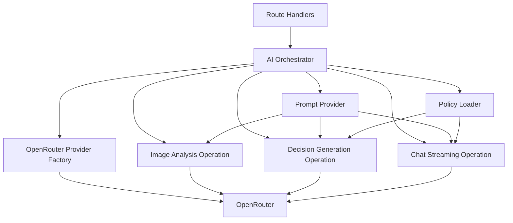
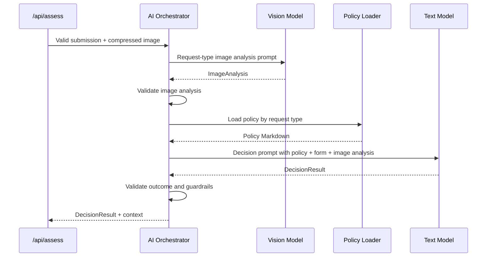
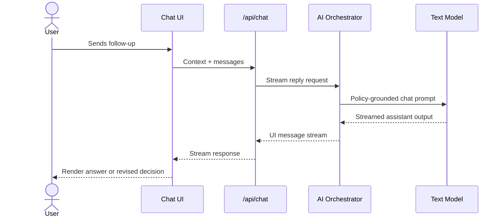

# ADR-001: AI Orchestration

**Date:** 2026-06-18
**Status:** Accepted
**Relates to:** [docs/ADR/000-main-architecture.md](000-main-architecture.md)

---

## 1. Scope

This ADR covers the AI call graph, model separation, prompt responsibilities, structured output contracts, policy grounding, chat continuation, and failure handling.

It does not cover visual UI layout, CSS, or image compression internals except where they affect AI input.

---

## 2. Context7 References

| Library | Context7 Handle | Used for |
|---|---|---|
| Vercel AI SDK | `/vercel/ai` | Structured output, streaming text, AI SDK UI message streams. |
| OpenRouter AI SDK Provider | `/openrouterteam/ai-sdk-provider` | `createOpenRouter`, model selection, provider routing, OpenRouter-specific settings. |
| Next.js | `/vercel/next.js` | Route Handler boundaries for server-only AI calls. |

Research notes from Context7:

- AI SDK supports Next.js Route Handlers that stream chat responses with `streamText`, UI message streams, and `@ai-sdk/react` consumption.
- AI SDK supports structured generation through schema-constrained output.
- OpenRouter's AI SDK provider supports provider creation with API key/base URL, model selection, chat models, provider routing, and structured output through AI SDK.

---

## 3. Component Design

### AI Orchestrator Responsibilities

The AI orchestrator is server-only and exposes three conceptual operations:

| Operation | Input | Output | Model |
|---|---|---|---|
| `analyzeImageForCase` | Request type, compressed image, category/model/reason/date summary. | `ImageAnalysis`. | `OPENROUTER_VISION_MODEL`. |
| `generateInitialDecision` | Intake submission, image analysis, selected policy. | `DecisionResult`. | `OPENROUTER_TEXT_MODEL`. |
| `streamCaseChatReply` | Active case context, selected policy, message history, latest user message. | AI SDK UI stream. | `OPENROUTER_TEXT_MODEL`. |

### Prompt Inventory

Prompts must be stored server-side and versionable. Each prompt has one owner and one output contract.

| Prompt | Used when | Must include |
|---|---|---|
| Return image-analysis prompt | `requestType = RETURN` | Determine resale condition, visible use, damage, completeness signals, photo usability. |
| Complaint image-analysis prompt | `requestType = COMPLAINT` | Determine visible damage, damage type, likely cause, whether manufacturing/user-caused/liquid/mechanical/wear/unclear. |
| Return decision prompt | Initial return assessment. | Return policy, 14-day rule, condition/resale rules, non-binding constraint, decision enum. |
| Complaint decision prompt | Initial complaint assessment. | Complaint policy, 2-year rule, exclusions, diagnosis hierarchy, non-binding constraint, decision enum. |
| Chat continuation prompt | Follow-up chat. | Full active case context, initial decision, policy, off-topic refusal rule, revision rules. |

### Policy Grounding

The policy document is the only rule source for the decision prompt:

| Request type | Policy file |
|---|---|
| `RETURN` | `docs/policies/polityka-zwrotow.md` |
| `COMPLAINT` | `docs/policies/polityka-reklamacji.md` |

The model must be instructed not to invent deadlines, rights, exceptions, or remedies outside the injected policy. If the policy does not cover a case, the correct outcomes are `ESCALATE` or `NEEDS_MORE_INFO`.

---

## 4. Data Structures

### Image Analysis Contract

| Field | Requirement |
|---|---|
| `usable` | Required boolean. False when the image cannot support assessment. |
| `description` | Required text summary of the visible product and condition. |
| `visibleDamage` | Required list; empty when none visible. |
| `conditionSignals` | Required list of resale/use/completeness indicators. |
| `likelyCause` | Required for complaint; may be `unclear`. |
| `missingItems` | Required list; non-empty when `usable=false`. |
| `confidence` | Required `low`, `medium`, or `high`. |

Guardrail: if `usable=false` or `confidence=low`, the next decision call must not return `APPROVE` or `REJECT` unless there is overwhelming non-visual policy evidence such as a missed deadline. Prefer `NEEDS_MORE_INFO` or `ESCALATE`.

### Decision Contract

| Field | Requirement |
|---|---|
| `outcome` | Exactly one of `APPROVE`, `REJECT`, `NEEDS_MORE_INFO`, `CONDITIONAL`, `ESCALATE`. |
| `justification` | Must cite the concrete policy reason in plain Polish. |
| `policyReferences` | Must identify the relevant policy sections/rules in user-readable terms. |
| `nextSteps` | Must be action-oriented and Polish. |
| `missingInformation` | Required and specific for `NEEDS_MORE_INFO`; empty otherwise. |
| `disclaimer` | Must state that the assessment is preliminary/non-binding and final decision belongs to service team. |

### Chat Message Contract

Chat messages follow AI SDK UI message shape during streaming. The implementation must define the application-level message type so the decision-card payload and plain text messages are rendered predictably.

---

## 5. Interface Contracts

### OpenRouter Provider Factory

| Input | Output | Constraints |
|---|---|---|
| Environment variables | Provider instance and model selectors. | Reads env only on server. Validates key/base URL/model names before calls. |

### Image Analysis Interface

| Input | Output | Errors |
|---|---|---|
| `requestType`, compressed image bytes/base64, submission summary | `ImageAnalysis` | Provider unavailable, unsupported model capability, invalid structured output, unsafe/unusable image. |

### Initial Decision Interface

| Input | Output | Errors |
|---|---|---|
| Submission, image analysis, selected policy | `DecisionResult` | Provider unavailable, invalid structured output, missing policy, decision violates guardrails. |

### Chat Interface

| Input | Output | Errors |
|---|---|---|
| Active case context, policy, UI message history | Streaming assistant reply | Provider unavailable, context missing, off-topic handling failure. |

---

## 6. Technical Decisions

### Use OpenRouter Through The AI SDK Provider

**Status:** Accepted  
**Date:** 2026-06-18  
**Context:** The user requires OpenRouter as the LLM provider, while the stack requires Vercel AI SDK. Context7 confirms an OpenRouter provider for AI SDK exists and supports model creation, provider routing, and structured generation through AI SDK.  
**Decision:** Use the OpenRouter AI SDK provider as the only model gateway in MVP.  
**Rejected alternatives:**
- Direct OpenRouter REST calls: rejected because it bypasses AI SDK streaming/structured-output integration.
- Direct OpenAI provider: rejected because the prompt requires OpenRouter.
**Consequences:**
- (+) One provider abstraction for text, vision, and chat.
- (+) Easier future model switching by env var.
- (-) Feature support depends on OpenRouter and selected upstream model capability.
**Review trigger:** Revisit if the selected OpenRouter models do not support required structured/multimodal behavior.

### Use Three Distinct AI Steps

**Status:** Accepted  
**Date:** 2026-06-18  
**Context:** The PRD separates image analysis, policy decision, and chat continuation. Combining them would make failure handling and testing ambiguous.  
**Decision:** Implement image analysis, initial decision, and follow-up chat as separate AI operations with separate prompts and contracts.  
**Rejected alternatives:**
- Single all-in-one prompt: rejected because AC-14 requires retaining image description as conversation context.
- Chat-only workflow: rejected because the first assistant message must be a structured decision card after form submission.
**Consequences:**
- (+) Clear AC mapping and easier tests.
- (+) Image analysis can fail without fabricating a decision.
- (-) More orchestration code and latency.
**Review trigger:** Revisit if end-to-end response time becomes unacceptable for demos.

### Fail Closed On Invalid Model Output

**Status:** Accepted  
**Date:** 2026-06-18  
**Context:** The product handles policy-sensitive customer expectations. Invalid AI output is worse than a visible temporary error.  
**Decision:** If structured output validation fails, the server returns a retryable error or `NEEDS_MORE_INFO` only when the model explicitly provided missing-info content. It must not repair meaning by guessing.  
**Rejected alternatives:**
- Best-effort text parsing: rejected as unreliable and hard to test.
- Default to `ESCALATE` on every invalid output: rejected because it hides provider/schema defects during development.
**Consequences:**
- (+) Prevents fabricated decisions.
- (-) Users may see more retry errors when model/provider behavior is unstable.
**Review trigger:** Revisit after repeated valid-user failures caused by strict output validation.

### Chat May Revise But Must Explain The Change

**Status:** Accepted  
**Date:** 2026-06-18  
**Context:** AC-25 allows revised recommendations when the user provides relevant new information.  
**Decision:** The chat prompt must allow revised decisions only when new information affects a policy rule or evidence confidence. Revised recommendations must explicitly say the recommendation changed, why it changed, and remain non-binding.  
**Rejected alternatives:**
- Lock the first decision forever: rejected by AC-25.
- Allow silent changes: rejected because it would confuse the customer.
**Consequences:**
- (+) Chat can handle missing-info and clarification flows.
- (-) Requires tests for revision wording and decision state.
**Review trigger:** Revisit if revisions become too frequent or inconsistent.

---

## 7. Diagrams

### Component Diagram

### Initial Decision Sequence

### Chat Continuation Sequence

---

## 8. Testing Strategy

### Test Scenarios For This Area

| Scenario | Type | Input | Expected output | Edge cases |
|---|---|---|---|---|
| Return image prompt selected | Unit | `requestType=RETURN` | Return image-analysis prompt used. | Category `Audio/Sluchawki`, hygiene seal constraints. |
| Complaint image prompt selected | Unit | `requestType=COMPLAINT` | Complaint damage/cause prompt used. | Mechanical vs manufacturing ambiguity. |
| Policy selected by type | Unit | Return/complaint request type. | Correct Markdown policy loaded. | Missing file fails closed. |
| Decision enum constrained | Unit/integration | Mock model returns invalid outcome. | Server rejects output. | Lowercase or unknown values. |
| Needs info guardrail | Unit/integration | Image unusable + model tries approve. | Server rejects or coerces to safe failure path according to implementation contract. | Deadline already exceeded can still reject by non-visual rule. |
| Chat off-topic | Integration | User asks unrelated task. | Polish refusal and redirect to case. | Legal advice request. |
| Revision | Integration | New relevant info changes outcome. | Assistant states changed decision and reason. | New info is irrelevant: no revision. |

### Technical Acceptance Criteria

- TAC-001-01: OpenRouter provider configuration is created only in server code.
- TAC-001-02: Image analysis uses the vision model env var; decision and chat use the text model env var.
- TAC-001-03: Decision generation includes exactly one selected policy document and never both policies.
- TAC-001-04: All decision and chat user-facing output is Polish.
- TAC-001-05: Invalid model output cannot reach the UI as a successful decision.
- TAC-001-06: Follow-up chat receives full case context on every request.
