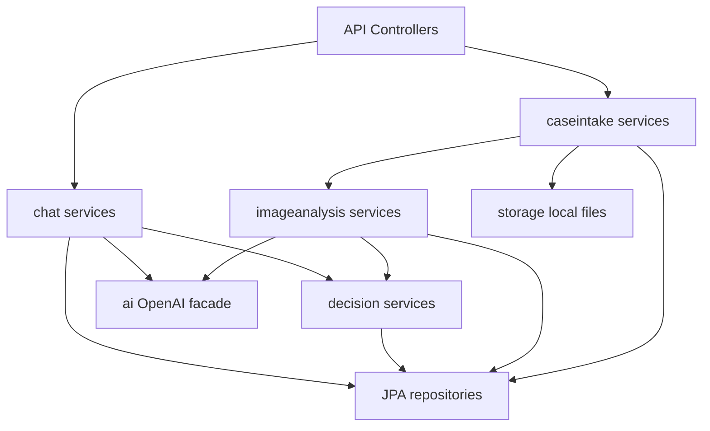
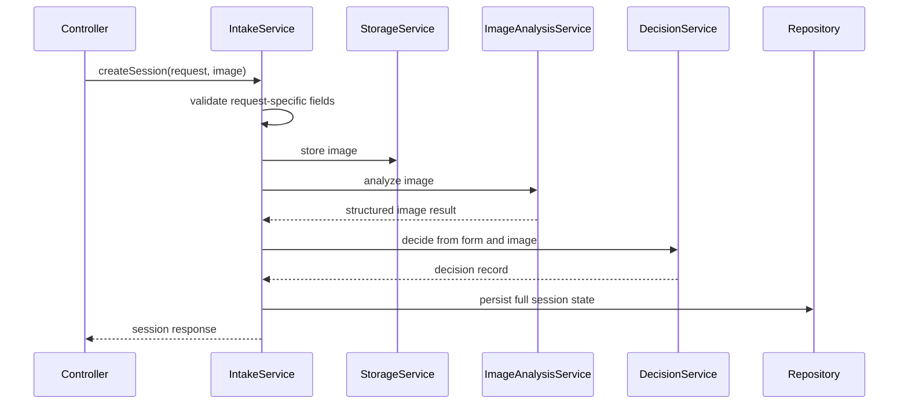

# ADR-001: Backend API and Spring Module Design

**Date:** 2026-06-17
**Status:** Accepted
**Relates to:** `docs/ADR/000-main-architecture.md`

---

## 1. Scope

This ADR covers the Java 21 Spring Boot backend, REST API, validation, transaction boundaries, module ownership, error format, and local runtime behavior. It does not cover detailed frontend UI composition or OpenAI prompt content; those are handled in ADR-002 and ADR-003.

---

## 2. Context7 References

| Library | Context7 Handle | Used for |
|---|---|---|
| Spring Boot | `/spring-projects/spring-boot` | REST API, validation, multipart, configuration, Docker Compose |
| OpenAI Java SDK | `/openai/openai-java` | AI adapter boundary |
| JUnit 5 | Resolve before implementation | Unit testing |
| Testcontainers | Resolve before implementation | PostgreSQL integration tests |

---

## 3. Component Design

### Backend Structure

Use one Spring Boot application under `app/backend/`.

Package by feature:

| Package | Responsibility |
|---|---|
| `com.jsystems.bestservice.caseintake` | Session creation, form validation, image attempt orchestration |
| `com.jsystems.bestservice.imageanalysis` | Image analysis command service and image evaluability results |
| `com.jsystems.bestservice.decision` | Deterministic PRD rule engine and decision versioning |
| `com.jsystems.bestservice.chat` | Chat message persistence and follow-up handling |
| `com.jsystems.bestservice.ai` | OpenAI facade and model response mapping |
| `com.jsystems.bestservice.storage` | Local image storage |
| `com.jsystems.bestservice.common.api` | Error response model and controller advice |
| `com.jsystems.bestservice.common.config` | Type-safe configuration properties |

### Patterns

- Use constructor injection only.
- Use DTOs for API input/output; never expose JPA entities.
- Use Bean Validation for request DTOs and service-level validation for request-type-specific rules.
- Use `@Transactional` on application service methods that change session, image, decision, or chat state.
- Use a global exception handler returning one consistent error shape.
- Use type-safe configuration properties for OpenAI, upload, CORS, and frontend settings.
- Keep domain rule decisions deterministic and testable without Spring context.

### Transaction Boundaries

| Operation | Transaction rule |
|---|---|
| Create session | One transaction for DB records after file is safely stored |
| Image retry | One transaction for image metadata, analysis, and session status |
| Decision generation | Same transaction as session/image attempt update |
| Chat message | One transaction for customer message, AI result, optional decision update, system message |
| File storage | Filesystem write occurs before DB commit; failures must prevent session creation |

If a DB commit fails after file write, the service must attempt best-effort local file cleanup and log cleanup failure.

---

## 4. Data Structures

### Request DTOs

`CreateSessionRequest`:

- `requestType`: `complaint` or `return`.
- `equipmentCategory`: one PRD category.
- `equipmentNameOrModel`: 1-200 characters.
- `purchaseDate`: ISO date, not future.
- `reason`: required for complaint, max 4000 characters.
- `image`: one multipart image.

`CreateImageAttemptRequest`:

- `image`: one multipart image.

`CreateChatMessageRequest`:

- `contentPl`: 1-4000 characters.

### Response DTOs

`SessionResponse`:

- `sessionId`.
- `requestType`.
- `status`.
- `terminalState`.
- `imageAttemptCount`.
- `remainingImageAttempts`.
- `latestDecision`.
- `imageRetry`.
- `messages`.

`DecisionResponse`:

- `status`: `approved`, `rejected`, or `human_verification_required`.
- `rejectionType`: nullable.
- `rejectionReasonPl`: nullable.
- `justificationPl`.
- `nextStepsPl`.
- `ruleCategory`.
- `version`.

`ApiErrorResponse`:

- `code`: stable machine-readable code.
- `messagePl`: user-facing Polish message when safe.
- `fieldErrors`: optional map of field names to Polish messages.
- `traceId`: request correlation id.

---

## 5. Interface Contracts

### Session Controller

`POST /api/sessions`

- Accepts multipart form.
- Returns `201` with `SessionResponse`.
- Blocks missing required fields before calling OpenAI.
- Must reject more than one image.

`POST /api/sessions/{sessionId}/image-attempts`

- Accepts multipart image only.
- Returns `200` with updated `SessionResponse`.
- Must return `409` if the session is not in `IMAGE_RETRY_REQUIRED`.

`GET /api/sessions/{sessionId}`

- Returns full active session state.
- Must return `404` for unknown session id.

### Chat Controller

`POST /api/sessions/{sessionId}/chat/messages`

- Accepts customer text.
- For MVP may return a complete response body or stream text chunks; the endpoint contract must be stable before frontend implementation.
- Must persist both customer and system messages.
- Must reject empty, oversized, or unknown-session messages.

### Error Codes

| Code | HTTP | Meaning |
|---|---:|---|
| `VALIDATION_FAILED` | 400 | Field validation failed |
| `UNSUPPORTED_IMAGE_TYPE` | 415 | Image MIME type not allowed |
| `IMAGE_TOO_LARGE` | 413 | Image exceeds configured size |
| `SESSION_NOT_FOUND` | 404 | Session id unknown |
| `SESSION_STATE_CONFLICT` | 409 | Operation invalid for current state |
| `AI_PROVIDER_UNAVAILABLE` | 502 | OpenAI request failed or timed out |
| `INTERNAL_ERROR` | 500 | Unexpected backend failure |

---

## 6. Technical Decisions

### Use Spring MVC, Not WebFlux, for MVP

**Status:** Accepted
**Date:** 2026-06-17
**Context:** The MVP is request/response-heavy with one optional streaming chat endpoint. The team is Java-oriented and needs clarity.
**Decision:** Use Spring MVC. Streaming can use response streaming or SSE where needed.
**Rejected alternatives:**
- WebFlux: stronger reactive streaming model, but adds complexity not required by MVP.
- Servlet-free external AI gateway: unnecessary for local course deployment.
**Consequences:**
- (+) Simpler controllers, validation, JPA transactions, and tests.
- (-) Long-running AI calls occupy request threads.
**Review trigger:** Revisit if concurrent AI chat usage becomes a bottleneck.

### Use Deterministic Rule Engine Before and After AI

**Status:** Accepted
**Date:** 2026-06-17
**Context:** The PRD contains strict rules. The system must not invent policy exceptions.
**Decision:** AI produces structured observations and Polish explanations, but final decision status and rejection type must be validated by deterministic backend rules.
**Rejected alternatives:**
- Let LLM decide everything: faster prototype, but violates strict consistency requirement.
- Hardcode all explanations without AI: consistent, but weak at interpreting images and follow-up text.
**Consequences:**
- (+) Decisions are testable and explainable.
- (-) Requires careful mapping between AI observations and rule categories.
**Review trigger:** Revisit if business rules become too complex for direct service logic.

### Use One Consistent API Error Shape

**Status:** Accepted
**Date:** 2026-06-17
**Context:** Frontend must show Polish validation messages near fields and chat-safe failure messages.
**Decision:** All API errors return `ApiErrorResponse` with stable `code`, Polish `messagePl`, optional `fieldErrors`, and `traceId`.
**Rejected alternatives:**
- Default Spring errors: inconsistent and often English.
- Per-controller error formats: brittle frontend handling.
**Consequences:**
- (+) Frontend error handling is predictable.
- (-) Requires global exception mapping from the beginning.
**Review trigger:** Revisit only if OpenAPI generation imposes a better shared schema.

---

## 7. Diagrams

### Component Diagram

### Sequence Diagram

---

## 8. Testing Strategy

### Test Scenarios

| Scenario | Type | Input | Expected output | Edge cases |
|---|---|---|---|---|
| Complaint required reason | Unit/API | Complaint without reason | `VALIDATION_FAILED` | Blank string, whitespace |
| Return optional reason | Unit/API | Return without reason | Accepted validation | Empty string normalized |
| File type validation | Unit/API | PDF or executable upload | `UNSUPPORTED_IMAGE_TYPE` | Fake extension with wrong MIME |
| Image size validation | Unit/API | Image above configured cap | `IMAGE_TOO_LARGE` | Boundary at exact cap |
| Session creation transaction | Integration | Valid session | DB records persisted | File cleanup on failure |
| Retry state conflict | Integration | Retry image for decided session | `SESSION_STATE_CONFLICT` | Unknown session |
| API error shape | API | Any validation error | Stable `ApiErrorResponse` | Field and non-field errors |

### Technical Acceptance Criteria

- TAC-001-01: All controller inputs use DTOs with validation.
- TAC-001-02: No JPA entity is serialized directly in any controller response.
- TAC-001-03: Every mutation endpoint has a transaction boundary in an application service.
- TAC-001-04: Multipart defaults are overridden by explicit `MAX_IMAGE_SIZE_MB`.
- TAC-001-05: Every API error includes a stable code and trace id.
