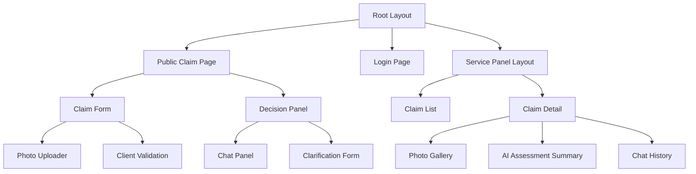
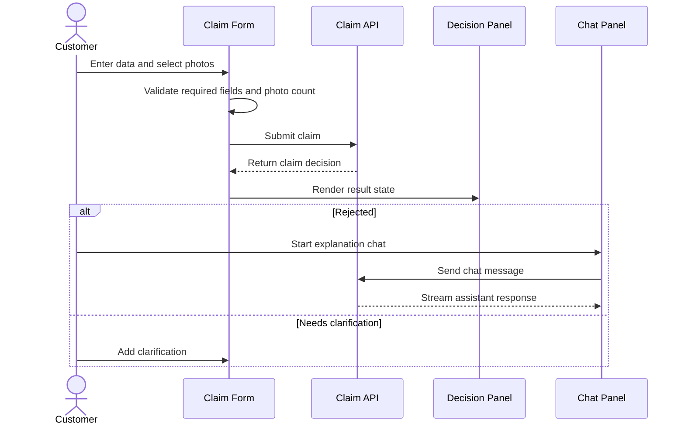

# ADR-001: Frontend UI

**Date:** 2026-06-17
**Status:** Accepted
**Relates to:** `docs/ADR/000-main-architecture.md`

---

## 1. Scope

This ADR covers the customer-facing UI, staff service panel UI, chat UI, styling system, and frontend state boundaries. It does not cover backend persistence, AI prompting, or authentication internals.

---

## 2. Context7 References

| Library | Context7 Handle | Used for |
|---|---|---|
| Next.js | `/vercel/next.js` | App Router, route organization, forms |
| React | `/reactjs/react.dev` | Components and client state |
| Tailwind CSS | `/tailwindlabs/tailwindcss.com` | Utility styling and theme variables |

---

## 3. Component Design

### Route Groups

| Route Area | Purpose |
|---|---|
| Public claim route | First screen, claim form, analysis state, decision state, clarification state |
| Claim detail route | Decision summary and rejected-claim chat entry |
| Service panel route | Protected list and detail views for seller/technician |
| Login route | Staff credentials login |

### UI Component Groups

| Component Group | Responsibility |
|---|---|
| Form controls | Text inputs, textarea, select, file picker, validation messages |
| Claim form | Collect equipment type, brand, model, description, circumstances, photos |
| Photo uploader | Enforce 1-5 photos, show previews, remove selected photo before submit |
| Decision panel | Show accepted, rejected, or needs clarification state |
| Chat panel | Stream assistant messages and persist conversation state after completion |
| Service table | List claims with status, date, decision, service-review flag |
| Service detail | Show full claim, photos, AI assessment, chat history |
| Status badges | Map claim status and AI decision to consistent visual language |

### State Management

Use local React state for transient form and chat UI state. Use server responses as source of truth after submission. Do not introduce a global client state library for the MVP.

---

## 4. Data Structures

### Claim Form State

Fields:

- `equipmentType`: fixed `bicycle`.
- `brand`: string.
- `model`: string.
- `problemDescription`: string.
- `damageCircumstances`: string.
- `photos`: browser `File` list, maximum 5.

### Decision View Model

Fields:

- `claimId`.
- `decision`.
- `damageType`.
- `reasoningSummary`.
- `requiresServiceReviewOption`.
- `canStartChat`.
- `clarificationPrompt`, present only for clarification state.

### Service Claim Row

Fields:

- `claimId`.
- `brand`.
- `model`.
- `status`.
- `decision`.
- `createdAt`.
- `serviceReviewRequested`.

---

## 5. Interface Contracts

The frontend consumes API contracts defined in `000-main-architecture.md` and `002-backend-api.md`.

Frontend validation must mirror backend validation but must not replace it. Backend validation remains authoritative.

---

## 6. Technical Decisions

### Use Tailwind CSS theme variables backed by design tokens

**Status:** Accepted  
**Date:** 2026-06-17

**Context:** The project already has `assets/design-tokens.json` and `docs/design-guidelines.md` derived from the requested visual direction. Tailwind docs support theme variables that compile to CSS variables.

**Decision:** Configure Tailwind tokens from the design system and expose them as CSS variables for colors, spacing, radius, and typography.

**Rejected alternatives:**

- Plain CSS modules only: rejected because the requested stack includes TailwindCSS.
- Runtime CSS-in-JS: rejected because it adds runtime complexity and is unnecessary for the MVP.

**Consequences:**

- (+) UI implementation remains fast and consistent.
- (+) Design tokens are usable in custom CSS when utility classes are not enough.
- (-) Developers must avoid arbitrary one-off utility values that drift from tokens.

**Review trigger:** Revisit if the app grows into a formal component library.

### Keep the first screen functional, not a marketing landing page

**Status:** Accepted  
**Date:** 2026-06-17

**Context:** The design direction is visually strong, but the PRD requires the form as the first screen. A marketing hero would slow the primary workflow.

**Decision:** The first screen contains the claim form immediately, with visual treatment inspired by the design system.

**Rejected alternatives:**

- Full landing page before form: rejected because it violates the PRD first-screen requirement.
- Plain admin-style form: rejected because the user requested a distinctive visual direction.

**Consequences:**

- (+) Users can start the claim immediately.
- (+) The app still has a clear visual identity.
- (-) Hero-style typography must be constrained so it does not reduce form usability.

**Review trigger:** Revisit if the app later adds a public marketing website separate from the product.

---

## 7. Diagrams

### Component Diagram

### Sequence Diagram

---

## 8. Testing Strategy

### Test Scenarios

| Scenario | Type | Input | Expected output | Edge cases |
|---|---|---|---|---|
| Empty form | Component | No fields | Polish validation messages | Missing photos and text |
| Too many photos | Component | 6 files | Submission blocked | Remove photo re-enables submission |
| Rejected decision | Component | Rejected API fixture | Chat CTA visible | Accepted decision hides chat CTA |
| Staff list | Component | Claims fixture | Rows and statuses visible | Empty state |
| Chat stream | Component/integration | Streaming chunks | Message updates live | Provider error state |

### Technical Acceptance Criteria

- TAC-001-01: The claim form is visible on first page load.
- TAC-001-02: The photo uploader prevents selecting more than 5 files.
- TAC-001-03: Every validation message rendered by the frontend is Polish.
- TAC-001-04: Rejected decisions render both chat and service-review actions.
- TAC-001-05: Staff panel pages are not reachable without authenticated session.
