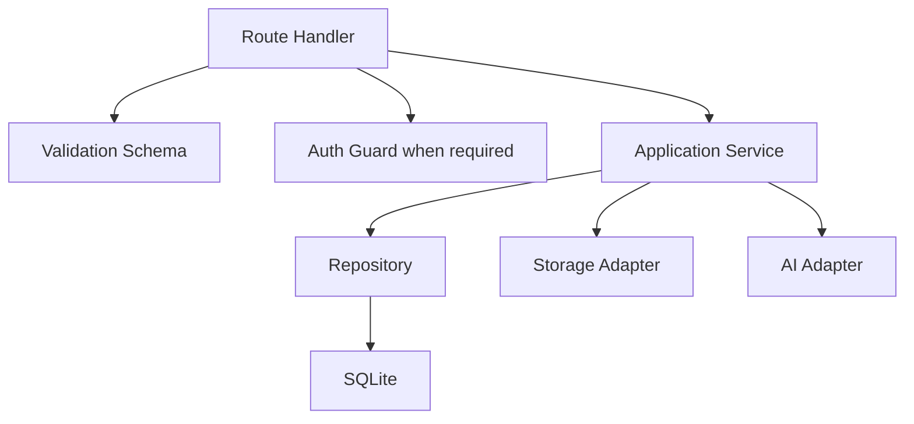
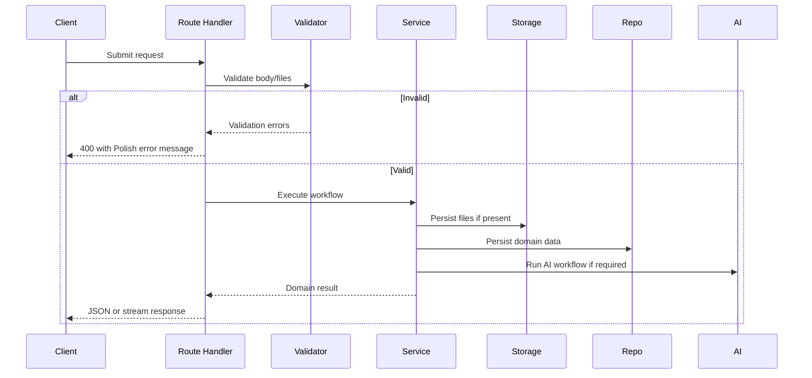

# ADR-002: Backend API

**Date:** 2026-06-17
**Status:** Accepted
**Relates to:** `docs/ADR/000-main-architecture.md`

---

## 1. Scope

This ADR covers backend route handlers, service-layer boundaries, validation, error handling, and interface contracts. It does not cover AI prompt design in detail, UI implementation, or database schema migrations.

---

## 2. Context7 References

| Library | Context7 Handle | Used for |
|---|---|---|
| Next.js | `/vercel/next.js` | Route Handlers, Server Actions, request/response boundaries |
| Prisma | `/prisma/web` | Persistence access through repositories |
| Auth.js | `/websites/authjs_dev` | Session checks for protected APIs |

---

## 3. Component Design

### Backend Layers

| Layer | Responsibility |
|---|---|
| Route Handlers | HTTP parsing, auth checks, response shaping |
| Validation Schemas | Input constraints for forms, files, chat, staff actions |
| Services | Business workflows and status transitions |
| Repositories | Database read/write operations |
| Storage Adapter | Photo persistence and URL resolution |
| AI Adapter | Preliminary assessment and chat generation |

Route handlers must not contain business decision logic beyond request parsing and auth enforcement.

---

## 4. Data Structures

### API Error Shape

Fields:

- `code`: stable machine-readable string.
- `message`: Polish user-facing message when returned to UI.
- `details`: optional field-specific validation errors.

### Assessment Result Shape

Fields:

- `decision`: `accepted`, `rejected`, `needs_clarification`.
- `damageType`: `mechanical` or `unknown`.
- `confidence`: `low`, `medium`, `high`.
- `reasoningSummary`: Polish text.
- `photoEvidenceSummary`: Polish text.
- `descriptionEvidenceSummary`: Polish text.
- `serviceReviewRecommended`: boolean.

---

## 5. Interface Contracts

### `POST /api/claims`

Receives multipart form data. Creates claim, stores images, runs AI assessment, and returns the first decision.

Validation:

- `equipmentType` must equal `bicycle`.
- `brand`, `model`, `problemDescription`, and `damageCircumstances` are required.
- `photos` count must be between 1 and 5.
- Files must be accepted image MIME types.

Atomicity:

- If validation fails, no files or database records are created.
- If storage succeeds but database creation fails, stored files must be cleaned up.
- If AI assessment fails after claim creation, claim status becomes `submitted` and staff panel marks assessment as unavailable.

### `POST /api/claims/{claimId}/clarifications`

Adds additional explanation and optionally additional photos. Re-runs assessment.

Validation:

- Claim must exist.
- Total photo count after upload must not exceed 5.
- Clarification text is required.

### `POST /api/claims/{claimId}/service-review`

Marks claim as requiring service review.

Validation:

- Claim must exist.
- Claim status must be `preliminarily_rejected`, `needs_clarification`, or `submitted`.

### `GET /api/service/claims`

Protected route. Returns paginated claim summaries.

Validation:

- Authenticated staff session required.
- Query pagination values must be bounded.

### `GET /api/service/claims/{claimId}`

Protected route. Returns complete claim detail.

Validation:

- Authenticated staff session required.
- Claim must exist.

### `POST /api/claims/{claimId}/chat`

Streams AI response for rejected-claim explanation.

Validation:

- Claim must exist.
- Latest assessment decision must be `rejected`.
- User message must be non-empty and within configured length limit.

---

## 6. Technical Decisions

### Use Route Handlers for API boundaries

**Status:** Accepted  
**Date:** 2026-06-17

**Context:** The app needs multipart submission, streaming chat, protected staff APIs, and service actions. Next.js App Router Route Handlers provide HTTP method boundaries in the same application.

**Decision:** Use Route Handlers for all public and protected API endpoints. Use Server Actions only for small authenticated mutations where streaming or multipart parsing is not required.

**Rejected alternatives:**

- Server Actions for everything: rejected because streaming chat and multipart/API contracts are clearer as route handlers.
- Separate Express backend: rejected because it adds another runtime and deployment surface.

**Consequences:**

- (+) API contracts are explicit and testable.
- (+) Streaming endpoints fit naturally.
- (-) Developers must keep route handlers thin to avoid business logic leakage.

**Review trigger:** Revisit if external clients need versioned public APIs.

### Validate all inputs on the server

**Status:** Accepted  
**Date:** 2026-06-17

**Context:** Frontend validation improves UX, but API endpoints remain the trusted boundary. File upload and AI classification must not run for invalid input.

**Decision:** Every route handler validates input before calling storage, persistence, or AI.

**Rejected alternatives:**

- Client-only validation: rejected because it is bypassable.
- Validation inside repositories: rejected because repositories should not know UI/API semantics.

**Consequences:**

- (+) Predictable errors and safer storage.
- (+) Tests can target validation independently.
- (-) Validation schemas must be kept aligned with UI messages.

**Review trigger:** Revisit if validation is shared with multiple clients.

---

## 7. Diagrams

### Component Diagram

### Sequence Diagram

---

## 8. Testing Strategy

### Test Scenarios

| Scenario | Type | Input | Expected output | Edge cases |
|---|---|---|---|---|
| Submit valid claim | Integration | Valid form + 1 photo | Claim and assessment persisted | 5 photos |
| Submit no photos | Integration | Valid text + no files | 400 error | Empty file field |
| Storage failure | Integration | Valid request, storage error | No partial DB claim | Cleanup attempted |
| AI failure | Integration | Valid request, AI unavailable | Claim stored, assessment unavailable | Staff panel visibility |
| Staff API unauthenticated | Integration | No session | 401 or redirect contract | Expired session |

### Technical Acceptance Criteria

- TAC-002-01: API validation rejects invalid payloads before any AI call.
- TAC-002-02: Claim submission with 6 photos returns a validation error.
- TAC-002-03: Staff APIs require authenticated session.
- TAC-002-04: Route handlers return stable error codes.
- TAC-002-05: Streaming chat endpoint only accepts rejected claims.
