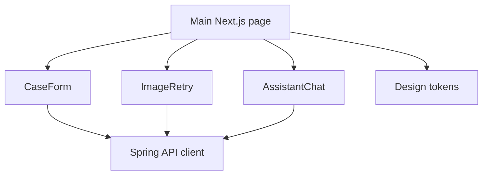
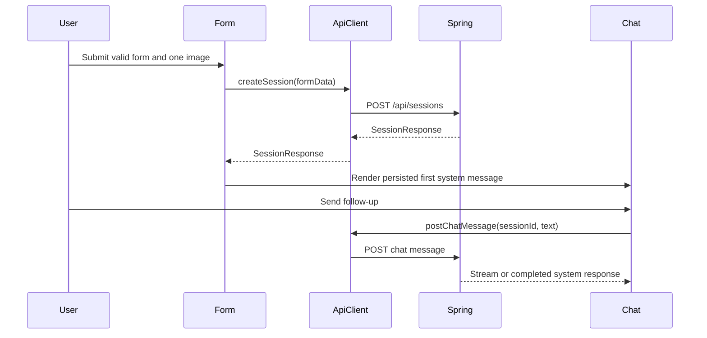

# ADR-002: Frontend and assistant-ui Chat Interface

**Date:** 2026-06-17
**Status:** Accepted
**Relates to:** `docs/ADR/000-main-architecture.md`

---

## 1. Scope

This ADR covers the Next.js frontend, Polish form UI, assistant-ui chat integration, client state, design system usage, and frontend testing. It does not cover backend rule implementation or OpenAI prompts.

---

## 2. Context7 References

| Library | Context7 Handle | Used for |
|---|---|---|
| assistant-ui | `/assistant-ui/assistant-ui` | Chat primitives, runtime, custom backend integration |
| Next.js | `/vercel/next.js` | Frontend app framework |
| React | `/reactjs/react.dev` | Component model |
| Tailwind CSS | `/tailwindlabs/tailwindcss.com` | Styling |
| Shadcn/ui | `/shadcn-ui/ui` | Form controls and base UI |

Also consulted `https://www.assistant-ui.com/llms.txt` on 2026-06-17. It points to runtime, custom backend, attachment, persistence, and primitive docs.

---

## 3. Component Design

### Frontend Structure

Use Next.js under `app/frontend/`.

| Area | Responsibility |
|---|---|
| `app/page` | Main flow entry: form before session, chat after decision |
| `components/case-form` | Polish request form, validation display, upload control |
| `components/image-retry` | Retry message, remaining attempts, replacement upload |
| `components/assistant-chat` | assistant-ui thread and composer |
| `components/decision-summary` | Decision status, rejection type, next steps |
| `lib/api` | Typed API client to Spring backend |
| `lib/session` | Browser active session id handling |
| `lib/design` | GitHub-like token mapping |

### assistant-ui Runtime Decision

Use `@assistant-ui/react` with a custom backend adapter, not `@assistant-ui/react-ai-sdk`, because the AI backend is Java/Spring, not a Next.js AI SDK route.

For MVP:

- The backend remains the source of truth for messages.
- The frontend loads persisted messages from `GET /api/sessions/{sessionId}`.
- The chat runtime sends new customer messages to Spring.
- The runtime renders streamed or completed system responses.
- Thread list management is not required for MVP because there is only one active anonymous session.

If multi-session history is added later, implement assistant-ui remote thread persistence adapters against Spring endpoints.

### UI Design

Use the GitHub-like design system from:

- `assets/design-tokens.json`
- `docs/design-guidelines.md`

The UI must be operational, not marketing-style:

- Dense but readable form.
- Dark GitHub-like header.
- White work surface.
- 6px radius controls.
- Blue links, green positive actions, red rejection/error, yellow warnings.
- Polish labels and validation messages only.

---

## 4. Data Structures

### Frontend Session State

- `sessionId`: UUID from backend, stored in browser storage for active session resume.
- `requestState`: `empty`, `submitting`, `retryRequired`, `chatReady`, `terminal`, `error`.
- `session`: latest `SessionResponse`.
- `isChatRunning`: true while assistant response is pending/streaming.

### Form State

- `requestType`: `reklamacja` or `zwrot`.
- `equipmentCategory`.
- `equipmentNameOrModel`.
- `purchaseDate`.
- `reason`.
- `imageFile`.
- `fieldErrors`.

### Message Rendering

Map backend `ChatMessage` to assistant-ui message parts:

- Customer message maps to user text part.
- System message maps to assistant text part.
- Decision update can include a compact decision summary component above the assistant message.
- Do not expose raw OpenAI reasoning.

---

## 5. Interface Contracts

Frontend consumes the backend contracts from ADR-001.

Additional frontend constraints:

- Client-side validation mirrors backend required fields but does not replace backend validation.
- The image input must allow exactly one file.
- The submit button must be disabled during submission.
- Chat composer must be disabled while an assistant response is running.
- Retry UI must show remaining attempts after unclear image response.
- All visible text must be Polish.

---

## 6. Technical Decisions

### Use Next.js, Not Spring Templates

**Status:** Accepted
**Date:** 2026-06-17
**Context:** The PRD requires a modern form-to-chat experience, and assistant-ui is React-based.
**Decision:** Build the frontend in Next.js with React and TypeScript.
**Rejected alternatives:**
- Thymeleaf: simpler Java-only stack, but poor fit for assistant-ui.
- Vite React: simpler than Next.js, but Next.js is already listed as the primary demo stack and has broad ecosystem support.
**Consequences:**
- (+) Best fit for assistant-ui and future frontend extension.
- (-) Adds Node/TypeScript toolchain to a Java-centered project.
**Review trigger:** Revisit if the course environment cannot support Node.

### Use Custom assistant-ui Backend Adapter

**Status:** Accepted
**Date:** 2026-06-17
**Context:** assistant-ui supports AI SDK and custom backend patterns. This project must keep OpenAI calls in Java.
**Decision:** Use assistant-ui primitives with a custom adapter that calls Spring chat endpoints and renders backend-owned messages.
**Rejected alternatives:**
- `@assistant-ui/react-ai-sdk`: excellent for Vercel AI SDK apps, but would move AI orchestration into TypeScript.
- Hand-written chat UI: more implementation risk for message state and accessibility.
**Consequences:**
- (+) Keeps Java backend authoritative while using strong chat UI primitives.
- (-) Requires implementing adapter glue and message conversion.
**Review trigger:** Revisit if backend moves to a TypeScript AI SDK implementation.

### Keep One Active Session for MVP

**Status:** Accepted
**Date:** 2026-06-17
**Context:** The PRD describes one active customer case, not an account dashboard.
**Decision:** Store only the active `sessionId` in browser storage and restore it on reload.
**Rejected alternatives:**
- Thread list UI: more complete but outside MVP.
- No resume: risks losing the chat after reload.
**Consequences:**
- (+) Simple customer flow and simpler anonymous state.
- (-) Customer cannot browse multiple past cases.
**Review trigger:** Revisit when employee dashboard or customer accounts are added.

---

## 7. Diagrams

### Component Diagram

### Sequence Diagram

---

## 8. Testing Strategy

### Test Scenarios

| Scenario | Type | Input | Expected output | Edge cases |
|---|---|---|---|---|
| Complaint form validation | Unit/component | Missing reason | Polish field error | Whitespace reason |
| Return optional reason | Unit/component | Return without reason | Submit allowed | Empty field |
| One file only | Unit/component | Multiple files | UI rejects extra files | Unsupported MIME |
| Retry display | Component | `remainingImageAttempts = 2` | Polish retry UI | Last attempt |
| Chat render | Component | Backend messages | assistant-ui thread shows history | Decision update message |
| End-to-end complaint | E2E | Valid complaint | Chat opens with decision | Mocked OpenAI response |
| End-to-end image retry | E2E | Unclear image three times | In-person verification | Attempts remaining |

### Technical Acceptance Criteria

- TAC-002-01: All visible UI labels and validation messages are Polish.
- TAC-002-02: The frontend never stores or receives OpenAI credentials.
- TAC-002-03: Browser reload restores the active session when `sessionId` exists.
- TAC-002-04: assistant-ui message rendering never displays hidden model reasoning.
- TAC-002-05: Form layout follows `docs/design-guidelines.md`.
