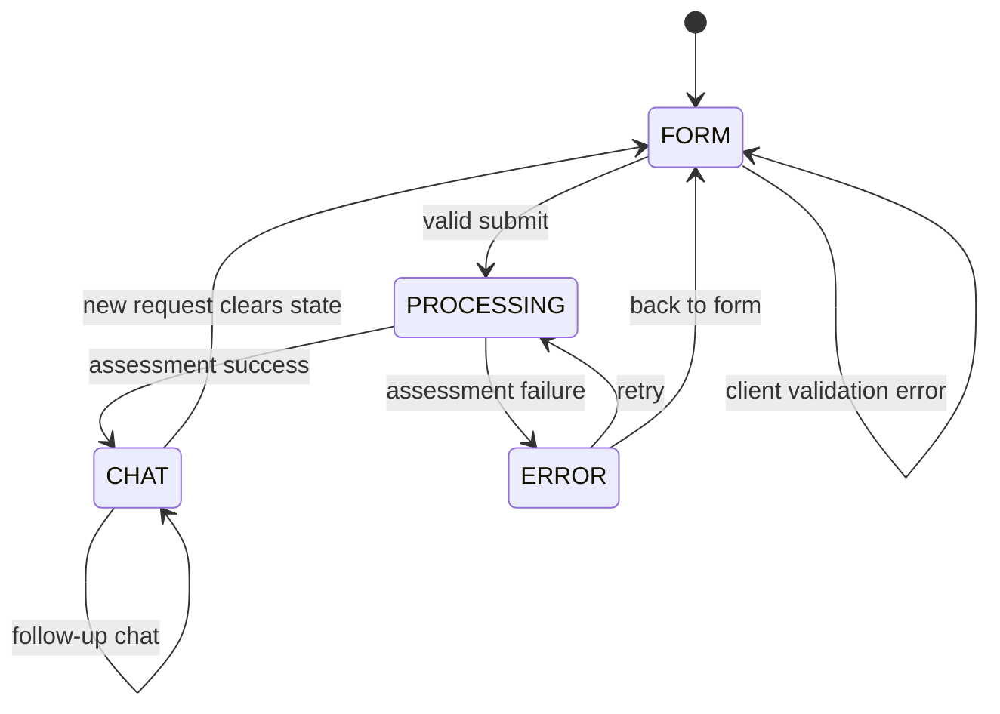
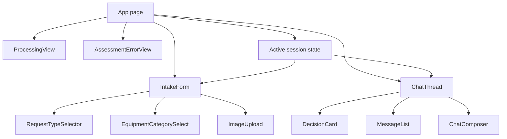
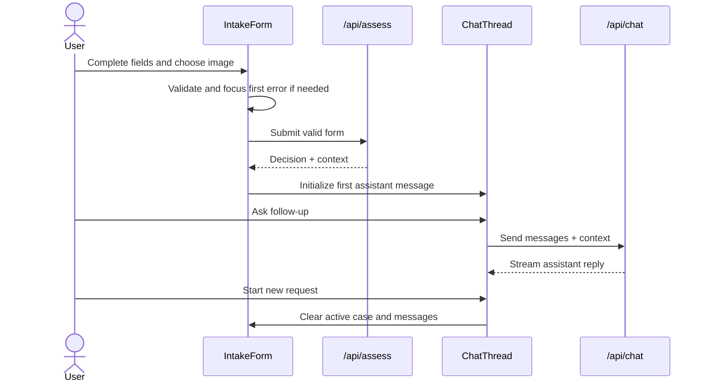

# ADR-002: Frontend And Session UX

**Date:** 2026-06-18
**Status:** Accepted
**Relates to:** [docs/ADR/000-main-architecture.md](000-main-architecture.md)

---

## 1. Scope

This ADR covers the customer-facing screens, client state, UI behavior, Polish copy constraints, AI SDK chat consumption, and responsive interaction model.

It does not define exact CSS implementation details beyond architectural constraints and design-system usage.

---

## 2. Context7 References

| Library | Context7 Handle | Used for |
|---|---|---|
| Next.js | `/vercel/next.js` | App Router page structure and Client Component boundaries. |
| Vercel AI SDK | `/vercel/ai` | `@ai-sdk/react` chat consumption and UI message rendering. |
| React | `/reactjs/react.dev` | Client state and component composition. |
| Tailwind CSS | `/tailwindlabs/tailwindcss.com` | Responsive styling aligned with `docs/design-guidelines.md`. |

---

## 3. Component Design

### Screen State Machine

The UI has one main route with controlled screen state:

| State | User-visible screen | Entered when | Exits when |
|---|---|---|---|
| `FORM` | Intake form | App opens or user starts new request. | Valid submit starts processing. |
| `PROCESSING` | Locked form or transition loader | `/api/assess` is in progress. | Success opens chat; failure opens error state. |
| `CHAT` | Chat thread with first decision card | `/api/assess` succeeds. | User starts new request. |
| `ERROR` | Assessment error with retry and back controls | `/api/assess` fails. | Retry succeeds, retry fails again, or user returns to form. |

### Main UI Components

| Component | Responsibility |
|---|---|
| `IntakeForm` | Owns field values, validation display, submit enablement, first invalid focus. |
| `RequestTypeSelector` | Exactly two mutually exclusive options: `Reklamacja` and `Zwrot`. |
| `EquipmentCategorySelect` | Fixed category list from PRD. |
| `ImageUpload` | Exactly one file, accepted formats, 10 MB limit, preview, replace/remove behavior. |
| `ProcessingView` | Polish status message while image and policy assessment runs. |
| `AssessmentErrorView` | Retry and return-to-form controls without showing partial decisions. |
| `ChatThread` | Renders first decision card and subsequent user/assistant messages. |
| `DecisionCard` | Renders greeting, outcome, justification, next steps, disclaimer in order. |
| `ChatComposer` | Sends free-text follow-up messages and handles streaming/disabled states. |
| `NewRequestButton` | Clears active case and returns to form. |

### Client State

The application stores only active-session state:

| State | Contents | Clears when |
|---|---|---|
| Form draft | Current intake values and local image preview. | Successful submit, new request, reload. |
| Active case | Case ID, sanitized submission, image analysis, initial decision. | New request, reload. |
| Chat messages | Initial assistant decision message plus chat turns. | New request, reload. |
| Pending/error state | Current request status and retry metadata. | Success, new request, reload. |

No browser local storage or IndexedDB is required for MVP. Using React state is sufficient unless the scaffold already includes a lightweight client-state pattern.

---

## 4. Data Structures

### Field Validation State

Each form field should expose:

| Field | Purpose |
|---|---|
| `value` | Current field value. |
| `touched` | Whether the user interacted with the field. |
| `error` | Polish inline validation error or empty state. |
| `required` | Dynamic requirement state, especially reason textarea. |

### Decision Display Model

`DecisionCard` consumes only a `DecisionResult`, not raw model text. It maps outcomes to Polish labels and visual status variants:

| Outcome | Polish label intent | Visual intent |
|---|---|---|
| `APPROVE` | Likely accepted. | Positive status. |
| `REJECT` | Likely rejected. | Negative status. |
| `NEEDS_MORE_INFO` | More information needed. | Informational status. |
| `CONDITIONAL` | Accepted conditionally. | Warning/conditional status. |
| `ESCALATE` | Human review needed. | Neutral/escalation status. |

### Chat State

Chat state must keep:

- `caseContext`: submission snapshot, image analysis, initial decision.
- `messages`: AI SDK UI message list.
- `isStreaming`: whether a response is currently arriving.
- `lastError`: retryable turn-level error, if any.

---

## 5. Interface Contracts

### Intake Form To `/api/assess`

| UI action | Contract |
|---|---|
| Submit | Send `multipart/form-data` only after client validation passes. |
| Retry from error | Re-send the same current form values and selected image if still available. |
| Return to form | Keep current form values unless user chooses new request. |

### Chat UI To `/api/chat`

| UI action | Contract |
|---|---|
| Send message | Submit current messages plus active case context. |
| Streaming response | Render partial assistant output without clearing existing messages. |
| Retry failed turn | Resend the failed user message with the same case context. |
| New request | Clear case context, messages, errors, and image preview. |

---

## 6. Technical Decisions

### Use One Route And A Client State Machine

**Status:** Accepted  
**Date:** 2026-06-18  
**Context:** The PRD navigation is linear: form to processing to chat, with start-over returning to form. There is no history screen.  
**Decision:** Implement a single main page with a client state machine rather than multiple routes for the MVP screens.  
**Rejected alternatives:**
- Separate `/form` and `/chat` pages: rejected because no persistent session exists across reload/direct entry.
- URL-encoded case state: rejected because it would expose too much context and does not fit image/form data.
**Consequences:**
- (+) Simple state clearing and predictable active-session behavior.
- (-) Browser refresh loses the chat, which matches PRD but must be clear during testing.
**Review trigger:** Revisit if session persistence or shareable case links enter scope.

### Use AI SDK UI Message Streaming For Follow-Up Chat

**Status:** Accepted  
**Date:** 2026-06-18  
**Context:** The PRD requires chat continuation and a visible agent thinking/streaming state. Context7 confirms AI SDK supports UI message streams and React chat consumption.  
**Decision:** Use AI SDK's UI message stream pattern for `/api/chat` and the chat UI. The first decision card can be inserted as the initial assistant message after `/api/assess`.  
**Rejected alternatives:**
- Polling for chat replies: rejected because streaming is expected and supported by the chosen stack.
- Custom SSE protocol: rejected because AI SDK already provides compatible stream primitives.
**Consequences:**
- (+) Chat UI follows provider-supported patterns.
- (+) Streaming states are easier to implement consistently.
- (-) Message shape must be typed carefully so decision-card data and text parts render correctly.
**Review trigger:** Revisit if AI SDK version changes its UI message APIs.

### Apply Design Guidelines Without Copying Product Identity Into Domain Language

**Status:** Accepted  
**Date:** 2026-06-18  
**Context:** `docs/design-guidelines.md` defines a Spotify-inspired dark, high-contrast system. The app domain is hardware service, not music.  
**Decision:** Use the extracted dark theme, green accent, spacing, and component tone, but keep product language and visual content focused on service assessment. Do not introduce music metaphors or unrelated branding in copy.  
**Rejected alternatives:**
- Generic light form UI: rejected because existing design guidance exists.
- Literal Spotify clone wording/content: rejected because it conflicts with the product domain.
**Consequences:**
- (+) UI aligns with course design artifacts.
- (-) Agents must be careful that the visual style does not distract from service clarity.
**Review trigger:** Revisit if design guidelines are replaced by a domain-specific design system.

---

## 7. Diagrams

### Frontend State Diagram

### Component Diagram

### User Flow Sequence

---

## 8. Testing Strategy

### Test Scenarios For This Area

| Scenario | Type | Input | Expected output | Edge cases |
|---|---|---|---|---|
| Empty form | Component | No fields filled. | Submit blocked and Polish required errors shown on interaction. | First invalid field focus. |
| Complaint requires reason | Component | Complaint selected, empty reason. | Reason textarea is required and submit blocked. | Switching to return makes reason optional. |
| One image behavior | Component | User selects image A then image B. | A is replaced or second add is blocked according to chosen UI behavior. | Remove returns to missing-image state. |
| Processing state | Component/E2E | Valid submit. | Form locked and Polish progress text shown. | Duplicate submit blocked. |
| Decision card order | Component | Mock decision result. | Greeting, decision, justification, next steps, disclaimer in order. | Long justification wraps without overlap. |
| Chat streaming | Integration/E2E | Follow-up message. | Partial reply renders and final message persists. | Send disabled or queued while streaming. |
| New request | Component/E2E | Click start over. | Form and chat reset. | Previous image preview removed. |

### Technical Acceptance Criteria

- TAC-002-01: All visible UI text is Polish.
- TAC-002-02: Submit is blocked while the form is invalid or processing.
- TAC-002-03: First decision message renders from structured `DecisionResult`, not parsed markdown.
- TAC-002-04: New request clears all active case and chat state.
- TAC-002-05: Chat retry does not duplicate successful previous messages.
- TAC-002-06: Mobile and desktop layouts keep controls readable and non-overlapping.
