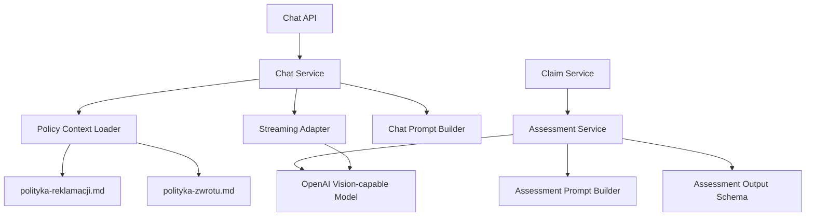
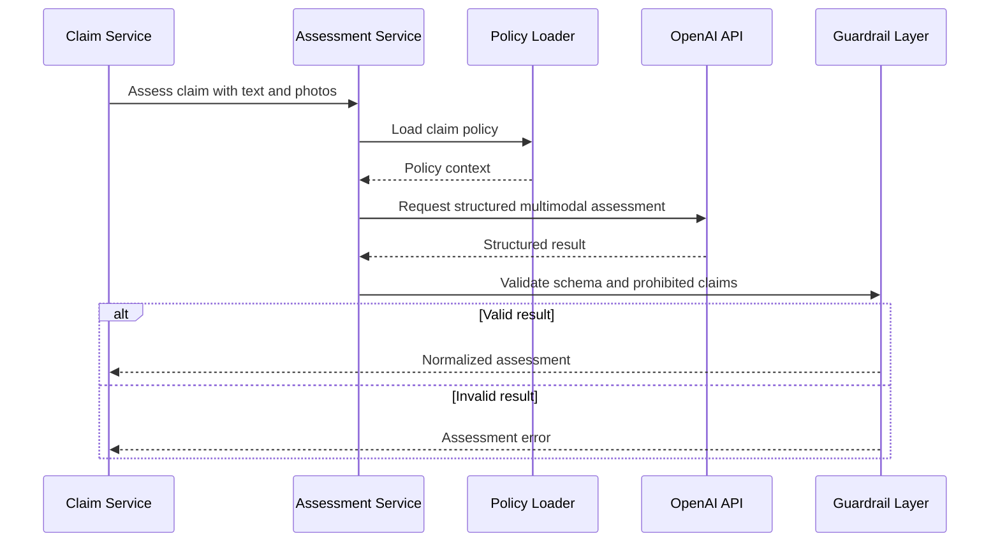

# ADR-003: AI Decision And Chat

**Date:** 2026-06-17
**Status:** Accepted
**Relates to:** `docs/ADR/000-main-architecture.md`

---

## 1. Scope

This ADR covers AI assessment, multimodal image/text analysis, structured outputs, rejected-claim chat, policy context, and guardrails. It does not cover UI rendering or database schema details beyond AI-related records.

---

## 2. Context7 References

| Library / Docs | Context7 Handle or Official URL | Used for |
|---|---|---|
| Vercel AI SDK | `/vercel/ai` | Streaming chat and structured AI workflow integration |
| OpenAI Images and Vision | `https://developers.openai.com/api/docs/guides/images-vision` | Image input for damage analysis |
| OpenAI Structured Outputs | `https://developers.openai.com/api/docs/guides/structured-outputs` | Schema-constrained assessment result |
| OpenAI Streaming | `https://developers.openai.com/api/docs/guides/streaming-responses` | Live streamed chat responses |

---

## 3. Component Design

### AI Services

| Service | Responsibility |
|---|---|
| Assessment Service | Produces structured preliminary decision from claim text and photos |
| Chat Service | Streams explanatory Polish chat after rejected decision |
| Policy Context Loader | Loads `docs/polityka-reklamacji.md` and, when needed, `docs/polityka-zwrotu.md` |
| Guardrail Layer | Enforces prohibited claims before and after model output |
| AI Result Normalizer | Maps model output to internal enums and safe user-facing Polish text |

### Model Responsibilities

The model may:

- Analyze images and text together.
- Compare visible damage with described circumstances.
- Return one of the three allowed decision categories.
- Ask for clarification when evidence is insufficient.
- Explain rejection in Polish.

The model must not:

- Present the decision as legally final.
- Promise refund, replacement, repair, or acceptance.
- Ignore the user's description when it changes image interpretation.
- Provide detailed legal advice.

---

## 4. Data Structures

### Assessment Output Schema

Fields:

- `decision`: `accepted`, `rejected`, `needs_clarification`.
- `damageType`: `mechanical`, `unknown`.
- `confidence`: `low`, `medium`, `high`.
- `reasoningSummary`: Polish explanation.
- `photoEvidenceSummary`: Polish summary of visible image evidence.
- `descriptionEvidenceSummary`: Polish summary of described circumstances.
- `clarificationQuestion`: Polish question, required only when decision is `needs_clarification`.
- `serviceReviewRecommended`: boolean.
- `mandatoryDisclaimer`: fixed Polish disclaimer text.

### Chat Prompt Context

Inputs:

- Claim details.
- Latest AI assessment.
- Claim photos metadata and evidence summary.
- Policy text from `docs/polityka-reklamacji.md`.
- Chat history.

---

## 5. Interface Contracts

### Assessment Service Interface

Input:

- Claim data.
- 1 to 5 local image references or encoded images.
- Policy context.

Output:

- Assessment output schema.

Errors:

- Provider unavailable.
- Image input rejected.
- Output does not match schema.
- Safety guardrail violation.

### Chat Service Interface

Input:

- Rejected claim id.
- User message.
- Existing chat messages.

Output:

- Live stream of Polish assistant text.
- Persistable final assistant message.

Errors:

- Claim not rejected.
- User asks out-of-scope question.
- Provider unavailable.

---

## 6. Technical Decisions

### Use structured outputs for preliminary assessment

**Status:** Accepted  
**Date:** 2026-06-17

**Context:** The PRD requires exactly three decision categories and measurable behavior. Free-text model output would be hard to persist, test, and display consistently.

**Decision:** The preliminary assessment must use schema-constrained structured output and must be rejected/retried if it does not match the schema.

**Rejected alternatives:**

- Free-text parsing: rejected because it is brittle and hard to test.
- Manual rule engine only: rejected because the MVP requires image-based AI assessment.

**Consequences:**

- (+) Deterministic API contract for UI and persistence.
- (+) Easier tests for allowed categories.
- (-) Prompt/schema design must be maintained as product rules evolve.

**Review trigger:** Revisit when new equipment types or damage categories are added.

### Use live streaming only for chat, not assessment

**Status:** Accepted  
**Date:** 2026-06-17

**Context:** The user requested live chat. The assessment, however, is better consumed as a complete structured object.

**Decision:** Assessment returns a complete structured result. Rejection chat streams responses live.

**Rejected alternatives:**

- Stream assessment: rejected because the UI needs a complete decision object.
- Non-streaming chat: rejected because the user selected live chat.

**Consequences:**

- (+) Chat feels responsive.
- (+) Assessment remains reliable and testable.
- (-) Chat persistence must handle partially streamed failures.

**Review trigger:** Revisit if assessment latency becomes unacceptable.

### Ground chat in claim and policy context

**Status:** Accepted  
**Date:** 2026-06-17

**Context:** The PRD says chat should explain rejection using general knowledge and policy where available. The repository now contains a claim policy document.

**Decision:** Chat prompt context must include the claim, latest assessment, and `docs/polityka-reklamacji.md`. `docs/polityka-zwrotu.md` is included only when the user asks about returns or the claim/return distinction.

**Rejected alternatives:**

- General model chat only: rejected because it may drift from product policy.
- Full legal advisory chat: rejected because legal validation is out of scope.

**Consequences:**

- (+) More consistent explanations.
- (+) Clear boundary between claim and return processes.
- (-) Policy documents must be kept current manually.

**Review trigger:** Revisit when formal legal/regulatory documents are added.

---

## 7. Diagrams

### Component Diagram

### Sequence Diagram

---

## 8. Testing Strategy

### Test Scenarios

| Scenario | Type | Input | Expected output | Edge cases |
|---|---|---|---|---|
| Fall-damaged frame | Unit/fixture | Photo summary + fall description | Rejected or service review with description-based reasoning | Low confidence |
| Frame cracked during normal riding | Unit/fixture | Photo summary + normal riding description | Not rejected solely due to mechanical damage | Needs clarification |
| Missing circumstances | Unit/fixture | Photo + vague text | Needs clarification | Clarification question required |
| Rejection chat | Integration | Rejected claim and policy | Streamed Polish explanation | No refund promise |
| Out-of-scope legal advice | Unit | Legal question | Refusal or bounded answer | Suggest service review |

### Technical Acceptance Criteria

- TAC-003-01: Assessment output always conforms to the internal schema before persistence.
- TAC-003-02: Assessment always includes the mandatory preliminary-decision disclaimer.
- TAC-003-03: Chat responses never promise refund, replacement, repair, or final legal outcome.
- TAC-003-04: Chat uses claim policy context for rejection explanations.
- TAC-003-05: Provider failures produce a recoverable application state visible in the service panel.
