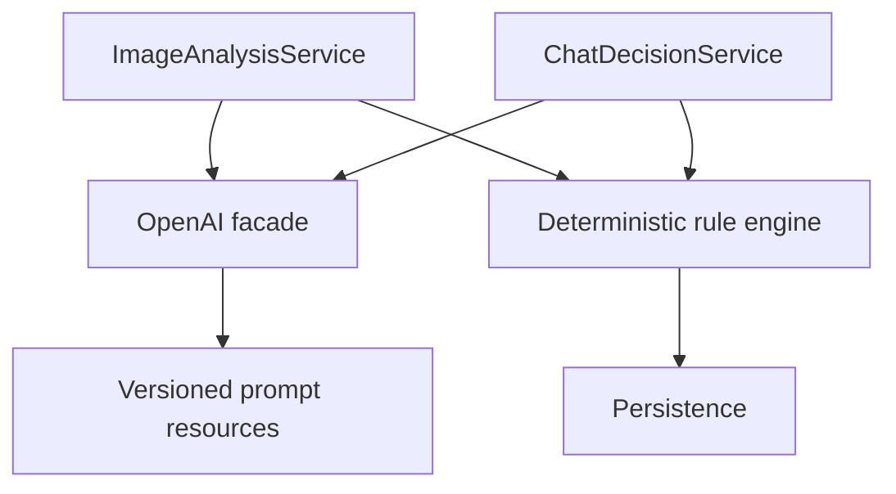
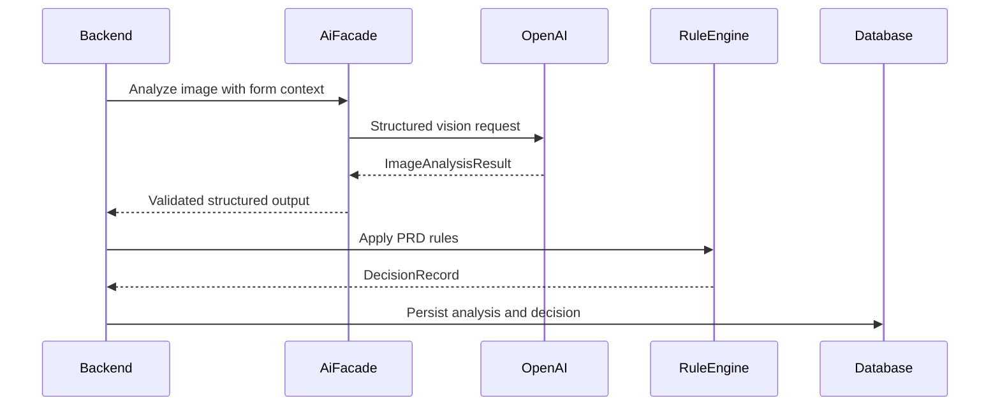

# ADR-003: AI Analysis and Decision Pipeline

**Date:** 2026-06-17
**Status:** Accepted
**Relates to:** `docs/ADR/000-main-architecture.md`

---

## 1. Scope

This ADR covers OpenAI usage, image analysis, structured AI outputs, prompt ownership, deterministic rule enforcement, chat follow-up behavior, and AI failure handling. It does not cover frontend rendering details.

---

## 2. Context7 References

| Library | Context7 Handle | Used for |
|---|---|---|
| OpenAI Java SDK | `/openai/openai-java` | OpenAI client, Responses API, structured outputs, streaming |
| Spring Boot | `/spring-projects/spring-boot` | Backend service integration and configuration |

---

## 3. Component Design

### AI Facade

Create one backend-owned `ai` facade with these responsibilities:

- Build OpenAI requests from sanitized session data.
- Submit image analysis requests.
- Submit follow-up chat evaluation requests.
- Parse structured model outputs.
- Convert provider errors into backend domain errors.
- Hide provider SDK details from `decision`, `chat`, and `imageanalysis` packages.

### Pipeline

The pipeline has two phases:

1. AI observation phase: OpenAI describes image condition and customer follow-up relevance.
2. Deterministic decision phase: backend rule service maps observations to PRD decisions.

AI must not be the sole authority for final status or rejection type. Backend rules must validate or override AI-suggested outcomes.

### Prompt Storage

Prompts must live as versioned resource files in backend source, grouped by purpose:

- Image analysis prompt.
- Complaint decision explanation prompt.
- Return decision explanation prompt.
- Follow-up relevance and disagreement prompt.
- Off-topic/refusal prompt.

Every persisted `DecisionRecord` and `ImageAnalysis` stores prompt version and model name.

---

## 4. Data Structures

### ImageAnalysisResult

Fields:

- `isEvaluable`: boolean.
- `notEvaluableReasonPl`: nullable Polish text.
- `visibleDamage`: nullable text.
- `visibleDefectIndicators`: nullable text.
- `visibleUsageSigns`: nullable text.
- `possibleCauseIndicators`: nullable text.
- `missingOrAlteredVisibleParts`: nullable text.
- `resaleCondition`: enum `appears_resellable`, `not_resellable`, `unclear`.
- `contradictionWithForm`: boolean.
- `confidence`: enum `low`, `medium`, `high`.

### DecisionDraft

Fields:

- `status`: one of PRD statuses.
- `rejectionType`: nullable PRD rejection type.
- `ruleCategory`: exact PRD rule category.
- `justificationPl`.
- `nextStepsPl`.
- `requiresHumanVerificationReasonPl`: nullable.

### FollowUpEvaluation

Fields:

- `isRelevantToCase`: boolean.
- `isDisagreement`: boolean.
- `newFacts`: list of concise facts.
- `canChangeDecision`: boolean.
- `recommendedDecisionDraft`: nullable.
- `responsePl`: Polish response.

---

## 5. Interface Contracts

### `ImageAnalysisService.analyze`

Input:

- Session form data.
- Stored image metadata and file path.
- Attempt number.

Output:

- `ImageAnalysisResult`.

Errors:

- Provider timeout.
- Unsupported image after backend validation.
- Structured output parsing failure.

### `DecisionService.decideInitial`

Input:

- Session form data.
- `ImageAnalysisResult`.

Output:

- Validated `DecisionRecord`.

### `ChatDecisionService.respondToFollowUp`

Input:

- Session.
- Latest decision.
- Image analysis.
- Full chat history.
- New customer message.

Output:

- Persistable system message.
- Optional new `DecisionRecord`.
- Optional terminal state update.

---

## 6. Technical Decisions

### Use OpenAI Java SDK from Environment Configuration

**Status:** Accepted
**Date:** 2026-06-17
**Context:** User selected OpenAI. Context7 docs show the Java SDK supports environment-based configuration and current generation APIs.
**Decision:** Configure the OpenAI Java client from environment variables and Spring properties. Backend is the only OpenAI caller.
**Rejected alternatives:**
- Frontend OpenAI calls: exposes secrets and bypasses backend rules.
- Raw HTTP client: more control, but less SDK support and more boilerplate.
**Consequences:**
- (+) Clear secret boundary and SDK-supported API access.
- (-) Backend depends on OpenAI SDK release compatibility.
**Review trigger:** Revisit if OpenAI Java SDK lacks a needed Responses/vision feature.

### Use Structured Outputs for AI Boundary

**Status:** Accepted
**Date:** 2026-06-17
**Context:** The PRD requires stable decision statuses, rejection types, and image condition fields.
**Decision:** All AI calls that affect decisions must return structured data matching backend DTOs. Free-form text is allowed only for Polish explanation fields.
**Rejected alternatives:**
- Parse free-form model text: brittle and hard to test.
- Store raw model output only: not enough for deterministic rule enforcement.
**Consequences:**
- (+) Easier validation, persistence, and testing.
- (-) Requires schema maintenance when PRD changes.
**Review trigger:** Revisit when adding new rejection categories or product types.

### Backend Rules Override AI Drafts

**Status:** Accepted
**Date:** 2026-06-17
**Context:** The system must not invent policy exceptions and must apply strict complaint/return rules.
**Decision:** The deterministic decision service must validate any AI-suggested decision. If AI output conflicts with PRD rules, the backend rule result wins.
**Rejected alternatives:**
- Trust AI for policy decisions: inconsistent and not auditable.
- Ignore AI recommendation entirely: loses useful synthesis of follow-up facts.
**Consequences:**
- (+) Rule consistency is testable.
- (-) More backend rule code.
**Review trigger:** Revisit if a formal rules engine is introduced.

### Do Not Store Chain-of-Thought

**Status:** Accepted
**Date:** 2026-06-17
**Context:** The product needs justification, not hidden reasoning. Customer-facing text must be concise Polish.
**Decision:** Store only structured observations, rule category, justification, next steps, and raw provider metadata needed for debugging. Do not request or store chain-of-thought.
**Rejected alternatives:**
- Store full model reasoning: privacy and UX risk.
- Store no model metadata: weak debugging.
**Consequences:**
- (+) Safer logs and clearer customer messages.
- (-) Some AI debugging detail is unavailable.
**Review trigger:** Revisit if audit requirements demand more traceability.

---

## 7. Diagrams

### Component Diagram

### Sequence Diagram

---

## 8. Testing Strategy

### Test Scenarios

| Scenario | Type | Input | Expected output | Edge cases |
|---|---|---|---|---|
| Evaluable complaint image | Unit | Image result with defect indicators | Rule engine can approve complaint | Low confidence |
| Mechanical damage | Unit | Image result shows cracks/impact | Reject `mechanical_damage_detected` | Customer explanation contradiction |
| Return not resellable | Unit | Damage or missing part | Reject `not_resellable` or exact visible category | Ambiguous resale |
| Structured output parse failure | Unit/integration | Malformed AI response | `AI_PROVIDER_UNAVAILABLE` or retry-safe error | Partial response |
| Follow-up disagreement | Unit | Customer challenges result | Human verification if unresolved | Relevant new facts |
| Off-topic message | Unit | Irrelevant request | Polish refusal | Abusive text |

### Technical Acceptance Criteria

- TAC-003-01: No final decision status is accepted unless it is valid under deterministic PRD rules.
- TAC-003-02: All AI outputs that affect state are schema-validated before persistence.
- TAC-003-03: Every AI call stores model name and prompt version.
- TAC-003-04: Tests can run with a fake AI facade without network access.
- TAC-003-05: Customer-visible AI text is Polish.
