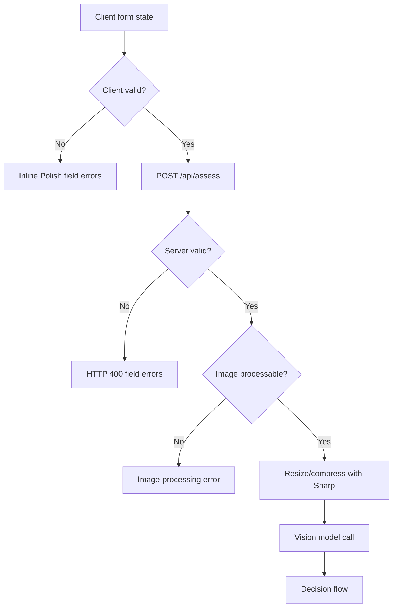
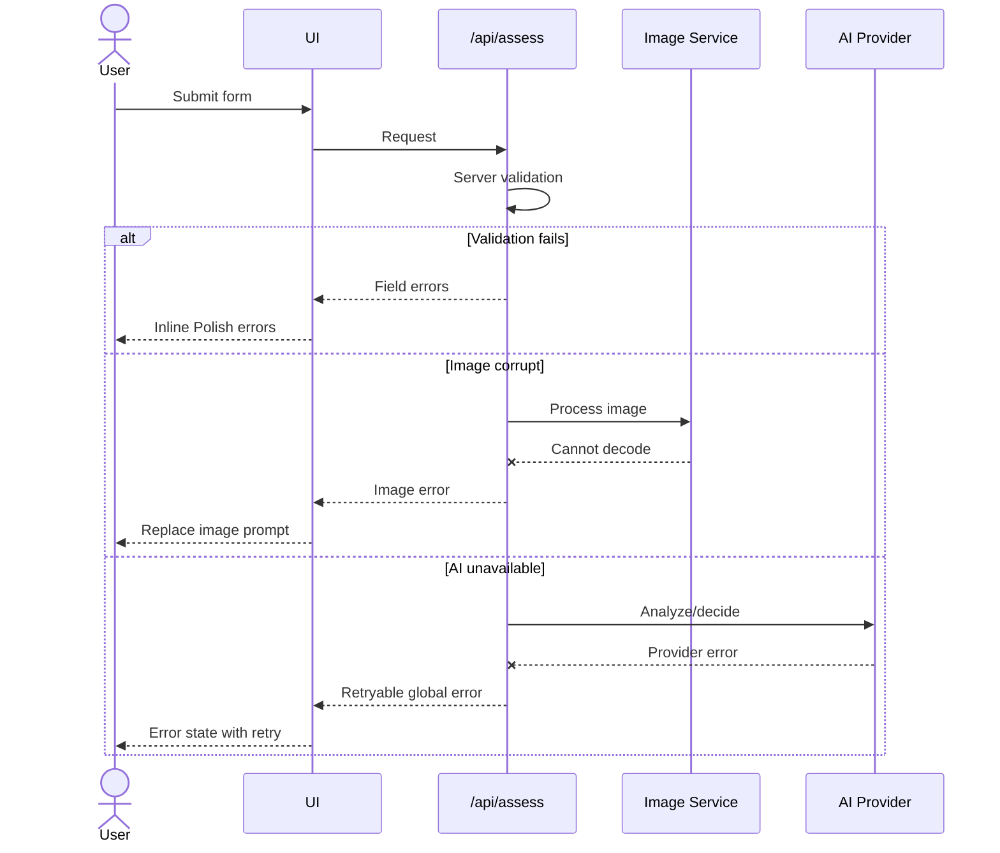
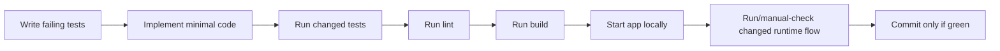

# ADR-003: Validation, Image Handling, And Verification

**Date:** 2026-06-18
**Status:** Accepted
**Relates to:** [docs/ADR/000-main-architecture.md](000-main-architecture.md)

---

## 1. Scope

This ADR covers client/server validation, file handling, image compression, error responses, and the verification strategy required before implementation commits.

It does not cover prompt wording beyond validation-related AI guardrails.

---

## 2. Context7 References

| Library | Context7 Handle | Used for |
|---|---|---|
| Next.js | `/vercel/next.js` | Route Handlers and request body/form-data handling. |
| Sharp | `/lovell/sharp` | Image resize/compression in Node.js runtime. |
| Vercel AI SDK | `/vercel/ai` | Mockable model-call boundaries and stream verification. |

---

## 3. Component Design

### Validation Layers

Validation must run twice:

| Layer | Purpose | Behavior |
|---|---|---|
| Client validation | Fast feedback and blocked submit. | Shows inline Polish errors and focuses the first invalid field. |
| Server validation | Security and correctness boundary. | Rejects invalid input before image processing or AI calls. |

Client validation is a convenience. Server validation is authoritative.

### Image Handling Pipeline

| Step | Responsibility |
|---|---|
| Accept file | Allow exactly one uploaded image. |
| Validate file | MIME/type allowlist: JPEG, PNG, WebP; size <= 10 MB. |
| Normalize metadata | Extract dimensions/metadata where useful for logs/tests; do not persist image. |
| Resize/compress | Reduce image to model-friendly dimensions and size. |
| Pass to vision model | Use the compressed representation only. |
| Discard | Do not save raw or compressed image after request completes. |

### Error Response Categories

| Category | Example | User behavior |
|---|---|---|
| Field validation | Missing reason, future date, invalid format. | Inline errors; user can correct. |
| Image processing | Corrupt image, unsupported actual encoding. | Polish file error; user can replace image. |
| Policy/config | Missing policy file, missing env var. | Generic temporary error; developer logs contain details. |
| AI provider | Timeout, unavailable, invalid output. | Error state with retry; no decision shown. |
| Chat turn | Follow-up reply fails. | Inline retry on that chat turn; previous decision remains visible. |

---

## 4. Data Structures

### Validation Error Shape

| Field | Type | Purpose |
|---|---|---|
| `code` | string | Stable machine-readable error code. |
| `field` | string or null | Field name for inline errors; null for global errors. |
| `message` | string | Polish user-facing message. |

### Assessment Error Shape

| Field | Type | Purpose |
|---|---|---|
| `kind` | enum | `VALIDATION`, `IMAGE_PROCESSING`, `AI_PROVIDER`, `CONFIG`, `UNKNOWN`. |
| `retryable` | boolean | Whether retry should be shown. |
| `message` | string | Polish user-facing message. |
| `fieldErrors` | array | Present for validation errors only. |

### Image Processing Result

| Field | Type | Purpose |
|---|---|---|
| `mimeType` | enum | Normalized output MIME type. |
| `byteLength` | number | Compressed size for tests/logging. |
| `width` | number | Output width. |
| `height` | number | Output height. |
| `payload` | bytes/base64 | In-memory payload sent to vision model. |

---

## 5. Interface Contracts

### Form Validation Contract

| Rule | Client | Server |
|---|---|---|
| Request type must be exactly return/complaint. | Enforced. | Enforced. |
| Category must be one of PRD list. | Enforced. | Enforced. |
| Equipment name required after trim. | Enforced. | Enforced. |
| Purchase date cannot be future. | Enforced. | Enforced. |
| Reason required for complaint. | Enforced. | Enforced. |
| Exactly one image required. | Enforced. | Enforced. |
| Image MIME/type JPEG, PNG, WebP only. | Enforced. | Enforced with actual file validation where possible. |
| Image max 10 MB before compression. | Enforced. | Enforced. |

### Image Compression Contract

| Input | Output | Constraints |
|---|---|---|
| Valid JPEG/PNG/WebP under 10 MB. | Compressed image payload. | Must preserve enough detail for visual assessment; output not shown to user. |

If compression fails, the server returns an image-processing error and does not call the vision model.

### Verification Contract

Before any implementation commit:

| Command | Required when |
|---|---|
| `npm test` | After test infrastructure exists. |
| `npm run lint` | After app scaffold defines lint. |
| `npm run build` | After app scaffold defines build. |
| Start app locally | Always before commit when runtime behavior changed. |

If commands do not exist yet, the implementation task must create them as part of scaffolding rather than skipping verification silently.

---

## 6. Technical Decisions

### Server Validation Must Precede AI Calls

**Status:** Accepted  
**Date:** 2026-06-18  
**Context:** Invalid input should not consume model calls or produce unreliable decisions. AC-07 and AC-29 require blocked submissions/errors rather than fabricated answers.  
**Decision:** `/api/assess` validates all form fields and file constraints before image compression or model calls.  
**Rejected alternatives:**
- Trust client validation: rejected because clients can bypass it.
- Let the model detect missing fields: rejected because this wastes cost and creates inconsistent errors.
**Consequences:**
- (+) Deterministic field errors and lower provider cost.
- (-) Validation logic is duplicated across client and server, so shared contracts/tests are needed.
**Review trigger:** Revisit if validation schema sharing creates maintenance issues.

### Use Sharp In Node Runtime For Image Compression

**Status:** Accepted  
**Date:** 2026-06-18  
**Context:** AC-10 requires backend compression/resizing before the multimodal model. Next.js Edge runtime is not appropriate for native image processing.  
**Decision:** Use Sharp in a Node.js Route Handler path for image resize/compression. Keep image payloads in memory and avoid persistence.  
**Rejected alternatives:**
- Browser-only compression: rejected because backend compression is required.
- Store image then process asynchronously: rejected because persistence and async jobs are out of scope.
- Edge runtime image processing: rejected because native image libraries and large body handling are better suited to Node runtime.
**Consequences:**
- (+) Reliable format support and smaller model payloads.
- (-) Native dependency can affect deployment packaging and build time.
**Review trigger:** Revisit if deployment target cannot support Sharp.

### Keep Error Messages User-Safe And Developer Details Server-Side

**Status:** Accepted  
**Date:** 2026-06-18  
**Context:** Provider/config errors may expose sensitive implementation details. Users need an understandable retry path, not stack traces.  
**Decision:** User-facing errors are Polish and generic enough to avoid leaking secrets or provider internals. Server logs may contain technical diagnostics during development.  
**Rejected alternatives:**
- Return raw provider errors to UI: rejected for security and UX.
- Hide all errors with no retry: rejected by AC-29.
**Consequences:**
- (+) Safer customer-facing behavior.
- (-) Developers need logs/tests to diagnose exact failures.
**Review trigger:** Revisit when production observability is added.

### E2E Must Cover Real User Flows After Scaffold

**Status:** Accepted  
**Date:** 2026-06-18  
**Context:** Repository guidelines state tests passing is not enough; the app must start and runtime behavior must be verified.  
**Decision:** After implementation scaffold exists, add Playwright E2E coverage for the main PRD flows and start the app before committing.  
**Rejected alternatives:**
- Unit tests only: rejected because file upload, chat streaming, and UI state transitions are user-facing workflows.
- Manual-only demo checks: rejected because agents need repeatable verification.
**Consequences:**
- (+) Catches integration and layout failures.
- (-) Requires additional setup in a greenfield repo.
**Review trigger:** Revisit if the course chooses a non-browser demo surface.

---

## 7. Diagrams

### Validation And Image Pipeline

### Error Handling Sequence

### Verification Flow

---

## 8. Testing Strategy

### Test Scenarios For This Area

| Scenario | Type | Input | Expected output | Edge cases |
|---|---|---|---|---|
| Server rejects missing image | Integration | Valid fields, no file. | HTTP 400 field error. | Empty file field. |
| Server rejects multiple images | Integration | Two files. | HTTP 400 field error or deterministic replacement before request. | Same filename. |
| Server rejects unsupported MIME | Integration | PDF/TXT file. | HTTP 400 with accepted formats. | Spoofed extension. |
| Server rejects large image | Integration | File > 10 MB. | HTTP 400 with size limit. | Exactly 10 MB boundary. |
| Compression succeeds | Unit/integration | Valid JPEG/PNG/WebP. | Output payload smaller/resized and image model called once. | Very wide/tall image. |
| Compression fails | Integration | Corrupt image bytes. | No AI call; image-processing error. | Valid MIME but invalid bytes. |
| Provider failure | Integration | Mock AI timeout/error. | Retryable error; no decision. | Failure on image step vs decision step. |
| Verification commands | Process | App scaffold exists. | `test`, `lint`, `build`, and app start are available and pass before commit. | Missing script must be added. |

### Technical Acceptance Criteria

- TAC-003-01: Client and server validation enforce the same PRD field constraints.
- TAC-003-02: Server validation happens before compression and before any LLM call.
- TAC-003-03: Only JPEG, PNG, and WebP are accepted.
- TAC-003-04: Files larger than 10 MB are rejected before compression.
- TAC-003-05: Corrupt or unprocessable images never reach the vision model.
- TAC-003-06: No uploaded image is persisted to disk or database in MVP.
- TAC-003-07: Runtime-affecting implementation changes are verified by starting the app before commit.
