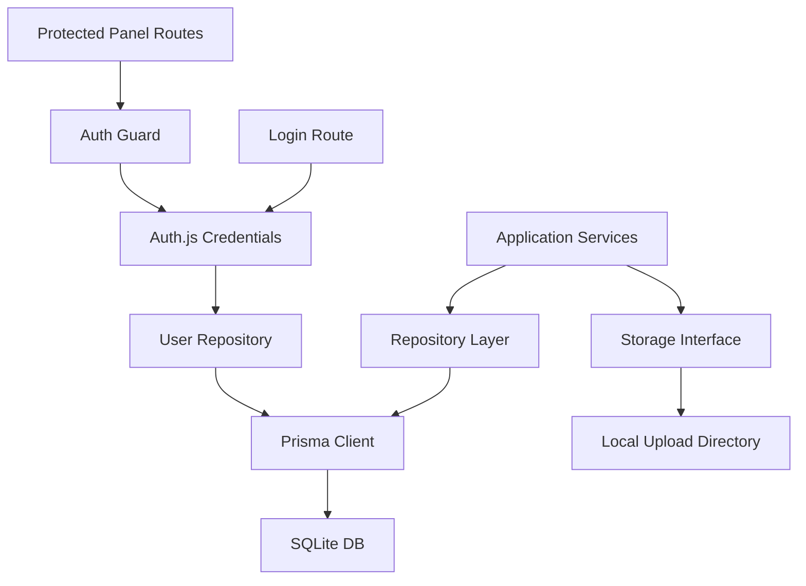
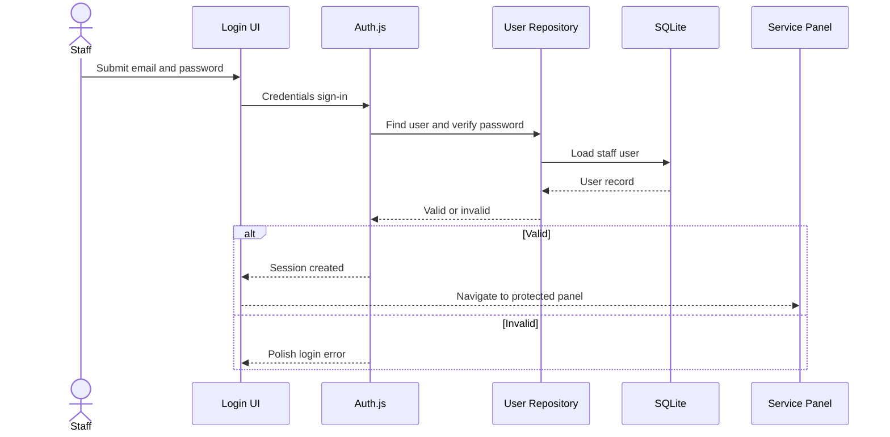

# ADR-004: Persistence, Auth, And Local Storage

**Date:** 2026-06-17
**Status:** Accepted
**Relates to:** `docs/ADR/000-main-architecture.md`

---

## 1. Scope

This ADR covers SQLite persistence, Prisma repositories, local image storage, simple staff login, and data retention constraints. It does not cover AI prompt logic or frontend visual design.

---

## 2. Context7 References

| Library | Context7 Handle | Used for |
|---|---|---|
| Prisma | `/prisma/web` | SQLite datasource, migrations, typed client |
| Auth.js | `/websites/authjs_dev` | Credentials login, session protection |
| Next.js | `/vercel/next.js` | Server runtime boundaries |

---

## 3. Component Design

### Persistence Components

| Component | Responsibility |
|---|---|
| Prisma schema | Defines Claim, ClaimPhoto, AiAssessment, ChatMessage, User |
| Prisma migrations | Version database structure |
| Repository layer | Encapsulates Prisma queries |
| Seed script | Creates initial staff account |
| Test database setup | Provides isolated SQLite database for integration tests |

### Storage Components

| Component | Responsibility |
|---|---|
| Storage interface | Defines write/read/delete metadata operations |
| Local storage adapter | Stores uploaded images under `UPLOAD_DIR` |
| Path sanitizer | Prevents unsafe file names and path traversal |
| Public file route | Serves claim photos through authenticated or claim-scoped access rules |

### Auth Components

| Component | Responsibility |
|---|---|
| Auth.js config | Credentials login and session configuration |
| Password hashing service | Hashes and verifies staff passwords |
| Auth guard | Protects service panel pages and APIs |
| User repository | Loads staff users |

---

## 4. Data Structures

### SQLite Database

Stores:

- Claims.
- Claim photos metadata.
- AI assessments.
- Chat messages.
- Staff users.
- Auth/session-related data if required by chosen Auth.js configuration.

### Local Upload Directory

Stores:

- Original uploaded images or normalized stored images.
- File names generated by the application, not trusted from user input.

Retention:

- MVP keeps all uploaded images until manually deleted.
- No automatic retention policy is required in MVP.

---

## 5. Interface Contracts

### Claim Repository

Operations:

- Create claim with photo metadata.
- Load claim with photos and latest assessment.
- Update claim status.
- List claims for service panel.
- Add clarification.

### Assessment Repository

Operations:

- Create assessment.
- Load latest assessment for claim.
- Load assessment history for staff detail view.

### Chat Repository

Operations:

- Append user message.
- Append assistant message after stream completion.
- List messages for claim.

### Storage Adapter

Operations:

- Store uploaded file and return metadata.
- Resolve view URL for stored file.
- Delete stored file.

### Auth Guard

Operations:

- Return authenticated user for protected routes.
- Deny unauthenticated access.
- Enforce staff role if role-specific behavior is added.

---

## 6. Technical Decisions

### Use Prisma with SQLite

**Status:** Accepted  
**Date:** 2026-06-17

**Context:** The user selected SQLite. The application needs typed database access, migrations, and test-friendly local persistence.

**Decision:** Use Prisma as the ORM and SQLite as the database provider.

**Rejected alternatives:**

- Raw SQLite queries: rejected because schema and query typing would be weaker.
- Drizzle ORM: viable, but Prisma is selected for maturity, migrations, and course-friendly ergonomics.
- PostgreSQL: rejected for MVP because the user selected SQLite.

**Consequences:**

- (+) Strong TypeScript integration and migrations.
- (+) Easy local setup.
- (-) Vercel production persistence is not durable with local SQLite.

**Review trigger:** Migrate to PostgreSQL before real customer usage.

### Use local filesystem storage behind an adapter

**Status:** Accepted  
**Date:** 2026-06-17

**Context:** The user selected local storage for photos. Direct file writes scattered through services would make future migration harder.

**Decision:** Implement a storage adapter interface and use local filesystem storage for the MVP.

**Rejected alternatives:**

- Vercel Blob now: rejected because the user selected local storage.
- Store image bytes in SQLite: rejected because it bloats the database and complicates photo delivery.

**Consequences:**

- (+) Simple local development.
- (+) Future migration to object storage is contained.
- (-) Runtime file writes on Vercel are not durable production storage.

**Review trigger:** Migrate storage to object storage before production pilot.

### Use Auth.js Credentials for staff login

**Status:** Accepted  
**Date:** 2026-06-17

**Context:** The MVP needs simple login for seller/technician panel. External OAuth is not required.

**Decision:** Use Auth.js Credentials provider with hashed staff passwords and protected service-panel routes.

**Rejected alternatives:**

- No login: rejected because the user selected simple login.
- OAuth provider: rejected because it introduces external setup that is unnecessary for MVP.
- Custom cookie auth: rejected because Auth.js provides tested session primitives.

**Consequences:**

- (+) Staff panel can be protected early.
- (+) No external identity provider is needed.
- (-) Password handling must be implemented carefully.

**Review trigger:** Revisit if multiple stores, SSO, role administration, or audit requirements are added.

---

## 7. Diagrams

### Component Diagram

### Sequence Diagram

---

## 8. Testing Strategy

### Test Scenarios

| Scenario | Type | Input | Expected output | Edge cases |
|---|---|---|---|---|
| Prisma migration | Integration | Empty test DB | Schema created | Re-run migration |
| Create claim | Integration | Valid claim | Claim, photos, assessment records | Transaction failure |
| Store photo | Unit/integration | Image file | Safe generated path | Unsafe original name |
| Login valid user | Integration | Seed credentials | Authenticated session | Case sensitivity |
| Login invalid user | Integration | Wrong password | Rejected login | No user enumeration |

### Technical Acceptance Criteria

- TAC-004-01: No uploaded file path is derived directly from unsanitized user input.
- TAC-004-02: User passwords are never stored as plaintext.
- TAC-004-03: Repository tests run against isolated SQLite database files.
- TAC-004-04: Claims can be listed with latest assessment in a single service call.
- TAC-004-05: The storage adapter can be replaced without changing claim service contracts.
