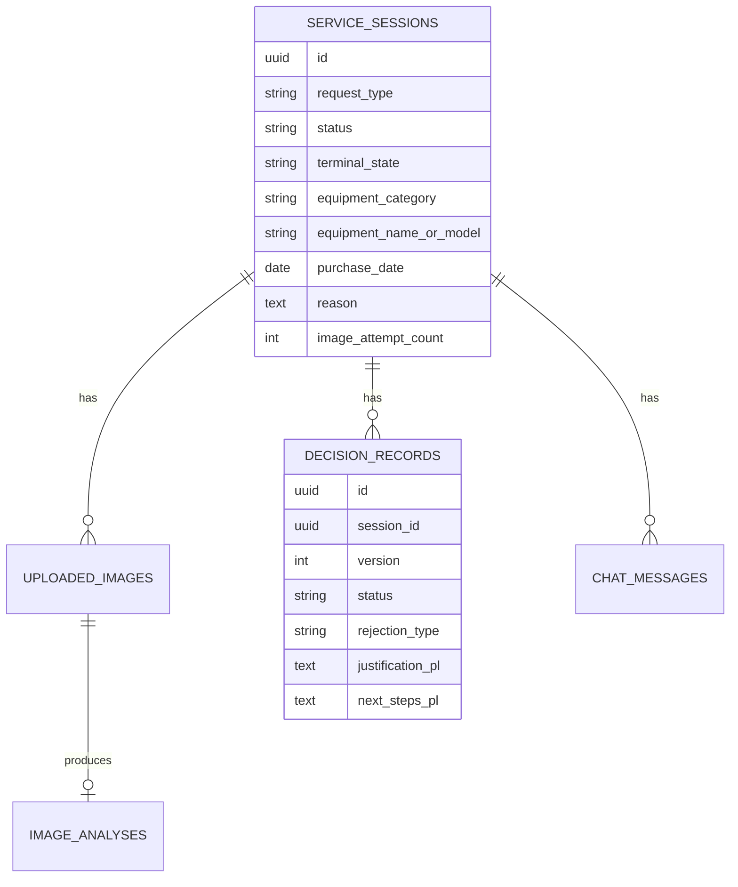
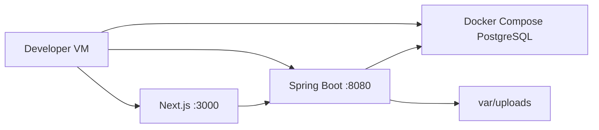
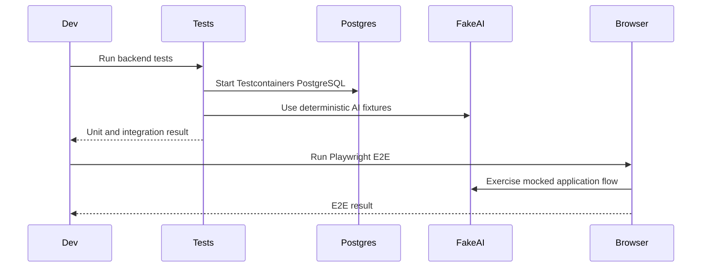

# ADR-004: Persistence, Local Storage, Deployment, and Verification

**Date:** 2026-06-17
**Status:** Accepted
**Relates to:** `docs/ADR/000-main-architecture.md`

---

## 1. Scope

This ADR covers PostgreSQL persistence, local filesystem uploads, migrations, local deployment, environment setup, verification commands, and test strategy. It does not define business rules beyond persistence and verification needs.

---

## 2. Context7 References

| Library | Context7 Handle | Used for |
|---|---|---|
| Spring Boot | `/spring-projects/spring-boot` | Docker Compose support, externalized configuration, multipart limits |
| PostgreSQL | Resolve before implementation | Database behavior and local setup |
| Flyway | Resolve before implementation | Database migrations |
| JUnit 5 | Resolve before implementation | Unit tests |
| Testcontainers | Resolve before implementation | PostgreSQL integration tests |
| Playwright | Resolve before implementation | E2E browser tests |

---

## 3. Component Design

### Persistence

Use PostgreSQL for all structured application state:

- Sessions.
- Uploaded image metadata.
- Image analysis summaries.
- Decision records.
- Chat messages.

Use Flyway migrations from the first schema change. Hibernate may validate schema in normal runs but must not be the source of production schema changes.

### Local Image Storage

Use local filesystem storage for uploaded images:

- Root folder from `UPLOAD_ROOT`.
- Store files under date/session-based folders.
- Generate server-side filenames; never trust original filenames for paths.
- Store only relative path and metadata in DB.
- Allow JPG, PNG, and WebP for MVP.
- Enforce explicit max size through Spring configuration.

### Local Deployment

Course-local setup:

- PostgreSQL via Docker Compose.
- Spring Boot backend on `localhost:8080`.
- Next.js frontend on `localhost:3000`.
- Upload folder under repository-local `var/uploads`, ignored by Git.

Future extension path:

- Replace local files with S3/MinIO adapter.
- Add authentication.
- Containerize backend/frontend.
- Add observability and centralized logs.

---

## 4. Data Structures

### Database Tables

Conceptual tables:

| Table | Purpose |
|---|---|
| `service_sessions` | Root session and form fields |
| `uploaded_images` | Image attempt metadata and storage path |
| `image_analyses` | Structured AI image analysis output |
| `decision_records` | Initial and updated decisions |
| `chat_messages` | Customer/system conversation history |

### Indexes

Required indexes:

- `service_sessions.created_at`.
- `uploaded_images.session_id`.
- `decision_records.session_id, version`.
- `chat_messages.session_id, sequence_number`.

### Retention

For MVP, no automatic deletion is required. Add a manual cleanup command or documented reset process for the course VM.

---

## 5. Interface Contracts

### StorageService

Responsibilities:

- Validate image extension, content type, and size.
- Store uploaded bytes under generated path.
- Return metadata for persistence.
- Resolve stored image for OpenAI analysis.
- Delete stored image on rollback cleanup when possible.

### Migration Contract

- Every schema change must be a Flyway migration.
- Tests must start from clean migrations.
- Application startup must fail if schema validation fails.

### Verification Commands

Expected commands after implementation:

| Scope | Command |
|---|---|
| Backend unit/integration | `mvn test` in `app/backend` |
| Backend build | `mvn verify` in `app/backend` |
| Frontend tests/lint | `npm test` and `npm run lint` in `app/frontend` |
| Frontend build | `npm run build` in `app/frontend` |
| E2E | Playwright command defined by frontend package |
| Local smoke | Start PostgreSQL, backend, frontend, submit one mocked flow |

---

## 6. Technical Decisions

### Use Flyway for Schema Migrations

**Status:** Accepted
**Date:** 2026-06-17
**Context:** The app is not initialized yet, but JPA entities will evolve quickly during course implementation.
**Decision:** Use Flyway migrations as the source of truth for schema changes.
**Rejected alternatives:**
- Hibernate auto DDL: convenient but not reliable for reviewable schema history.
- Manual SQL setup only: easy to drift between machines.
**Consequences:**
- (+) Repeatable local and test DB setup.
- (-) Each entity change may need a migration.
**Review trigger:** Revisit only if the course intentionally avoids migrations.

### Use PostgreSQL Testcontainers for Integration Tests

**Status:** Accepted
**Date:** 2026-06-17
**Context:** JPA/Hibernate behavior should be tested against the same database family used locally.
**Decision:** Integration tests that touch persistence must use PostgreSQL Testcontainers.
**Rejected alternatives:**
- H2 integration tests: faster but can hide SQL/type differences.
- Shared developer database: flaky and order-dependent.
**Consequences:**
- (+) Reliable DB tests and migration validation.
- (-) Requires Docker for integration test runs.
**Review trigger:** Revisit if Docker is unavailable on the course VM.

### Keep Uploads Out of Git and Database BLOBs

**Status:** Accepted
**Date:** 2026-06-17
**Context:** The course VM has limited assets and Git repo should stay small.
**Decision:** Store uploads in ignored local folder and persist metadata in PostgreSQL.
**Rejected alternatives:**
- Commit sample uploads: pollutes Git and risks privacy.
- Store BLOBs in DB: unnecessary for MVP and harder to inspect.
**Consequences:**
- (+) Simple local operations and small database rows.
- (-) DB backup alone does not include images.
**Review trigger:** Revisit before production or cross-machine sharing.

### Use Mocked OpenAI in Automated Tests

**Status:** Accepted
**Date:** 2026-06-17
**Context:** E2E and integration tests must be deterministic and not depend on API cost or network.
**Decision:** Automated tests use a fake AI adapter returning fixture outputs. Manual smoke tests may use real OpenAI when `OPENAI_API_KEY` is configured.
**Rejected alternatives:**
- Real OpenAI in CI/tests: non-deterministic, costly, and requires secrets.
- No AI boundary tests: leaves core behavior unverified.
**Consequences:**
- (+) Fast, reliable tests.
- (-) Requires separate manual validation for provider integration.
**Review trigger:** Revisit when adding provider contract tests or staging environment.

---

## 7. Diagrams

### Persistence Diagram

### Local Runtime Diagram

### Verification Sequence

---

## 8. Testing Strategy

### Test Scenarios

| Scenario | Type | Input | Expected output | Edge cases |
|---|---|---|---|---|
| Flyway clean migration | Integration | Empty PostgreSQL | Schema created | Re-run validation |
| JPA mappings | Integration | Persist full session graph | Records load correctly | Decision version ordering |
| Upload path safety | Unit | Dangerous filename | Generated safe path | Unicode, path traversal |
| File cleanup | Unit/integration | DB failure after file write | Cleanup attempted and logged | Cleanup fails |
| Local smoke | Manual/E2E | Valid complaint image fixture | Chat decision screen | Backend restart and session reload |
| No OpenAI key in tests | Test config | Missing key | Tests still pass with fake AI | Real smoke skipped |

### Technical Acceptance Criteria

- TAC-004-01: `var/uploads` or equivalent upload folder is ignored by Git.
- TAC-004-02: Flyway migrations create all required tables and indexes.
- TAC-004-03: Persistence tests use PostgreSQL Testcontainers.
- TAC-004-04: Automated tests do not require `OPENAI_API_KEY`.
- TAC-004-05: Local startup instructions include PostgreSQL, backend, frontend, and upload folder configuration.
