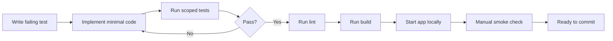
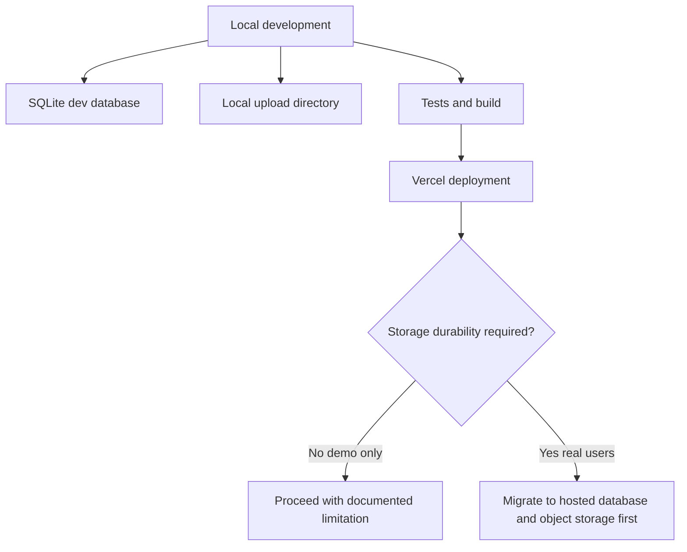
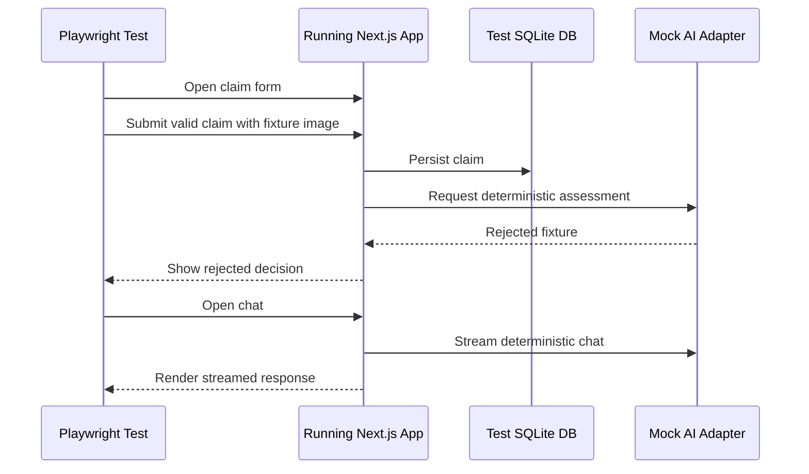

# ADR-005: Testing And Deployment

**Date:** 2026-06-17
**Status:** Accepted
**Relates to:** `docs/ADR/000-main-architecture.md`

---

## 1. Scope

This ADR covers verification commands, TDD workflow, CI expectations, local development, and Vercel deployment constraints. It does not define product requirements or UI design.

---

## 2. Context7 References

| Library / Platform | Context7 Handle | Used for |
|---|---|---|
| Next.js | `/vercel/next.js` | Build and runtime expectations |
| Tailwind CSS | `/tailwindlabs/tailwindcss.com` | CSS build integration |
| Vitest | `/vitest-dev/vitest` | Unit and integration tests |
| Vercel AI SDK | `/vercel/ai` | Mocking/isolating streamed AI behavior |

---

## 3. Component Design

### Test Types

| Test Type | Location | Purpose |
|---|---|---|
| Unit tests | `app/tests/unit/` | Pure validation, mapping, status, prompt-context logic |
| Component tests | `app/tests/components/` | Form, decision, panel, chat UI |
| Integration tests | `app/tests/integration/` | API handlers, Prisma, storage adapter, auth guard |
| E2E tests | `app/tests/e2e/` | Full user flows through running app |

### Verification Commands

Expected commands after initialization:

| Command | Purpose |
|---|---|
| `npm test` | Unit, component, and integration tests |
| `npm run lint` | ESLint validation |
| `npm run build` | Production build |
| `npm run dev` | Manual runtime verification |
| `npm run test:e2e` | Playwright E2E suite |

---

## 4. Data Structures

### Test Fixtures

Fixtures must include:

- Valid claim with one photo.
- Valid claim with five photos.
- Rejected frame-after-fall assessment.
- Not-rejected frame-during-normal-ride assessment.
- Needs-clarification assessment.
- Staff user account.
- Policy document excerpts.

### AI Mock Shape

Mocked AI responses must match the assessment output schema in ADR-003 and streaming chunk behavior for chat.

---

## 5. Interface Contracts

### CI / Verification Contract

Before committing implementation work:

1. New or changed behavior has tests.
2. Relevant test scope passes.
3. Lint passes.
4. Build passes.
5. App starts locally.

### Deployment Contract

Vercel deployment must be documented as MVP/demo deployment while SQLite and local uploads are selected. Production durability requires migration to hosted persistent database and object storage.

---

## 6. Technical Decisions

### Use TDD as the implementation workflow

**Status:** Accepted  
**Date:** 2026-06-17

**Context:** Repository instructions require tests before production code for every feature and bug fix.

**Decision:** Implementing agents must write failing tests from PRD/ADR behavior before production code, then implement the minimum code to pass.

**Rejected alternatives:**

- Manual verification only: rejected by repository rules.
- Tests after implementation: rejected because it weakens the agent workflow and acceptance criteria.

**Consequences:**

- (+) Behavior stays tied to PRD and ADR.
- (+) Refactoring is safer.
- (-) Initial implementation takes longer.

**Review trigger:** Never for feature work; only test tooling may change.

### Mock external AI in automated tests

**Status:** Accepted  
**Date:** 2026-06-17

**Context:** OpenAI responses are external, paid, and non-deterministic. Tests must verify application behavior reliably.

**Decision:** Unit and integration tests use mocked AI adapters with deterministic fixtures. E2E tests may use mocked provider responses unless explicitly run as a manual real-provider smoke test.

**Rejected alternatives:**

- Real OpenAI calls in CI: rejected due to cost, flakiness, and secret requirements.
- No AI tests: rejected because AI behavior drives the core product.

**Consequences:**

- (+) Tests are deterministic and cheap.
- (+) Prompt/schema contracts can be tested independently.
- (-) Real-provider regressions need separate manual smoke checks.

**Review trigger:** Add real-provider nightly smoke tests only after stable hosted credentials and budget controls exist.

### Deploy to Vercel with explicit non-durable storage warning

**Status:** Accepted  
**Date:** 2026-06-17

**Context:** User selected Vercel plus SQLite/local files. This combination does not satisfy production persistence requirements for submitted claims and images.

**Decision:** Vercel deployment is allowed for demo review, but README and deployment notes must state that persistence is not production-durable until migrated.

**Rejected alternatives:**

- Block Vercel deployment: rejected because user selected Vercel.
- Pretend local persistence is production-ready: rejected because it would create data-loss risk.

**Consequences:**

- (+) Demo can be shared on Vercel.
- (+) Risk is explicit before implementation.
- (-) Real operational usage is blocked until persistence migration.

**Review trigger:** Any pilot with real customer data.

---

## 7. Diagrams

### Verification Pipeline

### Deployment Flow

### E2E Flow

---

## 8. Testing Strategy

### Test Scenarios

| Scenario | Type | Input | Expected output | Edge cases |
|---|---|---|---|---|
| Full happy path | E2E | Valid claim and mocked accepted assessment | Decision page and panel record | One photo and five photos |
| Rejection + chat | E2E | Valid claim and mocked rejected assessment | Chat streams explanation | Provider error |
| Clarification | E2E | Needs-clarification fixture | Clarification UI visible | Additional photos limit |
| Staff auth | E2E | Unauthenticated panel URL | Login required | Invalid login |
| Build verification | CI | Project source | Build succeeds | Missing env example |

### Technical Acceptance Criteria

- TAC-005-01: The repository contains test fixtures for all three AI decision categories.
- TAC-005-02: CI or local verification runs tests without real OpenAI calls by default.
- TAC-005-03: The app has a documented manual smoke-test path after `npm run dev`.
- TAC-005-04: Deployment notes explicitly state SQLite/local storage limitations on Vercel.
- TAC-005-05: No commit is made until scoped verification passes.
