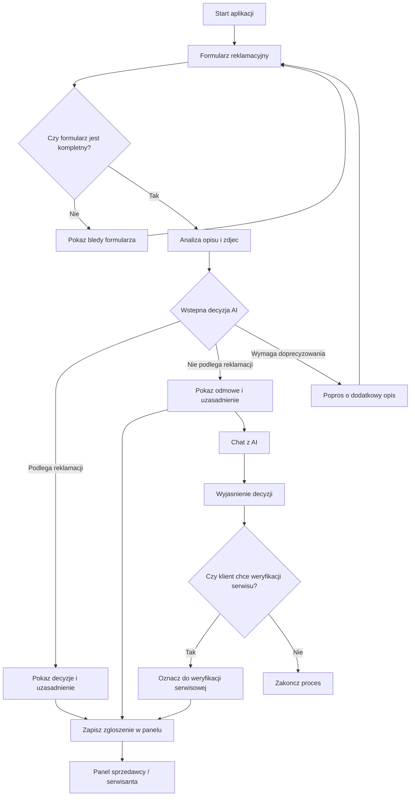

# PRD - Asystent reklamacji rowerow

---

## 1. Executive Summary

Tworzymy MVP aplikacji do wstepnej oceny reklamacji rowerow na podstawie formularza, opisu problemu i zdjec uszkodzonego sprzetu. Aplikacja ma pomoc klientowi zlozyc reklamacje, a sprzedawcy lub serwisantowi szybko zobaczyc komplet informacji i wstepna decyzje AI. Decyzja AI ma charakter pomocniczy i moze zostac przekazana do dodatkowej weryfikacji przez serwis.

---

## 2. Problem Statement

Obsluga reklamacji rowerow wymaga zebrania danych o sprzecie, opisu uszkodzenia, zdjec oraz kontekstu, w jakim doszlo do awarii. Samo zdjecie moze pokazac uszkodzenie, ale nie zawsze wyjasnia jego przyczyne. Bez uporzadkowanego procesu klient moze wyslac niekompletne informacje, a sprzedawca lub serwis musi recznie dopytywac o szczegoly. W efekcie decyzja reklamacyjna trwa dluzej, a klient nie zawsze rozumie powod odmowy.

---

## 3. Users / Personas

### Klient

Osoba skladajaca reklamacje roweru. Chce szybko opisac problem, dodac zdjecia i otrzymac jasna informacje, czy sprawa moze zostac przyjeta do reklamacji.

### Sprzedawca

Osoba przyjmujaca zgloszenia reklamacyjne. Chce widziec komplet danych klienta, dane roweru, opis uszkodzenia, zdjecia i wstepna decyzje AI w jednym panelu.

### Serwisant

Osoba oceniajaca zasadnosc reklamacji. Chce miec dostep do zdjec, typu uszkodzenia, uzasadnienia AI i informacji od klienta, aby podjac lub zweryfikowac decyzje.

---

## 4. Main Flows

### 4.1 Zlozenie reklamacji - happy path

1. Klient otwiera aplikacje.
2. System wyswietla formularz reklamacyjny.
3. Klient wybiera rodzaj sprzetu jako rower.
4. Klient podaje marke i model roweru.
5. Klient opisuje problem.
6. Klient dodaje od 1 do 5 zdjec uszkodzenia.
7. System sprawdza, czy formularz jest kompletny.
8. System analizuje zdjecia oraz opis okolicznosci powstania uszkodzenia.
9. System uwzglednia zgodnosc lub sprzecznosc miedzy widocznym uszkodzeniem a opisem klienta.
10. System okresla typ uszkodzenia jako mechaniczne.
11. System zwraca wstepna decyzje: reklamacja podlega albo nie podlega uznaniu.
12. System pokazuje klientowi decyzje i uzasadnienie.
13. System zapisuje zgloszenie w panelu sprzedawcy.

### 4.2 Brak mozliwosci oceny na podstawie zdjec

1. Klient wypelnia formularz i dodaje zdjecia.
2. System analizuje zdjecia i opis problemu.
3. System nie moze jednoznacznie ocenic uszkodzenia albo opis nie wyjasnia okolicznosci powstania uszkodzenia.
4. System prosi klienta o doprecyzowanie problemu.
5. Klient uzupelnia opis lub dodaje inne zdjecia, jesli limit nie zostal przekroczony.
6. System ponownie wykonuje wstepna ocene.

### 4.3 Ocena kontekstu uszkodzenia

1. Klient dodaje zdjecie uszkodzonej ramy roweru.
2. Klient opisuje okolicznosci powstania uszkodzenia.
3. System analizuje, czy opis wskazuje na zdarzenie zewnetrzne, niewlasciwe uzycie, upadek albo naturalna awarie podczas jazdy.
4. Jesli opis wskazuje, ze klient przewrocil sie na rowerze i uszkodzenie wynika z upadku, system moze zwrocic decyzje "nie podlega reklamacji".
5. Jesli opis wskazuje, ze rama pekla podczas normalnej jazdy, system traktuje sprawe jako potencjalnie podlegajaca reklamacji lub wymagajaca weryfikacji serwisowej.
6. System pokazuje uzasadnienie odnoszace sie zarowno do zdjec, jak i opisu klienta.

### 4.4 Odrzucenie reklamacji i rozmowa z AI

1. System zwraca decyzje, ze reklamacja wstepnie nie podlega uznaniu.
2. System pokazuje klientowi uzasadnienie odmowy.
3. Klient moze otworzyc chat z AI.
4. AI wyjasnia powod odmowy na podstawie decyzji, opisu zgloszenia, ogolnej wiedzy i regulaminu reklamacji, jesli jest dostepny.
5. AI informuje, ze dalsza weryfikacja moze zostac przekazana do serwisu.
6. Klient moze poprosic o dodatkowa weryfikacje przez serwisanta.

### 4.5 Przekazanie do serwisu

1. Klient wybiera opcje przekazania sprawy do dodatkowej weryfikacji.
2. System oznacza zgloszenie jako wymagajace weryfikacji serwisowej.
3. Sprzedawca lub serwisant widzi zgloszenie w panelu.
4. Panel pokazuje dane roweru, opis, zdjecia, decyzje AI, uzasadnienie i historie rozmowy, jesli istnieje.

---

## 5. User Stories

1. Jako klient chce wybrac typ sprzetu, podac marke i model roweru, opisac okolicznosci uszkodzenia oraz dodac zdjecia, aby zlozyc kompletna reklamacje.
2. Jako klient chce otrzymac wstepna decyzje i uzasadnienie, aby wiedziec, czy reklamacja moze zostac uznana.
3. Jako klient chce doprecyzowac problem, gdy AI nie potrafi ocenic uszkodzenia ze zdjec, aby nie konczyc procesu niejasnym wynikiem.
4. Jako klient chce porozmawiac z AI po odmowie reklamacji, aby lepiej zrozumiec powod decyzji.
5. Jako klient chce przekazac odrzucona sprawe do serwisanta, aby uzyskac dodatkowa weryfikacje.
6. Jako sprzedawca chce widziec wszystkie zgloszenia w panelu, aby obsluzyc reklamacje bez szukania danych w wielu miejscach.
7. Jako serwisant chce widziec zdjecia, opis i uzasadnienie AI, aby sprawniej ocenic zgloszenie.

---

## 6. Acceptance Criteria

### Formularz

AC-01: System wyswietla formularz reklamacyjny jako pierwszy ekran aplikacji.

AC-02: Formularz pozwala wybrac rodzaj sprzetu, przy czym w MVP obslugiwany jest rower.

AC-03: Formularz wymaga podania marki roweru.

AC-04: Formularz wymaga podania modelu roweru.

AC-05: Formularz wymaga opisu problemu.

AC-05A: Opis problemu musi obejmowac okolicznosci powstania uszkodzenia.

AC-06: Formularz wymaga dodania co najmniej 1 zdjecia.

AC-07: Formularz pozwala dodac maksymalnie 5 zdjec.

AC-08: System blokuje wyslanie formularza, jesli brakuje wymaganego pola lub zdjecia.

### Ocena AI

AC-09: System wykonuje wstepna ocene reklamacji po wyslaniu kompletnego formularza.

AC-09A: System uwzglednia zarowno zdjecia, jak i opis problemu przy wstepnej ocenie reklamacji.

AC-09B: System nie podejmuje wstepnej decyzji wylacznie na podstawie zdjec, jesli opis problemu wskazuje na istotne okolicznosci powstania uszkodzenia.

AC-10: System zwraca jedna z decyzji: "podlega reklamacji", "nie podlega reklamacji" albo "wymaga doprecyzowania".

AC-11: System klasyfikuje uszkodzenie jako mechaniczne, jesli analiza wskazuje na taki typ uszkodzenia.

AC-12: System pokazuje uzasadnienie dla kazdej decyzji AI.

AC-12A: Uzasadnienie decyzji AI odnosi sie do zdjec oraz do opisu okolicznosci uszkodzenia.

AC-12B: Jesli opis wskazuje, ze uszkodzenie ramy powstalo wskutek upadku lub przewrocenia sie na rowerze, system moze zakwalifikowac sprawe jako wstepnie niepodlegajaca reklamacji.

AC-12C: Jesli opis wskazuje, ze rama pekla podczas normalnej jazdy, system nie moze odrzucic reklamacji wylacznie dlatego, ze zdjecie pokazuje uszkodzenie mechaniczne.

AC-13: System informuje, ze decyzja AI jest wstepna i moze wymagac weryfikacji przez serwis.

AC-14: Jesli system nie moze ocenic sprawy na podstawie zdjec i opisu albo opis nie zawiera okolicznosci powstania uszkodzenia, pokazuje prosbe o doprecyzowanie problemu.

### Odmowa i chat

AC-15: Po decyzji "nie podlega reklamacji" system pokazuje klientowi opcje rozpoczecia rozmowy z AI.

AC-16: Chat odpowiada po polsku.

AC-17: Chat wyjasnia decyzje na podstawie informacji ze zgloszenia, ogolnej wiedzy i regulaminu reklamacji, jesli taki dokument jest dostepny.

AC-18: Chat nie obiecuje uznania reklamacji, zwrotu pieniedzy, wymiany sprzetu ani naprawy.

AC-19: Chat informuje, ze dalsze czynnosci reklamacyjne sa przekazywane do sprzedawcy lub serwisu.

### Panel sprzedawcy / serwisanta

AC-20: System zapisuje kazde kompletne zgloszenie reklamacyjne w panelu obslugi.

AC-21: Panel pokazuje marke roweru, model roweru, opis problemu, zdjecia, decyzje AI, typ uszkodzenia i uzasadnienie.

AC-22: Panel pozwala odroznic zgloszenia wymagajace dodatkowej weryfikacji serwisowej od pozostalych zgloszen.

AC-23: Panel pokazuje historie rozmowy klienta z AI, jesli rozmowa zostala rozpoczeta.

### Jezyk i komunikacja

AC-24: Wszystkie komunikaty widoczne dla uzytkownika sa w jezyku polskim.

AC-25: System uzywa jasnych komunikatow bledow dla brakujacych danych formularza.

---

## 7. Out of Scope

**Finalna decyzja prawna**

MVP nie rozstrzyga prawnie reklamacji. Decyzja AI jest wstepna i pomocnicza.

**Automatyczna naprawa, wymiana lub zwrot**

System nie realizuje zwrotow, wymian, napraw ani platnosci.

**Integracje z zewnetrznymi systemami**

MVP nie wymaga integracji z CRM, ERP, systemem sklepu, systemem serwisowym ani e-mailem.

**Pelna obsluga wielu kategorii sprzetu**

MVP skupia sie na rowerach. Inne typy sprzetu moga zostac dodane pozniej.

**Wielojezycznosc**

MVP obsluguje tylko jezyk polski.

**Aplikacja mobilna**

MVP zaklada aplikacje webowa, nie natywna aplikacje mobilna.

**Zaawansowany panel administracyjny**

MVP obejmuje panel obslugi zgloszen, ale nie definiuje rozbudowanego zarzadzania uzytkownikami, rolami ani konfiguracja systemu.

---

## 8. Constraints

### Business

1. Decyzja AI ma byc komunikowana jako wstepna ocena.
2. Klient musi miec mozliwosc przekazania sprawy do dodatkowej weryfikacji przez serwisanta.
3. Proces ma obejmowac ogolna logike reklamacyjna, bez szczegolowej walidacji prawnej.
4. System nie moze sugerowac, ze AI zastepuje sprzedawce, serwisanta albo formalna procedure reklamacyjna.

### Functional

1. Obslugiwany typ sprzetu w MVP: rower.
2. Wymagane dane: rodzaj sprzetu, marka, model, opis problemu z okolicznosciami powstania uszkodzenia, co najmniej 1 zdjecie.
3. Maksymalna liczba zdjec: 5.
4. Jezyk interfejsu: polski.
5. Obslugiwany typ uszkodzenia w MVP: mechaniczne.

### External document / data references

| Document name | File path | When it is used |
|---|---|---|
| Polityka reklamacji | docs/polityka-reklamacji.md | Uzywana przez chat do wyjasniania odmowy i interpretacji zgloszenia reklamacyjnego |
| Polityka zwrotu | docs/polityka-zwrotu.md | Uzywana do odroznienia zwrotu od reklamacji, jesli taki scenariusz zostanie wlaczony do zakresu |

---

## 9. UI Description

### Ekran formularza reklamacyjnego

Uzytkownik widzi formularz jako pierwszy ekran. Formularz zawiera wybor rodzaju sprzetu, pola marka i model, pole opisu problemu oraz sekcje dodawania zdjec. Pole opisu musi prosic uzytkownika o opisanie, co sie stalo i w jakich okolicznosciach powstalo uszkodzenie. Przycisk wyslania jest dostepny tylko wtedy, gdy formularz zawiera wymagane dane. Przy brakujacych danych system pokazuje komunikaty przy odpowiednich polach.

### Ekran analizy

Po wyslaniu formularza system pokazuje stan przetwarzania. Uzytkownik widzi informacje, ze zdjecia, opis i okolicznosci powstania uszkodzenia sa analizowane. Po zakonczeniu analizy system przechodzi do ekranu decyzji.

### Ekran decyzji

Uzytkownik widzi decyzje: reklamacja wstepnie podlega uznaniu, nie podlega uznaniu albo wymaga doprecyzowania. Ekran pokazuje uzasadnienie, typ uszkodzenia oraz informacje, ze decyzja AI jest wstepna. Przy odmowie widoczna jest opcja rozmowy z AI oraz opcja przekazania sprawy do serwisu.

### Ekran doprecyzowania

Jesli analiza jest niejednoznaczna albo opis nie wyjasnia okolicznosci powstania uszkodzenia, uzytkownik widzi prosbe o dodatkowy opis problemu. System pozwala uzupelnic opis i dodac dodatkowe zdjecia, jesli laczna liczba zdjec nie przekracza 5.

### Chat po odmowie

Uzytkownik widzi rozmowe dotyczaca odrzuconej reklamacji. Chat odpowiada po polsku, wyjasnia powod odmowy i informuje, ze dalsza weryfikacja moze zostac przekazana do serwisu. Chat nie zmienia samodzielnie decyzji reklamacyjnej.

### Panel sprzedawcy / serwisanta

Sprzedawca lub serwisant widzi liste zgloszen. Po otwarciu zgloszenia widzi dane roweru, opis, zdjecia, decyzje AI, typ uszkodzenia, uzasadnienie i ewentualna historie chatu. Zgloszenia wymagajace weryfikacji serwisowej sa oznaczone osobnym statusem.

---

## 10. User Flow Diagram

---

## 11. Agent / System Behavior Specification

### Rola agenta

Agent AI wykonuje wstepna ocene reklamacji roweru na podstawie danych formularza, opisu problemu, okolicznosci powstania uszkodzenia i zdjec. Agent pomaga klientowi zrozumiec decyzje oraz przygotowuje informacje dla sprzedawcy lub serwisanta.

### Co agent moze robic

1. Analizowac opis problemu i zdjecia.
2. Okreslac, czy reklamacja wstepnie podlega uznaniu.
3. Wskazywac uszkodzenie mechaniczne, jesli wynika to z dostepnych informacji.
4. Prosic klienta o doprecyzowanie problemu, jesli ocena jest niejednoznaczna.
5. Generowac uzasadnienie wstepnej decyzji.
6. Wyjasniac odmowe w chacie.
7. Informowac o mozliwosci dodatkowej weryfikacji przez serwis.
8. Uwzgledniac roznice miedzy uszkodzeniem widocznym na zdjeciu a okolicznosciami opisanymi przez klienta.
9. Traktowac opis klienta jako istotny sygnal decyzyjny, zwlaszcza gdy to samo widoczne uszkodzenie moze miec rozne przyczyny.

### Czego agent nie moze robic

1. Nie moze przedstawiac decyzji jako ostatecznej decyzji prawnej.
2. Nie moze obiecywac zwrotu pieniedzy, wymiany roweru ani naprawy.
3. Nie moze samodzielnie realizowac dalszych czynnosci reklamacyjnych.
4. Nie moze twierdzic, ze zastepuje sprzedawce albo serwisanta.
5. Nie moze ignorowac opisu klienta, jesli opis zmienia interpretacje widocznego uszkodzenia.
6. Nie moze udzielac szczegolowej porady prawnej.

### Kategorie decyzji

1. "Podlega reklamacji" - system komunikuje, ze zgloszenie wstepnie kwalifikuje sie do reklamacji i zostanie zapisane w panelu obslugi.
2. "Nie podlega reklamacji" - system komunikuje odmowe, pokazuje uzasadnienie i pozwala uruchomic chat wyjasniajacy.
3. "Wymaga doprecyzowania" - system prosi klienta o dodatkowe informacje, bo materialy nie wystarczaja do oceny.

### Obowiazkowy komunikat

Przy kazdej decyzji system pokazuje informacje: "To jest wstepna ocena wygenerowana automatycznie. Ostateczna decyzja moze wymagac weryfikacji przez sprzedawce lub serwis."

### Jezyk i ton

Agent komunikuje sie po polsku. Komunikaty maja byc konkretne, neutralne i zrozumiale dla klienta.

---

## 12. Further Notes

1. Regulamin reklamacji nie zostal jeszcze dostarczony, wiec w MVP chat moze bazowac na ogolnej wiedzy i danych zgloszenia.
2. Szczegolowe przepisy prawne nie sa czescia aktualnego zakresu.
3. Limity rozmiaru plikow, formaty zdjec i wymagania dotyczace kont uzytkownikow wymagaja decyzji w kolejnym etapie.
4. Architektura, model danych, integracje i wybor technologii powinny zostac opisane w osobnym ADR.
