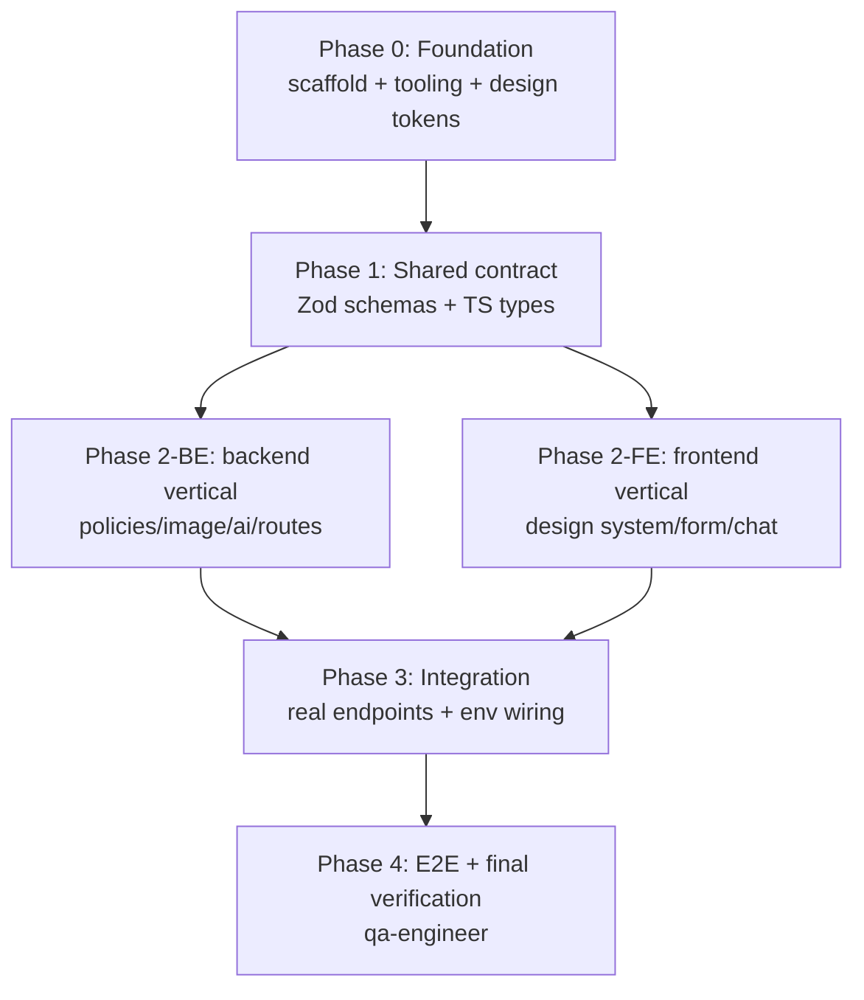
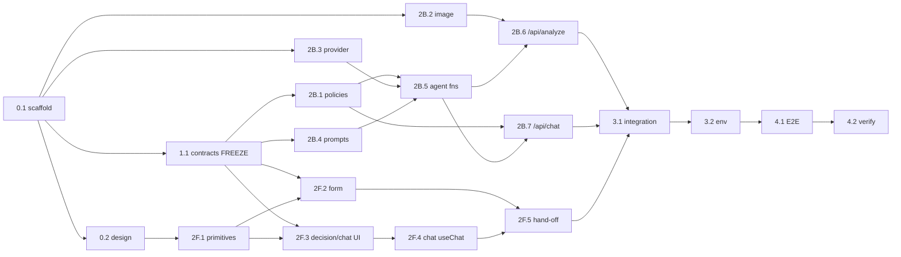

# Implementation Plan — Hardware Service Decision Copilot (PoC)

**Date:** 2026-06-18
**Role of this document:** Orchestration plan for building the full PoC (backend +
frontend + tests) by delegating to specialized sub-agents. The orchestrator does
**not** write production code — it only plans, delegates with exact per-task context,
and coordinates. Each step is small, test-driven, and committed before the next.

**Sources of truth (load per task, not all at once):**
- `docs/PRD-Product-Requirements-Document.md` — functional requirements, AC-01…AC-31.
- `docs/ADR/000-main-architecture.md` — system architecture, contracts, env, data models.
- `docs/ADR/001-frontend.md` — UI design & AI SDK UI wiring.
- `docs/ADR/002-backend-api.md` — route handlers, validation, image, orchestration.
- `docs/ADR/003-ai-agent.md` — OpenRouter provider, two models, prompts, decision schema.
- `docs/design-guidelines.md` + `assets/design-tokens.json` — Spotify-inspired dark theme.
- `docs/policies/complaint-policy.md`, `docs/policies/return-policy.md` — agent rules.

> Note: the orchestration prompt referenced `001-backend.md` / `002-frontend.md`; the
> **actual** files are `001-frontend.md`, `002-backend-api.md`, `003-ai-agent.md`.
> Use the actual files.

---

## 0. Locked decisions (confirmed with the user)

1. **Deliverable of the current orchestration turn:** this plan only — pause for
   review before any agent runs.
2. **Brand/theme:** use `docs/design-guidelines.md` as-is (Spotify-inspired dark
   theme, accent `#1ED760`). "Silky" is just the project name; no Spotify-branded copy.
3. **Scaffold:** fresh `create-next-app` (TypeScript, App Router, Tailwind), then add
   Shadcn/ui, Vitest + React Testing Library, and Playwright.
4. **Models:** both OpenRouter model IDs are env-configurable. Defaults:
   `OPENROUTER_MULTIMODAL_MODEL=openai/gpt-4o` (vision),
   `OPENROUTER_DECISION_MODEL=anthropic/claude-3.5-sonnet` (decision + chat).
   ⚠️ Env var names are **unverified** (`.env*` is read-blocked); confirm against
   `.env.example` in Phase 0 and reconcile before wiring.

---

## 1. Agents and ownership boundaries

To allow safe parallelism, each agent **owns** disjoint paths. No two agents edit the
same file concurrently.

| Agent | Owns (writeable paths) | Never writes |
|---|---|---|
| **be-developer** | `app/api/**`, `lib/ai/**`, `lib/image/**`, `lib/policies/**`, `lib/validation/**` (server refinements), backend tests | `app/components/**`, UI pages |
| **fe-developer** | `app/page.tsx`, `app/chat/**`, `app/layout.tsx`, `app/components/**`, `app/globals.css`, `tailwind.config.*`, FE tests, `lib/types` (consumes), design tokens wiring | `app/api/**`, `lib/ai/**`, `lib/image/**` |
| **qa-engineer** | `e2e/**`, Playwright config, test fixtures, final verification | production source under `app/`, `lib/` |

**Shared contract (`lib/contracts` / `lib/validation` schemas + TS types):** authored
once in Phase 1 by **be-developer**, then **frozen**. Both tracks import it read-only.
Any change after freeze requires an orchestrator-mediated contract-change step.

---

## 2. Coordination & execution protocol

- **Branch:** all work on a single feature branch `feat/poc-implementation`
  (created in Phase 0). Do **not** push unless the user asks.
- **One step = one commit.** Format `Area: short summary` (`Backend:`, `Frontend:`,
  `Tests:`, `Chore:`). Commit only after the step's tests + lint pass for the changed
  scope.
- **TDD every step:** (1) write/extend tests from the AC/TAC, (2) run, confirm they
  fail for the right reason, (3) implement minimum to pass, (4) run changed-scope
  verification, (5) refactor green.
- **Per-task context injection:** each task card below lists the *exact* files +
  sections + ACs the agent receives. Do **not** hand an agent the whole repo — only
  its card's "Context to inject." Each card is self-contained: the agent must not need
  to ask questions.
- **Parallelism rule:** agents may run concurrently only within the same "parallel
  group" (P-tag) because their owned paths are disjoint. Phase boundaries are
  synchronization points — all tasks in a phase complete and commit before the next
  phase starts, unless a card says otherwise.
- **Verification gate before a phase advances:** `npm run lint` + `npm test` green for
  everything built so far; build succeeds at integration/E2E gates.

---

## 3. Phase overview



Phase 2-BE and Phase 2-FE run **in parallel** (disjoint ownership, both depend only on
the frozen Phase 1 contract).

---

## 4. Task cards

Each card: **Owner · Depends-on · Blocks · Parallel-group · Goal · Context to inject ·
TDD/Deliverables · Done-when · Commit.**

### PHASE 0 — Foundation (sequential)

#### Task 0.1 — Scaffold + tooling
- **Owner:** be-developer · **Depends-on:** — · **Blocks:** all · **P-group:** none
- **Goal:** Fresh Next.js App Router + TS app in `app/` scaffold; install runtime deps
  (`ai`, `@ai-sdk/react`, `@openrouter/ai-sdk-provider`, `zod`, `sharp`); install dev
  deps (`vitest`, `@testing-library/react`, `@testing-library/jest-dom`, `jsdom`,
  `@playwright/test`); configure Vitest (jsdom for FE, node for BE), ESLint, and npm
  scripts `dev`, `build`, `lint`, `test`, `test:e2e`. Add `.env.example` reconciliation
  step output (list the names actually present; flag diffs vs ADR-000 §7).
- **Context to inject:** ADR-000 §3 (repo structure, stack), §7 (env vars); AGENTS.md
  (verification commands, test strategy table); Context7 handles for Next.js
  (`/vercel/next.js`), AI SDK (`/vercel/ai`), OpenRouter provider
  (`/openrouterteam/ai-sdk-provider`).
- **TDD/Deliverables:** a trivial smoke test (`sanity.test.ts`) that runs under Vitest;
  `npm run lint`, `npm test`, `npm run build` all succeed on the empty app.
- **Done-when:** all three commands pass; deps pinned in `package.json`; `.env.example`
  names reported back to the orchestrator.
- **Commit:** `Chore: scaffold Next.js app with AI SDK, OpenRouter, Vitest, Playwright`.

#### Task 0.2 — Design system foundation
- **Owner:** fe-developer · **Depends-on:** 0.1 · **Blocks:** 2F.* · **P-group:** none
- **Goal:** Map `assets/design-tokens.json` into the Tailwind theme + CSS variables
  (colors, typography stack, spacing, radii from design-guidelines). Root layout
  (`app/layout.tsx`) with dark background `#121212`, font stack, favicon/logo from
  `assets/`. One primitive to prove the system: the green pill **PrimaryButton**
  (`#1ED760`, black text, pill radius, grow-on-hover).
- **Context to inject:** `docs/design-guidelines.md` (all), `assets/design-tokens.json`,
  `assets/logo.svg`, `assets/favicon.svg`; ADR-001 §3 (component list).
- **TDD/Deliverables:** RTL test that `PrimaryButton` renders, has black text token and
  pill radius class; visual snapshot optional.
- **Done-when:** tokens available as Tailwind utilities + CSS vars; button test passes.
- **Commit:** `Frontend: design tokens, root layout, primary button`.

### PHASE 1 — Shared contract (sequential, frozen after)

#### Task 1.1 — Contracts: schemas + types (the linchpin)
- **Owner:** be-developer · **Depends-on:** 0.1 · **Blocks:** ALL Phase 2 · **P-group:** none
- **Goal:** Author the **shared** Zod schemas + inferred TS types used by both tracks:
  `IntakeForm` schema (Polish messages, AC-04…AC-09 rules: requestType enum, category
  enum AC-02, model non-empty trimmed, purchaseDate ≤ today, reason required iff
  complaint, image format/size at the type level), `Decision` schema (5-outcome enum,
  justification, nextSteps, missing[], conditions[], disclaimer, greeting — model-
  compatible per ADR-003 §4: `.nullable()` not `.optional()`), `ImageAnalysis`,
  `CaseContext`, `AnalyzeResponse`, `ChatRequestBody`. Export a single `lib/contracts`
  barrel. Mark the module **frozen** after merge.
- **Context to inject:** PRD AC-01…AC-09, AC-15…AC-19, AC-22; ADR-000 §5 (data models)
  & §6 (contracts); ADR-003 §4 (Decision schema rules); ADR-002 §4 (DTOs); Zod docs.
- **TDD/Deliverables:** exhaustive unit tests for the form schema — one per AC-04…AC-09
  pass/fail case (future date, empty reason on complaint, whitespace model, bad format,
  >10 MB, missing image, all-10 categories) and Decision schema parse/round-trip.
- **Done-when:** all schema unit tests pass; types exported; orchestrator announces
  **contract frozen**.
- **Commit:** `Backend: shared Zod contracts and types (form, decision, context)`.

### PHASE 2 — Parallel verticals (BE ∥ FE)

> 2B.* (be-developer) and 2F.* (fe-developer) run concurrently. Within each track,
> steps are sequential. All import the frozen Phase 1 contract; UI uses **mocked**
> endpoints so it needs no real backend.

#### Backend track (P-group: **P2-BE**)

##### Task 2B.1 — Policy loader
- **Owner:** be-developer · **Depends-on:** 1.1 · **Blocks:** 2B.5, 2B.7
- **Goal:** `lib/policies.loadPolicy(kind)` reads + caches `complaint-policy.md` /
  `return-policy.md` (per ADR-002/TD-5; real filenames).
- **Context to inject:** ADR-002 §3 (lib/policies), ADR-000 TD-5, the two policy files.
- **TDD:** unit test — return→return-policy text; complaint→complaint-policy text;
  cache hit returns same content.
- **Commit:** `Backend: policy loader with caching`.

##### Task 2B.2 — Image compression
- **Owner:** be-developer · **Depends-on:** 0.1 · **Blocks:** 2B.6
- **Goal:** `lib/image.compress(file)` with sharp — enforce JPEG/PNG/WebP, downscale to
  a bounded max edge, re-encode at bounded quality; return `{bytes, mediaType}` (AC-10).
- **Context to inject:** ADR-002 §3 (lib/image) & BE-4; PRD AC-08/09/10; sharp docs.
- **TDD:** unit with fixture images — large image shrinks under bound; non-accepted
  format rejected; already-small image still re-encoded; output ≤ bound (TAC-002-02).
- **Commit:** `Backend: image compression/normalization (sharp)`.

##### Task 2B.3 — OpenRouter provider + model factory
- **Owner:** be-developer · **Depends-on:** 0.1 · **Blocks:** 2B.5
- **Goal:** `lib/ai/provider` — one `createOpenRouter`; `getMultimodalModel()` /
  `getDecisionModel()` from env; never cross-wired.
- **Context to inject:** ADR-003 §3 & AI-1, ADR-000 §7; OpenRouter provider docs
  (`/openrouterteam/ai-sdk-provider`).
- **TDD:** unit (mock provider) — factory selects `OPENROUTER_MULTIMODAL_MODEL` vs
  `OPENROUTER_DECISION_MODEL` (TAC-003-01); env override honored.
- **Commit:** `Backend: OpenRouter provider and two-model factory`.

##### Task 2B.4 — Prompt builders
- **Owner:** be-developer · **Depends-on:** 1.1 · **Blocks:** 2B.5
- **Goal:** `lib/ai/prompts` — `imageComplaint`, `imageReturn`, `decisionComplaint`,
  `decisionReturn`, `chatSystem`. Policy injected at call time; enforce PRD §11 rules
  (Polish, no invented rules, NEEDS_MORE_INFO on uncertainty, mandatory disclaimer).
- **Context to inject:** PRD §11, AC-12/13/14/16/17/18/19/26; ADR-003 §3 & AI-3/AI-4/AI-5.
- **TDD:** unit — complaint vs return image prompts differ per AC-12/13; decision
  prompts differ per AC-14; chat system includes context+policy placeholders.
- **Commit:** `Backend: prompt builders for image, decision, chat`.

##### Task 2B.5 — Agent functions (analyzeImage / decide / chatStream)
- **Owner:** be-developer · **Depends-on:** 2B.1, 2B.3, 2B.4 · **Blocks:** 2B.6, 2B.7
- **Goal:** Implement the three `lib/ai` functions; `decide` uses structured output +
  Zod parse; uncertainty → NEEDS_MORE_INFO; parse failure → throw (no fabrication).
- **Context to inject:** ADR-003 §3/§5/§6 (AI-2, AI-5), PRD AC-15/17/18/19/23/25/26/30.
- **TDD:** unit with **mocked LLM** — valid Decision parses; missing justification →
  throw; usable=false → NEEDS_MORE_INFO + missing[]; two-model wiring asserted
  (TAC-003-01..03, 05, 08).
- **Commit:** `Backend: image analysis, decision, and chat agent functions`.

##### Task 2B.6 — `/api/analyze` route
- **Owner:** be-developer · **Depends-on:** 1.1, 2B.2, 2B.5 · **Blocks:** 3.1
- **Goal:** Node-runtime route: parse FormData → server-validate → compress → vision →
  decide → build seed message + context → 200; 422 on validation; 502/503 on provider
  error (no fabricated decision).
- **Context to inject:** ADR-002 §3/§5/§6 (BE-1..4), ADR-000 §6, PRD AC-07/29/30; Next.js
  route handler + FormData docs.
- **TDD:** **integration (mock only the LLM)** — valid complaint→200 Decision; missing
  reason→422 PL; future date→422; bad format/oversize→422; usable=false→NEEDS_MORE_INFO
  200; provider 5xx→retryable error, no decision (TAC-002-01..05).
- **Commit:** `Backend: /api/analyze orchestration route`.

##### Task 2B.7 — `/api/chat` route (streaming)
- **Owner:** be-developer · **Depends-on:** 2B.1, 2B.5 · **Blocks:** 3.1
- **Goal:** Node-runtime streaming route: parse `{messages, context}` → load policy →
  build system prompt → `chatStream` → UI message stream; off-topic declined; revision
  marked.
- **Context to inject:** ADR-002 §3/§5 (chat), ADR-003 §3 (chatStream), PRD AC-23/24/25/26;
  AI SDK UI stream docs (`createUIMessageStreamResponse`, `toUIMessageStream`).
- **TDD:** integration (mock LLM) — system prompt contains policy+context; streamed
  reply; off-topic declined (TAC-002-06).
- **Commit:** `Backend: /api/chat streaming route`.

#### Frontend track (P-group: **P2-FE**)

##### Task 2F.1 — UI primitives
- **Owner:** fe-developer · **Depends-on:** 0.2 · **Blocks:** 2F.2, 2F.3
- **Goal:** Shadcn/ui-based primitives themed to tokens: Select, Input, Textarea,
  Card, Dialog, SecondaryButton, FieldError, StatusBadge.
- **Context to inject:** design-guidelines §6, ADR-001 §3; Shadcn/ui docs.
- **TDD:** RTL render + token-class assertions per primitive.
- **Commit:** `Frontend: themed UI primitives`.

##### Task 2F.2 — Intake form + client validation
- **Owner:** fe-developer · **Depends-on:** 1.1, 2F.1 · **Blocks:** 2F.5
- **Goal:** Form per PRD §9.1 (fields in order, reason required-state bound to request
  type, single-image dropzone with preview/remove, submit-blocked-while-invalid); client
  validation via the **shared schema**; build `multipart/form-data`; loading/error states.
  Backend call **mocked**.
- **Context to inject:** PRD §9.1, AC-01…AC-09; ADR-001 §3 (Screen 1) & FE-3; the frozen
  contract module.
- **TDD:** RTL — reason toggles required (AC-05); future date blocked (AC-04);
  format/size guard (AC-08/09); single-image (AC-11); 422 maps to inline PL errors;
  5xx→error state (TAC-001-01/02/06/07).
- **Commit:** `Frontend: intake form with client validation`.

##### Task 2F.3 — Decision card + chat thread components
- **Owner:** fe-developer · **Depends-on:** 1.1, 2F.1 · **Blocks:** 2F.4
- **Goal:** `DecisionCard` (greeting, status badge AC-22, justification, next steps,
  disclaimer — ordered per AC-21), `MessageBubble`, `TypingIndicator`, `TurnError`.
- **Context to inject:** PRD AC-19/20/21/22, §9.3; ADR-001 §3 (Screen 2) & FE-2.
- **TDD:** RTL — render all 5 outcomes with distinct badge; disclaimer always present
  (TAC-001-03).
- **Commit:** `Frontend: decision card and chat message components`.

##### Task 2F.4 — Chat screen + useChat wiring
- **Owner:** fe-developer · **Depends-on:** 2F.3 · **Blocks:** 2F.5
- **Goal:** `app/chat` with `useChat` + `DefaultChatTransport`; attach `context` via
  `prepareSendMessagesRequest`; seed with decision message; typing/streaming/error
  states; "new request" clears state. Transport **mocked**.
- **Context to inject:** PRD AC-23/24/25/27/28, §9.3; ADR-001 §3 (Screen 2) & FE-1; AI
  SDK UI `useChat` docs.
- **TDD:** RTL with mock transport — every send includes `context` (AC-23); revision
  marked (AC-25); new request resets messages (AC-28) (TAC-001-04/05).
- **Commit:** `Frontend: chat screen with useChat transport`.

##### Task 2F.5 — Form→chat hand-off + navigation/states
- **Owner:** fe-developer · **Depends-on:** 2F.2, 2F.4 · **Blocks:** 3.1
- **Goal:** Wire form success → hand off `decision/imageAnalysis/seedMessages/context`
  to chat (client state) → navigate; processing + global error states (PRD §9.2/9.4);
  "new request" returns to empty form.
- **Context to inject:** PRD §9 navigation, AC-27/28; ADR-001 §3 (state management) & FE-2.
- **TDD:** RTL — happy hand-off renders card; error path shows retry; new request resets.
- **Commit:** `Frontend: form-to-chat hand-off and navigation states`.

### PHASE 3 — Integration (sequential; after P2-BE ∧ P2-FE)

#### Task 3.1 — Replace mocks with real endpoints + contract reconciliation
- **Owner:** be-developer (lead) + fe-developer (support) · **Depends-on:** all 2B.*, 2F.*
- **Goal:** Point the UI at the real `/api/analyze` and `/api/chat`; remove FE
  transport/fetch mocks; reconcile any contract drift (must touch the frozen contract
  only via this mediated step). Start the app and run one real happy-path return and
  one complaint manually (key required).
- **Context to inject:** ADR-000 §6 (contracts), ADR-001 §5, ADR-002 §5; the running app.
- **TDD:** keep all unit/integration green; add a thin integration test asserting the
  UI request shapes match the route parsers.
- **Commit:** `Chore: wire UI to real API routes, reconcile contracts`.

#### Task 3.2 — Env + model configuration
- **Owner:** be-developer · **Depends-on:** 3.1
- **Goal:** Finalize env handling: confirm names against `.env.example` (reported in
  0.1), set model defaults, document required keys; fail fast with a clear PL/EN message
  if `OPENROUTER_API_KEY` is missing.
- **Context to inject:** ADR-000 §7, ADR-003 §3; `.env.example` (from 0.1 report).
- **TDD:** unit — missing key → explicit startup error; defaults applied when model env
  unset.
- **Commit:** `Chore: finalize env and model configuration`.

### PHASE 4 — E2E + verification (qa-engineer)

#### Task 4.1 — Playwright E2E (real stack)
- **Owner:** qa-engineer · **Depends-on:** 3.1, 3.2
- **Goal:** E2E covering: return→APPROVE, complaint→APPROVE, REJECT, NEEDS_MORE_INFO,
  CONDITIONAL, ESCALATE; validation errors; service error + retry; chat follow-up &
  revision; new request; Polish text throughout.
- **Context to inject:** PRD §4, §5, AC-20…AC-31; ADR-000 §10 (scenarios); Playwright docs.
- **Real-stack note:** per AGENTS.md, E2E runs the real app. Because live LLM output is
  non-deterministic and costly, drive the model layer through a **network-level test
  double** (intercept the OpenRouter call) returning canned-but-valid responses per
  scenario, and assert **structural** behavior (correct outcome label rendered,
  disclaimer present, PL strings, error/retry, state reset) rather than exact wording.
  Keep one optional `@live` smoke test, skipped in CI, that hits the real API.
- **TDD:** E2E specs authored from the AC before any UI tweak they reveal is needed.
- **Commit:** `Tests: Playwright E2E for full decision and chat flows`.

#### Task 4.2 — Final verification & report
- **Owner:** qa-engineer · **Depends-on:** 4.1
- **Goal:** Run `npm run lint`, `npm test`, `npm run build`, `npm run test:e2e`; start
  the app; produce a checklist mapping each AC-01…AC-31 to a passing test. Report gaps.
- **Done-when:** all suites green, app starts, every AC has a backing test or a noted
  justified gap.
- **Commit:** `Tests: full verification pass and AC coverage report`.

---

## 5. Dependency matrix

| Task | Owner | Depends on | Blocks | Parallel group |
|---|---|---|---|---|
| 0.1 Scaffold | be | — | everything | — |
| 0.2 Design system | fe | 0.1 | 2F.* | — |
| 1.1 Contracts (freeze) | be | 0.1 | all Phase 2 | — |
| 2B.1 Policies | be | 1.1 | 2B.5, 2B.7 | P2-BE |
| 2B.2 Image | be | 0.1 | 2B.6 | P2-BE |
| 2B.3 Provider/models | be | 0.1 | 2B.5 | P2-BE |
| 2B.4 Prompts | be | 1.1 | 2B.5 | P2-BE |
| 2B.5 Agent fns | be | 2B.1, 2B.3, 2B.4 | 2B.6, 2B.7 | P2-BE |
| 2B.6 /api/analyze | be | 1.1, 2B.2, 2B.5 | 3.1 | P2-BE |
| 2B.7 /api/chat | be | 2B.1, 2B.5 | 3.1 | P2-BE |
| 2F.1 Primitives | fe | 0.2 | 2F.2, 2F.3 | P2-FE |
| 2F.2 Form | fe | 1.1, 2F.1 | 2F.5 | P2-FE |
| 2F.3 Decision/chat UI | fe | 1.1, 2F.1 | 2F.4 | P2-FE |
| 2F.4 Chat + useChat | fe | 2F.3 | 2F.5 | P2-FE |
| 2F.5 Hand-off/nav | fe | 2F.2, 2F.4 | 3.1 | P2-FE |
| 3.1 Integration | be+fe | all 2B.*, 2F.* | 3.2 | — |
| 3.2 Env/config | be | 3.1 | 4.1 | — |
| 4.1 E2E | qa | 3.1, 3.2 | 4.2 | — |
| 4.2 Verification | qa | 4.1 | — | — |

### Cross-agent synchronization points (where one agent must wait)
- **After 1.1 (contract freeze):** fe-developer cannot start 2F.2/2F.3 until the
  contract module is merged and announced frozen.
- **Phase 2 → 3:** integration (3.1) waits for **both** P2-BE and P2-FE to fully
  complete and commit.
- **Phase 3 → 4:** qa-engineer starts only after 3.2.
- Within P2-BE and P2-FE, the only shared-file risk is the contract module — read-only
  in Phase 2, so the two tracks never collide.

### Dependency graph


---

## 6. Definition of done (PoC)
- Every PRD acceptance criterion AC-01…AC-31 is backed by a passing test (4.2 report).
- `npm run lint`, `npm test`, `npm run build`, and Playwright E2E all pass; the app
  starts and runs the full form → decision → chat flow.
- Two distinct OpenRouter models are wired by role (vision vs decision/chat), both
  env-configurable.
- No persistence; "new request" fully resets state. All user-facing text is Polish.
- Commits are focused, one per step, on `feat/poc-implementation` (not pushed unless
  requested).

---

## 7. Open items to confirm before/at Phase 0
1. **Env var names** — verify `.env.example` (read-blocked for the orchestrator) and
   reconcile with ADR-000 §7 (task 0.1 reports actual names).
2. **E2E LLM strategy** — confirm the network-level test-double approach for 4.1
   (vs spending on live model calls); default is the test double with one skipped
   `@live` smoke.
```
