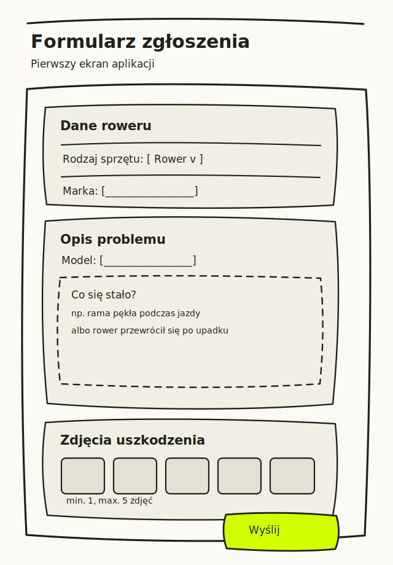
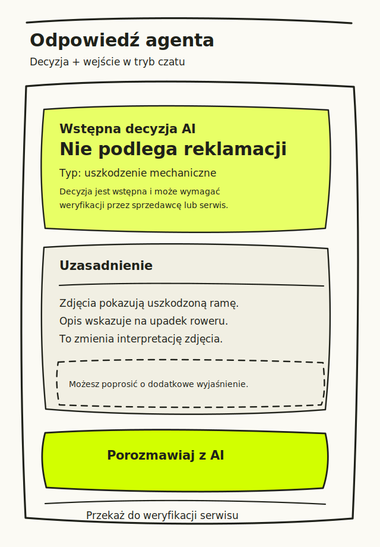
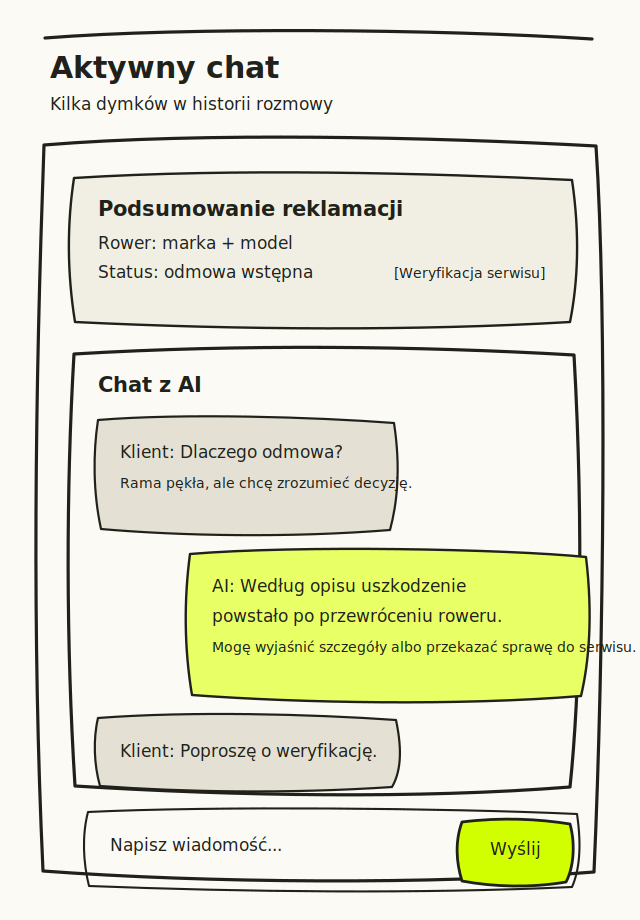

# Modele szkieletowe - główne widoki aplikacji

Na podstawie [PRD.md](PRD.md) przygotowano trzy bardzo szablonowe, ręcznie stylizowane wireframe'y. Każdy główny widok ma osobny plik SVG:

1. **Formularz zgłoszenia reklamacji** - `assets/wireframes/claim-submission-form-view.svg`
2. **Odpowiedź agenta** - `assets/wireframes/agent-decision-chat-entry-view.svg`
3. **Aktywny chat** - `assets/wireframes/claim-chat-conversation-view.svg`

## Pliki graficzne

### 1. Formularz zgłoszenia

### 2. Odpowiedź agenta

### 3. Aktywny chat

## Zakres szkiców

Szkice pokazują funkcjonalność i rozmieszczenie elementów, bez decyzji o finalnym UI. Nie należy ich traktować jako ostatecznego projektu wizualnego.

## Widok 1 - Formularz

Zawiera:

- wybór rodzaju sprzętu,
- markę i model roweru,
- opis problemu,
- opis okoliczności powstania uszkodzenia,
- dodawanie zdjęć,
- informację o limicie 1-5 zdjęć,
- przycisk wysłania formularza.

## Widok 2 - Odpowiedź agenta

Zawiera:

- wstępną decyzję AI,
- typ uszkodzenia,
- uzasadnienie odnoszące się do zdjęć i opisu,
- komunikat, że decyzja jest wstępna,
- przycisk przejścia do chatu,
- opcję przekazania sprawy do weryfikacji serwisu.

## Widok 3 - Aktywny chat

Zawiera:

- krótkie podsumowanie reklamacji,
- status reklamacji,
- historię rozmowy z kilkoma dymkami,
- pole wpisywania wiadomości,
- przycisk wysłania,
- możliwość przekazania sprawy do serwisu.
